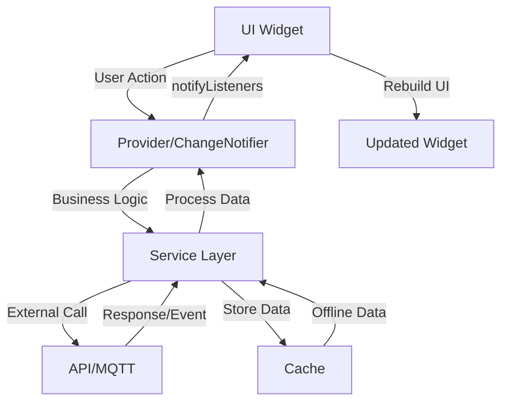
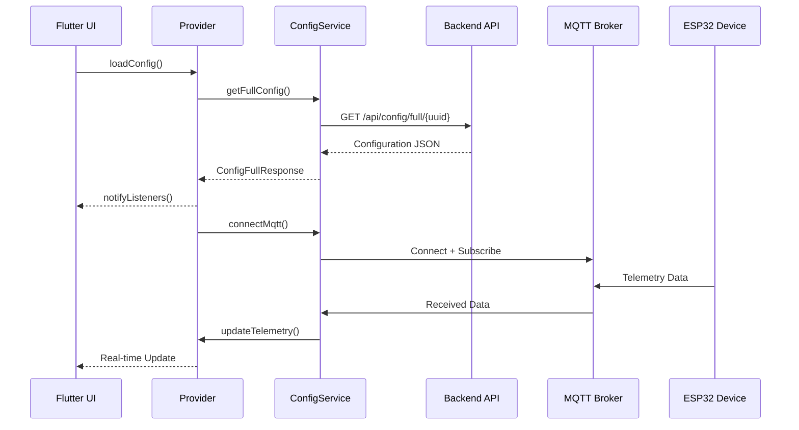
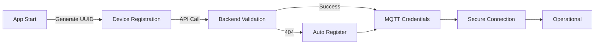

# 🏗️ Arquitetura - AutoCore Flutter

## 📋 Resumo Executivo

Este documento descreve a arquitetura do AutoCore Flutter App, um aplicativo moderno para controle e monitoramento de dispositivos IoT ESP32 em tempo real.

**Data**: 25/08/2025  
**Versão**: 1.0.0  
**Status**: ✅ Produção Ready  
**Arquitetura**: Clean Architecture + Provider Pattern  

## 🎯 Visão Geral da Arquitetura

### Princípios Fundamentais
1. **Clean Architecture**: Separação clara entre camadas
2. **Single Responsibility**: Cada classe/módulo tem uma única responsabilidade
3. **Dependency Inversion**: Dependências apontam para abstrações
4. **Reactive Programming**: Estado reativo com Provider/ChangeNotifier
5. **Offline First**: Funciona sem conexão usando cache local

### Stack Tecnológico
- **Framework**: Flutter 3.13+
- **Language**: Dart 3.x
- **State Management**: Provider + ChangeNotifier
- **Code Generation**: Freezed + JSON Serializable
- **Communication**: MQTT Client + Dio HTTP
- **Storage**: SharedPreferences
- **Architecture**: Clean Architecture

## 🏛️ Estrutura de Camadas

### Layer Overview
```
┌─────────────────────────────────────────┐
│            Presentation Layer           │ ← Features/UI
├─────────────────────────────────────────┤
│              Domain Layer               │ ← Business Logic
├─────────────────────────────────────────┤
│           Infrastructure Layer          │ ← External Services
├─────────────────────────────────────────┤
│               Core Layer                │ ← Shared Resources
└─────────────────────────────────────────┘
```

### 1. Core Layer (`lib/core/`)
**Responsabilidade**: Recursos compartilhados e funcionalidades base

```
core/
├── constants/          # Constantes globais
│   ├── api_endpoints.dart
│   ├── device_constants.dart
│   ├── mqtt_protocol.dart
│   └── mqtt_topics.dart
├── extensions/         # Extensions para classes Flutter
│   └── theme_extensions.dart
├── models/            # Modelos centrais (Freezed)
│   ├── error_message.dart
│   ├── mqtt_base_message.dart
│   └── telemetry_state.dart
├── theme/             # Sistema de temas
│   └── ac_theme.dart  # Tema configurável Freezed
├── utils/             # Utilitários
│   └── logger.dart    # AppLogger estruturado
└── widgets/           # Widgets base reutilizáveis
    └── loading_widget.dart
```

**Características**:
- ✅ Sem dependências de camadas superiores
- ✅ Reutilizável em todo o projeto
- ✅ Constantes tipadas e organizadas
- ✅ Logger estruturado com níveis

### 2. Domain Layer (`lib/domain/`)
**Responsabilidade**: Regras de negócio e contratos

```
domain/
├── entities/          # Entidades de negócio
│   └── device_entity.dart
├── models/            # Modelos de domínio
│   └── screen_model.dart
└── repositories/      # Contratos de repositório
    └── config_repository.dart
```

**Características**:
- ✅ Independente de frameworks
- ✅ Contém lógica de negócio pura
- ✅ Define contratos (interfaces)
- ✅ Entidades imutáveis

### 3. Infrastructure Layer (`lib/infrastructure/`)
**Responsabilidade**: Implementação de serviços externos

```
infrastructure/
└── services/
    ├── api_service.dart              # Cliente HTTP
    ├── config_service.dart           # Gestão de configuração
    ├── device_registration_service.dart # Auto-registro
    ├── mqtt_service.dart             # Cliente MQTT
    └── telemetry_service.dart        # Processamento telemetria
```

**Características**:
- ✅ Implementa contratos do Domain
- ✅ Gerencia comunicação externa
- ✅ Error handling robusto
- ✅ Singleton pattern para services compartilhados

### 4. Features Layer (`lib/features/`)
**Responsabilidade**: Funcionalidades específicas da aplicação

```
features/
├── config/            # Feature de configuração
│   └── providers/
├── dashboard/         # Feature principal
│   ├── pages/
│   ├── widgets/
│   └── providers/
├── screens/           # Telas dinâmicas
│   ├── pages/
│   ├── widgets/
│   └── providers/
└── settings/          # Configurações do app
    ├── pages/
    └── widgets/
```

**Características**:
- ✅ Modularizado por funcionalidade
- ✅ Separação clara de responsabilidades
- ✅ Reutilização entre features

## 🔄 Fluxo de Dados

### Arquitetura Reativa


### Exemplo Prático: Carregar Configuração
```dart
// 1. UI Widget solicita dados
Consumer<ConfigProvider>(
  builder: (context, configProvider, child) {
    if (configProvider.isLoading) {
      return LoadingWidget();
    }
    return DashboardWidget(config: configProvider.config);
  },
)

// 2. Provider gerencia estado
class ConfigProvider extends ChangeNotifier {
  final ConfigService _configService;
  
  Future<void> loadConfig() async {
    _isLoading = true;
    notifyListeners();
    
    try {
      _config = await _configService.getFullConfig(deviceUuid);
    } catch (e) {
      _error = e;
    } finally {
      _isLoading = false;
      notifyListeners();
    }
  }
}

// 3. Service implementa lógica
class ConfigService {
  Future<ConfigFullResponse> getFullConfig(String deviceUuid) async {
    // Try API first
    try {
      final response = await _apiService.getFullConfig(deviceUuid);
      await _cacheConfig(response);
      return response;
    } catch (e) {
      // Fallback to cache
      return await _getCachedConfig();
    }
  }
}
```

## 📡 Arquitetura de Comunicação

### Dual Communication Pattern
O app utiliza dois canais de comunicação complementares:

#### 1. HTTP/REST (Request-Response)
```
Flutter App ←→ Backend API
     ↓
┌─ Configuration Loading
├─ Device Registration  
├─ MQTT Credentials
└─ Batch Operations
```

**Características**:
- ✅ Reliable para operações críticas
- ✅ Caching para offline support
- ✅ Error handling e retry logic
- ✅ Authentication support

#### 2. MQTT (Publish-Subscribe)
```
Flutter App ←→ MQTT Broker ←→ ESP32 Devices
     ↓                ↓
┌─ Real-time Telemetry  ├─ Device Commands
├─ Status Updates       ├─ Heartbeat Safety
├─ Event Notifications  └─ Bidirectional
└─ Low-latency Control
```

**Características**:
- ✅ Real-time communication
- ✅ QoS levels per message type
- ✅ Automatic reconnection
- ✅ Topic-based routing

### Communication Flow


## 🔐 Security Architecture

### Authentication Flow


### Security Measures
1. **Device Identity**: UUID v4 criptográfico único
2. **API Security**: Backend validation e rate limiting
3. **MQTT Security**: Credentials dinâmicas per-device
4. **Data Security**: Sensitive data não exposta em logs
5. **Heartbeat Safety**: Auto-shutdown para buttons críticos

## 📦 Modular Architecture

### Feature Modularity
Cada feature é um módulo independente:

```dart
// Feature Structure Template
feature_name/
├── pages/
│   └── feature_page.dart       # Tela principal da feature
├── widgets/
│   ├── feature_widget.dart     # Widgets específicos
│   └── components/             # Subcomponentes
├── providers/
│   └── feature_provider.dart   # Estado da feature
├── models/
│   └── feature_models.dart     # Modelos específicos
└── services/
    └── feature_service.dart    # Lógica de negócio
```

### Dependency Injection
```dart
// main.dart - Provider setup
MultiProvider(
  providers: [
    // Core Services (Singletons)
    Provider<ApiService>(create: (_) => ApiService()),
    Provider<MqttService>(create: (_) => MqttService()),
    
    // Feature Providers
    ChangeNotifierProvider<ConfigProvider>(
      create: (context) => ConfigProvider(
        configService: context.read<ConfigService>(),
        mqttService: context.read<MqttService>(),
      ),
    ),
    
    ChangeNotifierProvider<TelemetryProvider>(
      create: (context) => TelemetryProvider(
        telemetryService: context.read<TelemetryService>(),
      ),
    ),
  ],
  child: MyApp(),
)
```

## 🎨 UI Architecture

### Widget Composition Strategy
```dart
// Composite Widget Pattern
class DashboardPage extends StatelessWidget {
  @override
  Widget build(BuildContext context) {
    return Scaffold(
      body: Column(
        children: [
          DashboardHeader(),           // Stateless
          Expanded(
            child: DashboardGrid(),    // Stateful with Consumer
          ),
          DashboardActions(),         // Stateless
        ],
      ),
    );
  }
}

// Reactive Widget with Provider
class DashboardGrid extends StatelessWidget {
  @override
  Widget build(BuildContext context) {
    return Consumer<ConfigProvider>(
      builder: (context, config, child) {
        if (config.isLoading) return LoadingWidget();
        if (config.hasError) return ErrorWidget(config.error);
        
        return GridView.builder(
          itemCount: config.screens.length,
          itemBuilder: (context, index) {
            return ScreenItemWidget(config.screens[index]);
          },
        );
      },
    );
  }
}
```

### Theme Architecture
```dart
// ACTheme - Freezed Configuration
@freezed
class ACTheme with _$ACTheme {
  const factory ACTheme({
    @Default(Color(0xFF007AFF)) Color primaryColor,
    @Default(Color(0xFF1C1C1E)) Color backgroundColor,
    @Default(8.0) double borderRadiusSmall,
    @Default(16.0) double spacingMd,
    @FontWeightConverter() @Default(FontWeight.w600) FontWeight buttonWeight,
  }) = _ACTheme;

  factory ACTheme.fromJson(Map<String, dynamic> json) =>
      _$ACThemeFromJson(json);
}

// Usage in Widgets
class StyledButton extends StatelessWidget {
  Widget build(BuildContext context) {
    final theme = context.read<ThemeProvider>().currentTheme;
    
    return Container(
      decoration: BoxDecoration(
        color: theme.primaryColor,
        borderRadius: BorderRadius.circular(theme.borderRadiusSmall),
      ),
      child: child,
    );
  }
}
```

## ⚡ Performance Architecture

### Optimization Strategies
1. **Const Widgets**: Maximum use of const constructors
2. **Selective Rebuilds**: Specific Consumer widgets
3. **Lazy Loading**: Defer expensive operations
4. **Image Caching**: Efficient asset management
5. **Memory Management**: Proper dispose() patterns

### Cache Strategy
```dart
// Three-tier caching
class ConfigService {
  // Tier 1: In-memory cache (fastest)
  ConfigFullResponse? _memoryCache;
  
  // Tier 2: Persistent cache (offline support)
  Future<void> _cacheConfig(ConfigFullResponse config) async {
    await _prefs.setString('config_cache', jsonEncode(config.toJson()));
    await _prefs.setInt('config_timestamp', DateTime.now().millisecondsSinceEpoch);
  }
  
  // Tier 3: Network fetch (fresh data)
  Future<ConfigFullResponse> _fetchFromNetwork() async {
    return await _apiService.getFullConfig(deviceUuid);
  }
}
```

## 🧪 Testing Architecture

### Testing Strategy
```
Testing Pyramid:
      /\
     /  \
    / E2E \     ← Integration Tests
   /      \
  /        \
 / Widget   \   ← Widget Tests
/____________\
  Unit Tests    ← Service & Logic Tests
```

### Test Structure
```
test/
├── helpers/
│   ├── test_helpers.dart      # Common test utilities
│   └── mock_data.dart         # Test data factories
├── unit/
│   ├── services/              # Service layer tests
│   ├── models/                # Model serialization tests
│   └── providers/             # Provider logic tests
├── widget/
│   ├── pages/                 # Page widget tests
│   └── components/            # Component tests
└── integration/
    └── app_flow_test.dart     # End-to-end flows
```

## 📊 Monitoring & Analytics

### Logging Architecture
```dart
// Structured Logging
class AppLogger {
  static void info(String message, {Map<String, dynamic>? context}) {
    _log(LogLevel.info, message, context);
  }
  
  static void error(String message, {
    Object? error,
    StackTrace? stackTrace,
    Map<String, dynamic>? context,
  }) {
    _log(LogLevel.error, message, context, error, stackTrace);
  }
}

// Usage throughout app
AppLogger.info('Config loaded successfully', context: {
  'deviceUuid': device.uuid,
  'screenCount': config.screens.length,
  'loadTime': stopwatch.elapsedMilliseconds,
});
```

### Performance Monitoring
```dart
// Performance Telemetry
class PerformanceTelemetry {
  static void trackScreenLoad(String screenName, Duration loadTime) {
    AppLogger.info('Screen performance', context: {
      'screen': screenName,
      'loadTime': loadTime.inMilliseconds,
    });
  }
  
  static void trackApiCall(String endpoint, Duration duration, bool success) {
    AppLogger.info('API performance', context: {
      'endpoint': endpoint,
      'duration': duration.inMilliseconds,
      'success': success,
    });
  }
}
```

## 🔮 Evolution & Scalability

### Architectural Decisions
1. **Clean Architecture**: Facilita testes e manutenção
2. **Provider over BLoC**: Simplicidade para o escopo atual
3. **Freezed Models**: Type-safe + JSON serialization
4. **Modular Features**: Escalabilidade horizontal
5. **Offline-first**: Reliability em cenários reais

### Future Considerations
- **State Management**: Migração para Riverpod se necessário
- **Testing**: Implementação de coverage >80%
- **Performance**: Otimizações baseadas em métricas reais
- **Security**: Two-factor auth e encryption
- **Platform**: Desktop/Web support

## ✅ Quality Gates

### Architecture Compliance
- [ ] Clean Architecture boundaries respeitadas
- [ ] Single Responsibility Principle seguido
- [ ] Dependency Inversion implementada
- [ ] Separation of Concerns clara
- [ ] SOLID principles aplicados

### Code Quality
- [ ] Flutter analyze: 0 issues
- [ ] All services have error handling
- [ ] All resources properly disposed
- [ ] Type safety enforced
- [ ] Documentation complete

### Performance
- [ ] App startup < 3s
- [ ] Screen transitions < 200ms
- [ ] Memory usage < 120MB
- [ ] APK size < 25MB
- [ ] Build time < 60s

---

## 🎯 Conclusão

A arquitetura do AutoCore Flutter foi projetada para:

1. **Maintainability**: Código limpo e bem organizado
2. **Scalability**: Adição fácil de novas features
3. **Testability**: Estrutura que facilita testes
4. **Performance**: Otimizada para dispositivos móveis
5. **Reliability**: Robusta com offline support

**Status**: ✅ **Arquitetura consolidada e produção ready**

---

**Documento gerado por**: A36-DOCUMENTATION-ORGANIZATION  
**Data**: 25/08/2025  
**Próxima revisão**: 01/10/2025  
**Versão da Arquitetura**: 1.0.0