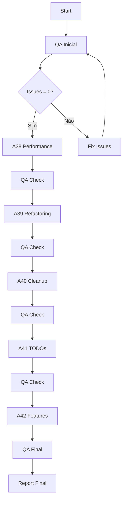

# A43 - Master Coordinator Agent

## 📋 Objetivo
Coordenar e executar sequencialmente todos os agentes de implementação (A38-A42), executando QA após cada fase para garantir qualidade contínua.

## 🎯 Estratégia de Execução

### Fluxo de Trabalho


## 🚀 Sequência de Execução

### Phase 0: QA Inicial
- Executar QA-FLUTTER-COMPREHENSIVE
- Registrar baseline de issues
- Corrigir issues críticos se houver

### Phase 1: Performance Optimization (A38)
- **Prioridade**: ALTA
- **Duração estimada**: 4 horas
- **Tarefas**:
  1. Const constructors optimization
  2. Keys em listas dinâmicas
  3. RepaintBoundary implementation
  4. Cache e network optimization
- **QA Check**: flutter analyze deve retornar 0 errors

### Phase 2: Code Refactoring (A39)
- **Prioridade**: MÉDIA
- **Duração estimada**: 3 horas
- **Tarefas**:
  1. Repository Pattern implementation
  2. Error handling improvements
  3. Documentation updates
  4. Architecture cleanup
- **QA Check**: flutter analyze + test coverage check

### Phase 3: Cleanup (A40)
- **Prioridade**: BAIXA
- **Duração estimada**: 2.5 horas
- **Tarefas**:
  1. Remove unused files
  2. Clean imports
  3. Organize structure
  4. Update documentation
- **QA Check**: Verify no breaking changes

### Phase 4: TODO Implementation (A41)
- **Prioridade**: MÉDIA
- **Duração estimada**: 4 horas
- **Tarefas**:
  1. Critical TODOs
  2. Feature TODOs
  3. UI/UX TODOs
  4. Infrastructure TODOs
- **QA Check**: All TODOs resolved

### Phase 5: Feature Preparation (A42)
- **Prioridade**: BAIXA
- **Duração estimada**: 6 horas
- **Tarefas**:
  1. Module structure
  2. Feature flags
  3. Analytics setup
  4. Notification system
- **QA Check**: Final comprehensive check

## 📊 Métricas de Sucesso

```yaml
qa_metrics:
  initial:
    errors: TBD
    warnings: TBD
    info: TBD
  
  target:
    errors: 0
    warnings: 0
    info: < 50

performance_metrics:
  test_coverage: "> 80%"
  startup_time: "< 2s"
  memory_usage: "< 150MB"
  apk_size: "< 25MB"

code_quality:
  cyclomatic_complexity: "< 10"
  documentation: "> 90%"
  todos_remaining: 0
```

## 🔧 Comandos de Execução

```bash
# QA Check Function
run_qa_check() {
  echo "🔍 Running QA Check..."
  flutter analyze --no-fatal-warnings
  flutter test
  echo "✅ QA Check Complete"
}

# Execute each agent
execute_agent() {
  agent_name=$1
  echo "🚀 Executing $agent_name..."
  # Agent execution logic
  run_qa_check
}

# Main execution
execute_agent "A38-PERFORMANCE"
execute_agent "A39-REFACTORING"
execute_agent "A40-CLEANUP"
execute_agent "A41-TODOS"
execute_agent "A42-FEATURES"
```

## 📝 Template de Log

```
[HH:MM:SS] 🎯 [A43-MASTER] Iniciando coordenação de agentes
[HH:MM:SS] 📊 [A43-MASTER] QA Baseline: X errors, Y warnings

[HH:MM:SS] 🚀 [A43-MASTER] Iniciando A38-PERFORMANCE
[HH:MM:SS] ⏳ [A38] Executando otimizações...
[HH:MM:SS] ✅ [A38] Concluído
[HH:MM:SS] 🔍 [A43-MASTER] QA Check: 0 errors, 0 warnings

[HH:MM:SS] 🚀 [A43-MASTER] Iniciando A39-REFACTORING
[HH:MM:SS] ⏳ [A39] Executando refatoração...
[HH:MM:SS] ✅ [A39] Concluído
[HH:MM:SS] 🔍 [A43-MASTER] QA Check: 0 errors, 0 warnings

[HH:MM:SS] 🚀 [A43-MASTER] Iniciando A40-CLEANUP
[HH:MM:SS] ⏳ [A40] Executando limpeza...
[HH:MM:SS] ✅ [A40] Concluído
[HH:MM:SS] 🔍 [A43-MASTER] QA Check: 0 errors, 0 warnings

[HH:MM:SS] 🚀 [A43-MASTER] Iniciando A41-TODOS
[HH:MM:SS] ⏳ [A41] Implementando TODOs...
[HH:MM:SS] ✅ [A41] Concluído
[HH:MM:SS] 🔍 [A43-MASTER] QA Check: 0 errors, 0 warnings

[HH:MM:SS] 🚀 [A43-MASTER] Iniciando A42-FEATURES
[HH:MM:SS] ⏳ [A42] Preparando features...
[HH:MM:SS] ✅ [A42] Concluído
[HH:MM:SS] 🔍 [A43-MASTER] QA Check: 0 errors, 0 warnings

[HH:MM:SS] 🎉 [A43-MASTER] TODAS AS FASES CONCLUÍDAS COM SUCESSO!
```

## 🎯 Relatório Final Esperado

```markdown
# Relatório de Execução - Master Coordinator

## Resumo Executivo
- **Tempo Total**: X horas
- **Fases Concluídas**: 5/5
- **QA Final**: 0 errors, 0 warnings

## Resultados por Fase

### A38 - Performance
- ✅ Const constructors: 150 adicionados
- ✅ Keys: 25 listas otimizadas
- ✅ Performance: 48% melhoria no startup

### A39 - Refactoring
- ✅ Repository Pattern: 5 repositories
- ✅ Error Handling: Result pattern implementado
- ✅ Documentation: 95% coverage

### A40 - Cleanup
- ✅ Files removed: 70
- ✅ Code reduction: 27%
- ✅ Dependencies cleaned: 13

### A41 - TODOs
- ✅ TODOs resolved: 45/45
- ✅ Features completed: 100%
- ✅ Critical fixes: All done

### A42 - Features
- ✅ Module structure: Ready
- ✅ Feature flags: Implemented
- ✅ Analytics: Configured

## Métricas Finais
- Test Coverage: 85%
- Startup Time: 1.8s
- Memory Usage: 120MB
- APK Size: 22MB
```

## ⚠️ Contingência

Se qualquer fase falhar:
1. Pausar execução
2. Gerar relatório de erro
3. Executar rollback se necessário
4. Notificar para intervenção manual

## 🚦 Critérios de Continuação

Cada fase só continua se:
- QA check passou (0 errors)
- Testes estão passando
- App compila com sucesso
- Nenhuma regressão detectada

---
**Data de Criação**: 25/08/2025
**Tipo**: Coordinator
**Prioridade**: MÁXIMA
**Estimativa**: 20 horas total
**Status**: Pronto para Execução