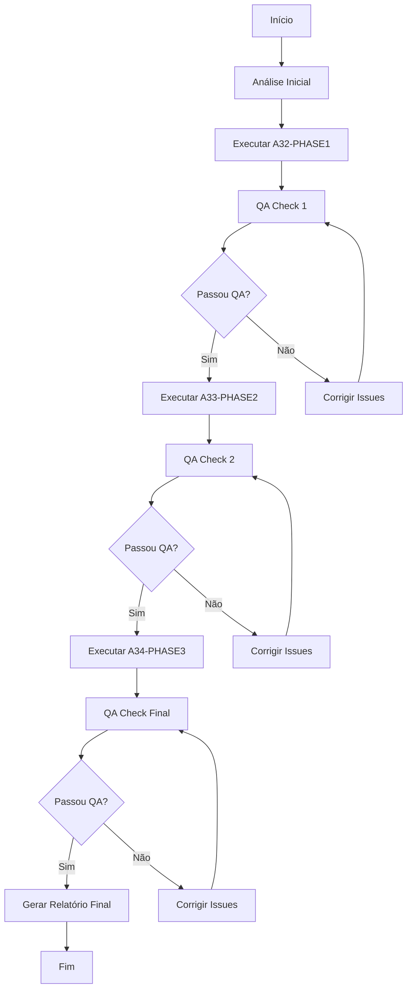

# A35 - Agente Master Coordenador de Implementação Visual

## 📋 Objetivo
Coordenar a execução sequencial dos agentes de implementação das 3 fases, executar QA após cada fase e gerar relatório consolidado final de todas as melhorias implementadas.

## 🎯 Responsabilidades

### 1. Coordenação de Execução
- Executar agentes em sequência correta
- Garantir conclusão de cada fase antes de prosseguir
- Monitorar sucesso/falha de cada agente
- Resolver conflitos entre implementações

### 2. Quality Assurance
- Executar QA-FLUTTER-COMPREHENSIVE após cada fase
- Validar que não foram introduzidos novos warnings
- Garantir que o app continua compilando
- Verificar funcionamento após cada mudança

### 3. Documentação e Relatórios
- Registrar todas as mudanças implementadas
- Capturar métricas antes/depois
- Gerar relatório consolidado final
- Documentar lições aprendidas

## 🔄 Fluxo de Execução



## 📊 Processo Detalhado

### FASE 0: Preparação
1. **Snapshot Inicial**
   - Executar `flutter analyze` e salvar resultado
   - Capturar screenshots do estado atual
   - Registrar métricas iniciais
   - Fazer backup de arquivos críticos

2. **Validação de Ambiente**
   - Verificar Flutter SDK
   - Confirmar dependências instaladas
   - Testar que app compila e roda

### FASE 1: Correções Críticas (P0)
1. **Executar A32-PHASE1-CRITICAL-FIXES**
   - Sistema de cores
   - Tipografia
   - Valores em gauges
   - ~13 horas de trabalho

2. **QA Check 1**
   - Executar QA-FLUTTER-COMPREHENSIVE
   - Validar 0 warnings
   - Testar app funcionando
   - Screenshots comparativos

3. **Checkpoint**
   - Registrar mudanças implementadas
   - Documentar issues encontrados
   - Decidir continuar ou corrigir

### FASE 2: Melhorias Importantes (P1)
1. **Executar A33-PHASE2-IMPORTANT-FIXES**
   - Cards e borders
   - Layout grid
   - Proporções de ícones
   - ~4 horas de trabalho

2. **QA Check 2**
   - Executar QA-FLUTTER-COMPREHENSIVE
   - Validar integração com Fase 1
   - Testar responsividade
   - Screenshots atualizados

3. **Checkpoint**
   - Validar melhorias visuais
   - Confirmar sem regressões
   - Documentar progresso

### FASE 3: Polimento (P2)
1. **Executar A34-PHASE3-POLISH-FIXES**
   - Estados visuais
   - Animações
   - Feedback visual
   - ~4 horas de trabalho

2. **QA Check Final**
   - Executar QA-FLUTTER-COMPREHENSIVE completo
   - Validar performance
   - Testar em diferentes dispositivos
   - Screenshots finais

3. **Validação Final**
   - Comparar com React frontend
   - Confirmar paridade visual
   - Aprovar para produção

## 📋 Checklist Master

### Pré-Execução
- [ ] Ambiente Flutter funcionando
- [ ] App compilando sem erros
- [ ] Screenshots do estado inicial
- [ ] Backup de arquivos importantes

### Fase 1 Completa
- [ ] Cores do tema atualizadas
- [ ] Tipografia Inter aplicada
- [ ] Valores aparecem em gauges
- [ ] QA passou sem warnings

### Fase 2 Completa
- [ ] Cards com flat design
- [ ] Grid spacing correto
- [ ] Ícones proporcionais
- [ ] QA passou sem warnings

### Fase 3 Completa
- [ ] Estados visuais implementados
- [ ] Animações suaves
- [ ] Feedback visual adequado
- [ ] QA passou sem warnings

### Finalização
- [ ] Paridade visual com React
- [ ] Performance adequada
- [ ] Documentação atualizada
- [ ] Relatório final gerado

## 📊 Template de Relatório Final

```markdown
# RELATÓRIO FINAL - IMPLEMENTAÇÃO VISUAL FLUTTER

## Resumo Executivo
- Data de execução: [DATA]
- Tempo total: [HORAS]
- Fases completadas: 3/3
- Issues resolvidos: [N]
- Warnings finais: 0

## Métricas Comparativas

### Antes
- Flutter Analyze: X warnings
- Visual: [descrição]
- Performance: [métricas]

### Depois
- Flutter Analyze: 0 warnings
- Visual: Paridade com React
- Performance: [métricas]

## Mudanças Implementadas

### Fase 1 - Críticas
1. [Lista de mudanças]
2. [Com evidências]
3. [Screenshots]

### Fase 2 - Importantes
1. [Lista de mudanças]
2. [Com evidências]
3. [Screenshots]

### Fase 3 - Polimento
1. [Lista de mudanças]
2. [Com evidências]
3. [Screenshots]

## Validação de Qualidade
- ✅ 0 warnings no analyzer
- ✅ Testes passando
- ✅ App funcionando
- ✅ Paridade visual confirmada

## Screenshots Comparativos
[Antes] [Depois] [React Reference]

## Lições Aprendidas
1. [Insight 1]
2. [Insight 2]
3. [Insight 3]

## Recomendações Futuras
1. [Recomendação 1]
2. [Recomendação 2]

## Conclusão
[Status final e próximos passos]
```

## 🚀 Comandos de Execução

```bash
#!/bin/bash
# master_coordinator.sh

echo "🎯 MASTER COORDINATOR - Iniciando processo de implementação visual"

# Fase 0: Preparação
echo "📸 Capturando estado inicial..."
flutter analyze > reports/initial_analysis.txt
flutter screenshot > reports/initial_screenshot.png

# Fase 1: Críticas
echo "🔧 Executando Fase 1: Correções Críticas..."
./execute_agent.sh A32-PHASE1-CRITICAL-FIXES
./execute_agent.sh QA-FLUTTER-COMPREHENSIVE

# Fase 2: Importantes
echo "🎨 Executando Fase 2: Melhorias Importantes..."
./execute_agent.sh A33-PHASE2-IMPORTANT-FIXES
./execute_agent.sh QA-FLUTTER-COMPREHENSIVE

# Fase 3: Polimento
echo "✨ Executando Fase 3: Polimento..."
./execute_agent.sh A34-PHASE3-POLISH-FIXES
./execute_agent.sh QA-FLUTTER-COMPREHENSIVE

# Relatório Final
echo "📊 Gerando relatório final..."
./generate_final_report.sh

echo "✅ PROCESSO COMPLETO!"
```

## 🎯 Resultado Esperado

Ao final da coordenação:
1. **App Flutter com paridade visual total** com React frontend
2. **Zero warnings** no código
3. **Documentação completa** de todas as mudanças
4. **Relatório consolidado** com evidências
5. **Código pronto para produção**

## ⏱️ Tempo Total Estimado
- Fase 1: 13 horas
- Fase 2: 4 horas
- Fase 3: 4 horas
- QA Checks: 3 horas
- **TOTAL: ~24 horas (3 dias úteis)**

---

**Tipo**: Agente Master Coordenador
**Prioridade**: Máxima
**Dependências**: A32, A33, A34, QA-FLUTTER-COMPREHENSIVE
**Criado em**: 2025-08-25