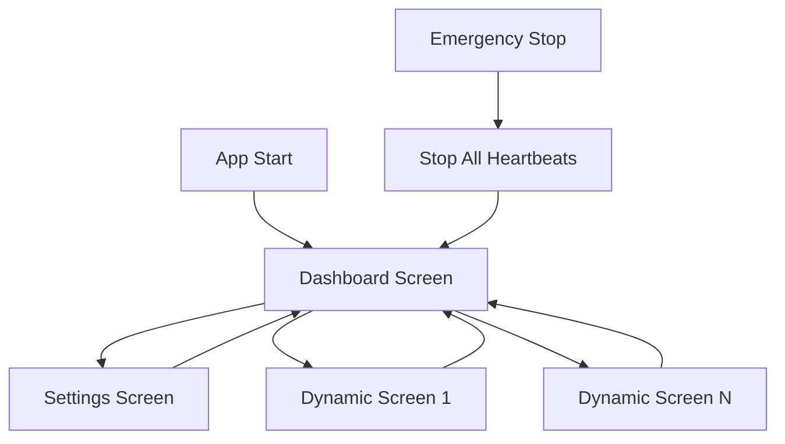

# 📱 Screens - AutoCore Flutter App

Documentação completa de todas as telas do aplicativo AutoCore Flutter.

## 🎯 Visão Geral

O aplicativo AutoCore possui uma arquitetura de telas dinâmicas baseada em configurações vindas do backend. As telas podem ser de dois tipos: estáticas (configuradas no código) e dinâmicas (configuradas através do backend).

## 📋 Tipos de Screens

### 🔧 Screens Estáticas
Telas fixas do aplicativo, sempre disponíveis:

- **[Dashboard](#dashboard-screen)** - Tela principal de navegação e controle
- **[Settings](#settings-screen)** - Configurações de conexão e preferências

### ⚡ Screens Dinâmicas
Telas geradas dinamicamente baseadas na configuração do backend:

- **Device Control Screens** - Telas de controle específicas por dispositivo
- **Custom Screens** - Telas personalizadas definidas pelo usuário

## 🏠 Dashboard Screen

**Arquivo**: `lib/features/dashboard/dashboard_screen.dart`  
**Rota**: `/` (tela inicial)  
**Provider**: `dashboardProvider`

### Funcionalidades

- **Vehicle Card** - Exibe informações do veículo e status do sistema
- **Screen Navigation** - Botões para acessar screens dinâmicas
- **Quick Actions** - Ações rápidas através de macros
- **Emergency Stop** - Botão de parada de emergência (FAB)

### Estado de Loading

- ✅ **Loading**: Exibe `CircularProgressIndicator`
- ❌ **Error**: Modo offline com botão "Tentar Novamente"
- ✅ **Success**: Exibe conteúdo completo

### Componentes Principais

1. **Vehicle Card**
   - Nome e modelo do veículo
   - Status do sistema (MQTT conectado)
   - Nível de bateria (quando disponível)
   - Temperatura (quando disponível)

2. **Screen Navigation Grid**
   - Grid responsivo (2 colunas mobile, 4 desktop)
   - Botões para cada screen dinâmica
   - Ícones personalizáveis por screen
   - Navegação via Go Router

3. **Quick Actions**
   - Lista horizontal de macros
   - ActionChips com emoji/ícone
   - Execução via API HTTP

### Interações do Usuário

```dart
// Navegação para screen dinâmica
onTap: () => context.go('/screen/$id')

// Execução de macro
onPressed: () => dashboardProvider.executeMacro(id)

// Botão de emergência
onPressed: () => HeartbeatService.emergencyStopAll()
```

### Estados de UI

- **Modo Online**: Todas as funcionalidades disponíveis
- **Modo Offline**: Exibe cache + botão reconectar
- **Loading**: Indicadores de carregamento durante ações

## ⚙️ Settings Screen

**Arquivo**: `lib/features/settings/settings_screen.dart`  
**Rota**: `/settings`  
**Provider**: `settingsProvider`

### Seções de Configuração

#### 1. API Backend (Gateway)
- Host/IP do backend AutoCore
- Porta de conexão (padrão: 8081)
- Opção HTTPS
- Validação de conectividade

#### 2. MQTT Broker
- Host/IP do broker MQTT
- Porta de conexão (padrão: 1883)
- Credenciais opcionais (usuário/senha)
- Teste de conexão MQTT

#### 3. Config Service
- Host/IP do serviço de configuração
- Porta de conexão (padrão: 8080)
- Opção HTTPS
- Validação de acesso

#### 4. Configurações Gerais
- Auto conectar na inicialização
- **Heartbeat** (crítico para segurança)
  - Habilitar/desabilitar heartbeat
  - Intervalo de heartbeat (100-2000ms)
  - Timeout de heartbeat (500-5000ms)

### Validações de Formulário

```dart
// Validação de host
validator: (value) {
  if (value == null || value.isEmpty) {
    return 'Campo obrigatório';
  }
  return null;
}

// Validação de porta
validator: (value) {
  final port = int.tryParse(value);
  if (port == null || port < 1 || port > 65535) {
    return 'Porta inválida (1-65535)';
  }
  return null;
}
```

### Teste de Conexões

O settings screen permite testar todas as conexões configuradas:

```dart
final results = {
  'api': await testApiConnection(),
  'mqtt': await testMqttConnection(),  
  'config': await testConfigConnection(),
};
```

### Persistência

Todas as configurações são persistidas usando SharedPreferences e carregadas automaticamente na inicialização do app.

## 🎯 Dynamic Screens

**Arquivos**: 
- `lib/core/widgets/dynamic/dynamic_screen.dart`
- `lib/core/widgets/dynamic/dynamic_route_screen.dart`
- `lib/core/widgets/dynamic/dynamic_widget_builder.dart`

### Carregamento de Configuração

As screens dinâmicas são carregadas do backend usando a API:

```dart
// Carregar configuração de screen
GET /api/screens/{screenId}

// Resposta esperada
{
  "id": 1,
  "name": "Iluminação",
  "icon": "lightbulb",
  "layout": {
    "type": "grid",
    "columns": 2,
    "widgets": [...]
  }
}
```

### Widgets Suportados

1. **Controle de Relé**
   - Switch toggle
   - Botão momentâneo
   - Status indicator

2. **Indicadores**
   - Gauge circular/linear
   - Status badge
   - Progress bar

3. **Containers**
   - Card container
   - Section divider
   - Spacer

### Sistema de Layout

```dart
enum LayoutType {
  grid,     // Grid responsivo
  column,   // Coluna vertical
  row,      // Linha horizontal
  stack,    // Empilhamento
}
```

### Responsividade

As screens dinâmicas se adaptam automaticamente ao dispositivo:

- **Mobile**: Layout otimizado para telas pequenas
- **Tablet**: Grid com mais colunas
- **Desktop**: Layout desktop com maior densidade

## 🔄 Navigation Flow



### Estrutura de Rotas

```dart
final routes = [
  GoRoute(
    path: '/',
    builder: (context, state) => DashboardScreen(),
  ),
  GoRoute(
    path: '/settings',
    builder: (context, state) => SettingsScreen(),
  ),
  GoRoute(
    path: '/screen/:id',
    builder: (context, state) => DynamicRouteScreen(
      screenId: state.pathParameters['id']!,
    ),
  ),
];
```

## 🚨 Sistema de Segurança

### Emergency Stop

Presente em todas as telas através do FloatingActionButton:

```dart
FloatingActionButton(
  onPressed: () {
    AppLogger.warning('EMERGENCY STOP ACTIVATED');
    HeartbeatService.instance.emergencyStopAll();
  },
  backgroundColor: Colors.red,
  child: Icon(Icons.stop),
);
```

### Heartbeat para Botões Momentâneos

Botões momentâneos (buzina, guincho) utilizam sistema de heartbeat:

```dart
// Iniciar heartbeat ao pressionar
onTapDown: (_) => HeartbeatService.startMomentary(deviceId, channel),

// Parar heartbeat ao soltar
onTapUp: (_) => HeartbeatService.stopMomentary(deviceId, channel),
```

## 📊 Métricas de Performance

### Tempo de Carregamento
- **Dashboard**: < 500ms (com cache)
- **Settings**: < 100ms (dados locais)
- **Dynamic Screens**: < 1000ms (primeira carga)

### Responsividade de UI
- **Animações**: 60 FPS consistente
- **Transições**: Suaves entre telas
- **Loading**: Estados intermediários claros

## 🧪 Testes

### Cenários de Teste

1. **Conectividade**
   - ✅ Online completo
   - ⚠️ Modo offline
   - ❌ Falha de conexão

2. **Dynamic Screens**
   - ✅ Carregamento bem-sucedido
   - ❌ Screen não encontrada
   - ⚠️ Configuração inválida

3. **Emergency Stop**
   - ✅ Parada imediata
   - ✅ Notificação visual
   - ✅ Log de segurança

### Testes de Widget

```dart
testWidgets('Dashboard should load screens', (tester) async {
  await tester.pumpWidget(AutoCoreApp());
  await tester.pumpAndSettle();
  
  expect(find.text('CONTROLES'), findsOneWidget);
  expect(find.byType(GridView), findsOneWidget);
});
```

## 🎨 Design System

### Cores por Estado
- **Online**: Verde (`successColor`)
- **Offline**: Laranja (`warningColor`)  
- **Erro**: Vermelho (`errorColor`)
- **Loading**: Azul (`primaryColor`)

### Tipografia
- **Títulos**: `fontSizeLarge` + `fontWeightBold`
- **Seções**: `fontSizeSmall` + `fontWeightBold` + `letterSpacing`
- **Corpo**: `fontSizeMedium` + `fontWeightNormal`

### Espaçamentos
- **Extra Small**: 4px (`spacingXs`)
- **Small**: 8px (`spacingSm`)
- **Medium**: 16px (`spacingMd`)
- **Large**: 24px (`spacingLg`)
- **Extra Large**: 32px (`spacingXl`)

---

**Próximos passos**: Ver [Widgets Customizados](../widgets/README.md) para detalhes dos componentes utilizados nas screens.