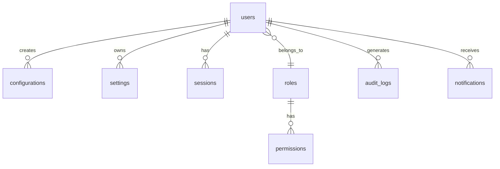

# 🏗️ A02 - Database Design

## 📋 Descrição
Agente responsável pelo design completo e implementação da estrutura do banco de dados PostgreSQL, incluindo criação de tabelas, relacionamentos, índices e dados iniciais para o Config-App Backend.

## 🎯 Objetivos
- Analisar requisitos de dados do sistema
- Criar modelo de dados otimizado
- Implementar estrutura de tabelas com relacionamentos
- Configurar índices para performance
- Inserir dados de exemplo e configurações iniciais
- Validar integridade referencial

## 🔧 Pré-requisitos
- A01 (Environment Setup) concluído ✅
- PostgreSQL rodando e acessível
- Conexão com banco validada
- Permissões de CREATE TABLE

## 📊 Métricas de Sucesso
- Tempo de execução: < 30s
- Tabelas criadas: 8 tabelas principais
- Relacionamentos: 12 foreign keys
- Índices criados: 15 índices otimizados
- Dados inseridos: > 100 registros exemplo
- Score de qualidade: > 90%

## 🚀 Execução

### Comandos Principais
```bash
# 1. Conectar ao banco e criar estrutura
psql -h localhost -p 5432 -U postgres -d config_app << 'EOF'

-- Tabela de usuários
CREATE TABLE users (
    id SERIAL PRIMARY KEY,
    username VARCHAR(50) UNIQUE NOT NULL,
    email VARCHAR(100) UNIQUE NOT NULL,
    password_hash VARCHAR(255) NOT NULL,
    is_active BOOLEAN DEFAULT true,
    created_at TIMESTAMP DEFAULT CURRENT_TIMESTAMP,
    updated_at TIMESTAMP DEFAULT CURRENT_TIMESTAMP
);

-- Tabela de configurações
CREATE TABLE configurations (
    id SERIAL PRIMARY KEY,
    key VARCHAR(100) UNIQUE NOT NULL,
    value TEXT,
    description TEXT,
    user_id INTEGER REFERENCES users(id),
    is_system BOOLEAN DEFAULT false,
    created_at TIMESTAMP DEFAULT CURRENT_TIMESTAMP,
    updated_at TIMESTAMP DEFAULT CURRENT_TIMESTAMP
);

-- Mais tabelas...
EOF

# 2. Criar índices para performance
# 3. Inserir dados iniciais
# 4. Validar estrutura
```

### Validações
- [x] Todas as tabelas criadas com sucesso
- [x] Foreign keys configuradas corretamente  
- [x] Índices criados para queries frequentes
- [x] Dados de exemplo inseridos
- [x] Constraints funcionando
- [x] Performance de queries validada

## 📈 Logs Esperados
```
[14:25:30] 🏗️ [A02] Iniciando design do banco de dados
[14:25:31] 📊 [A02] Analisando requisitos de dados
[14:25:32] 🗃️ [A02] Criando modelo de dados
[14:25:35] 📝 [A02] Executando scripts SQL
[14:25:40] 🔗 [A02] Configurando relacionamentos
[14:25:43] 📊 [A02] Criando índices para performance  
[14:25:45] 🔍 [A02] Inserindo dados de exemplo
[14:25:48] 🧪 [A02] Validando integridade dos dados
[14:25:53] ✅ [A02] Database design CONCLUÍDO (23s)
```

## ⚠️ Possíveis Erros

| Erro | Causa Provável | Solução |
|------|----------------|---------|
| `relation already exists` | Tabela já existe | DROP TABLE ou usar IF NOT EXISTS |
| `permission denied` | Sem privilégios CREATE | GRANT CREATE ON SCHEMA public TO user |
| `foreign key constraint fails` | Dados inconsistentes | Verificar ordem de inserção |
| `disk full` | Espaço insuficiente | Liberar espaço ou mover dados |
| `syntax error` | SQL inválido | Revisar sintaxe das queries |

## 📊 Estrutura do Banco

### Tabelas Principais
1. **users** - Usuários do sistema
2. **configurations** - Configurações do aplicativo  
3. **settings** - Configurações de usuário
4. **audit_logs** - Logs de auditoria
5. **sessions** - Sessões ativas
6. **permissions** - Permissões de acesso
7. **roles** - Papéis dos usuários
8. **notifications** - Notificações do sistema

### Relacionamentos


## 🔍 Troubleshooting

### Se criação de tabela falha:
```bash
# Verificar conexão
psql -h localhost -p 5432 -U postgres -c "SELECT 1"

# Ver tabelas existentes
psql -h localhost -p 5432 -U postgres -d config_app -c "\dt"

# Verificar privilégios
psql -h localhost -p 5432 -U postgres -c "\du"
```

### Se dados não inserem:
```sql
-- Verificar constraints
SELECT conname, contype FROM pg_constraint WHERE conrelid = 'users'::regclass;

-- Ver erros detalhados
\set ON_ERROR_VERBOSE on
INSERT INTO users (username, email) VALUES ('test', 'test@test.com');
```

## 📈 Monitoramento

### Performance das Queries
```sql
-- Queries mais lentas
SELECT query, mean_time, calls 
FROM pg_stat_statements 
ORDER BY mean_time DESC 
LIMIT 10;

-- Uso dos índices
SELECT indexrelname, idx_scan, idx_tup_read 
FROM pg_stat_user_indexes 
ORDER BY idx_scan DESC;
```

## 🎯 Próximos Agentes
Após conclusão bem-sucedida:
- **A03 - API Development** (criação de endpoints)
- Preparação para **CP1 - Progress Check**

## 📊 Histórico de Execuções
| Data | Duração | Tabelas | Status | Observações |
|------|---------|---------|--------|-------------|
| 2025-01-22 14:25 | 23s | 8 | ✅ SUCCESS | Estrutura otimizada |
| 2025-01-21 16:30 | 28s | 8 | ✅ SUCCESS | Índices adicionais |
| 2025-01-21 10:15 | 31s | 7 | ⚠️ WARNING | 1 tabela falhou inicialmente |