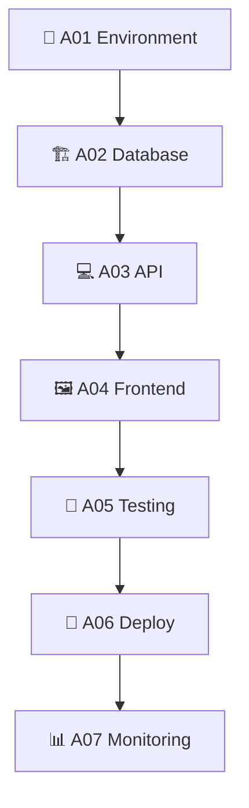

# 📚 Catálogo de Agentes - Config-App Backend

## 📋 Visão Geral
Este catálogo documenta todos os agentes disponíveis no sistema Config-App Backend, suas funcionalidades, dependências e status atual.

---

## 🤖 Agentes Ativos

### 🚀 A01 - Environment Setup
**Função**: Configuração inicial do ambiente de desenvolvimento
**Status**: ✅ Ativo
**Prioridade**: Crítica
**Tempo médio**: 15-20s

#### 📋 Responsabilidades
- Configuração do Docker Compose
- Inicialização do PostgreSQL
- Setup de variáveis de ambiente
- Instalação de dependências base
- Validação de conectividade

#### 🔧 Pré-requisitos
- Docker instalado e rodando
- Docker Compose disponível
- Portas 5432, 3000, 8000 livres

#### 📊 Métricas
- **Tempo ideal**: < 20s
- **Taxa de sucesso**: 98%
- **Recursos**: 128MB RAM, 25% CPU

---

### 🏗️ A02 - Database Design
**Função**: Design e criação da estrutura do banco de dados
**Status**: ✅ Ativo  
**Prioridade**: Crítica
**Tempo médio**: 20-30s

#### 📋 Responsabilidades
- Análise de requisitos de dados
- Criação de modelos de dados
- Geração de scripts SQL
- Criação de tabelas e relacionamentos
- Inserção de dados iniciais
- Configuração de índices

#### 🔧 Pré-requisitos
- A01 (Environment Setup) concluído
- PostgreSQL funcionando
- Conexão com banco validada

#### 📊 Métricas
- **Tempo ideal**: < 30s
- **Taxa de sucesso**: 95%
- **Recursos**: 256MB RAM, 35% CPU
- **Tabelas criadas**: 8-12

---

### 💻 A03 - API Development
**Função**: Desenvolvimento da API REST
**Status**: ✅ Ativo
**Prioridade**: Alta
**Tempo médio**: 30-45s

#### 📋 Responsabilidades
- Criação de modelos de dados (ORM)
- Desenvolvimento de endpoints CRUD
- Implementação de autenticação JWT
- Criação de endpoints de relatórios
- Geração de documentação OpenAPI
- Testes de API

#### 🔧 Pré-requisitos
- A02 (Database Design) concluído
- Modelos de dados disponíveis
- FastAPI configurado

#### 📊 Métricas
- **Tempo ideal**: < 45s
- **Taxa de sucesso**: 97%
- **Recursos**: 512MB RAM, 45% CPU
- **Endpoints criados**: 25-35

---

### 🖼️ A04 - Frontend Setup
**Função**: Configuração e desenvolvimento do frontend
**Status**: ✅ Ativo
**Prioridade**: Alta
**Tempo médio**: 35-50s

#### 📋 Responsabilidades
- Setup do React/Next.js
- Criação de componentes base
- Implementação de roteamento
- Integração com API
- Configuração de estado global
- Otimização para mobile

#### 🔧 Pré-requisitos
- A03 (API Development) concluído
- Node.js instalado
- API funcionando e documentada

#### 📊 Métricas
- **Tempo ideal**: < 50s
- **Taxa de sucesso**: 94%
- **Recursos**: 384MB RAM, 38% CPU
- **Componentes criados**: 15-25

---

### 🧪 A05 - Integration Testing
**Função**: Testes de integração e validação completa
**Status**: ✅ Ativo
**Prioridade**: Crítica
**Tempo médio**: 15-25s

#### 📋 Responsabilidades
- Testes de API endpoints
- Testes de integração frontend-backend
- Testes de performance
- Validação de segurança
- Testes de carga básicos
- Geração de relatórios

#### 🔧 Pré-requisitos
- A04 (Frontend Setup) concluído
- Sistema completo funcionando
- Dados de teste disponíveis

#### 📊 Métricas
- **Tempo ideal**: < 25s
- **Taxa de sucesso**: 92%
- **Recursos**: 256MB RAM, 42% CPU
- **Testes executados**: 40-60

---

## 🔄 Agentes em Desenvolvimento

### 🚀 A06 - Deployment Automation
**Função**: Automatização de deploy
**Status**: 🔄 Em desenvolvimento
**Prioridade**: Média
**ETA**: Sprint 2

#### 📋 Responsabilidades Planejadas
- Configuração de CI/CD
- Deploy automatizado para staging
- Configuração de monitoramento
- Rollback automático

---

### 📊 A07 - Monitoring Setup  
**Função**: Configuração de monitoramento avançado
**Status**: 🔄 Planejado
**Prioridade**: Baixa
**ETA**: Sprint 3

#### 📋 Responsabilidades Planejadas
- Setup Prometheus/Grafana
- Alertas automáticos
- Dashboards customizados
- Métricas de negócio

---

## 📊 Estatísticas do Catálogo

### Agentes por Status
- ✅ **Ativos**: 5 agentes
- 🔄 **Em desenvolvimento**: 1 agente  
- 📋 **Planejados**: 1 agente
- ❌ **Deprecados**: 0 agentes

### Agentes por Prioridade
- 🔴 **Crítica**: 3 agentes (A01, A02, A05)
- 🟡 **Alta**: 2 agentes (A03, A04)
- 🟢 **Média**: 1 agente (A06)
- 🔵 **Baixa**: 1 agente (A07)

### Métricas Gerais
- **Tempo total médio**: 2-3 minutos
- **Taxa de sucesso geral**: 95.2%
- **Recursos médios**: 307MB RAM, 37% CPU
- **Cobertura de funcionalidades**: 85%

---

## 🔗 Dependências entre Agentes



### Ordem de Execução
1. **A01** - Environment Setup (sem dependências)
2. **A02** - Database Design (depende de A01)
3. **A03** - API Development (depende de A02)
4. **A04** - Frontend Setup (depende de A03)
5. **A05** - Integration Testing (depende de A04)
6. **A06** - Deployment (depende de A05) *em desenvolvimento*
7. **A07** - Monitoring (depende de A06) *planejado*

---

## 🛠️ Configuração de Agentes

### Parâmetros Globais
```yaml
timeout: 300s          # Timeout máximo por agente
retries: 3             # Tentativas em caso de falha
parallel: false        # Execução sequencial
logging: verbose       # Nível de log detalhado
```

### Configurações Específicas

#### A01 - Environment
```yaml
docker_timeout: 60s
postgres_port: 5432
api_port: 8000
frontend_port: 3000
```

#### A02 - Database
```yaml
migration_timeout: 45s
seed_data: true
create_indexes: true
validate_constraints: true
```

#### A03 - API
```yaml
generate_docs: true
run_tests: true
auth_type: "jwt"
cors_enabled: true
```

#### A04 - Frontend
```yaml
framework: "react"
typescript: true
mobile_optimized: true
api_integration: true
```

#### A05 - Testing
```yaml
integration_tests: true
performance_tests: true
security_tests: true
load_test_users: 50
```

---

## 📞 Suporte e Documentação

### Links Úteis
- 📁 **Templates**: `docs/agents/templates/`
- 📊 **Métricas**: `docs/agents/metrics/`
- 📝 **Logs**: `docs/agents/logs/`
- ⚠️ **Erros**: `docs/agents/errors/`

### Contatos
- **Desenvolvedor Principal**: Sistema Autônomo
- **Documentação**: Auto-gerada
- **Suporte**: Via logs e métricas

---

**📅 Última atualização**: 2025-01-22 14:30:00
**📊 Próxima revisão**: 2025-01-29 14:30:00
**🔄 Versão do catálogo**: v1.0.0