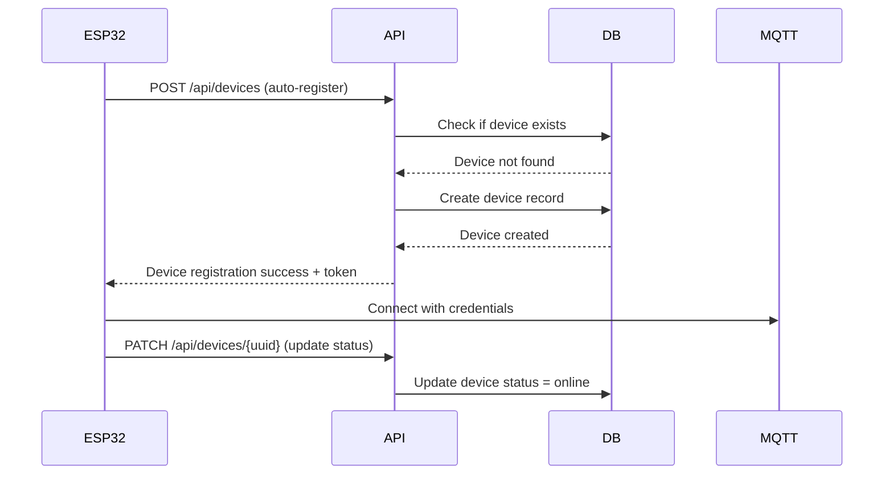
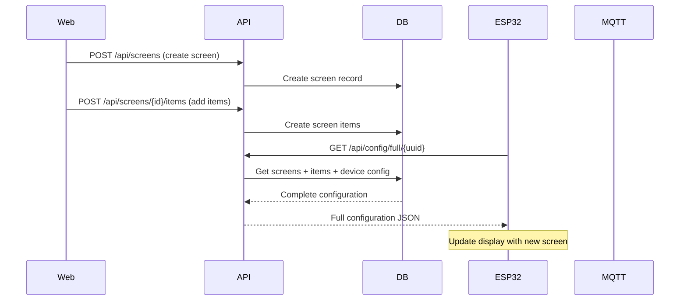
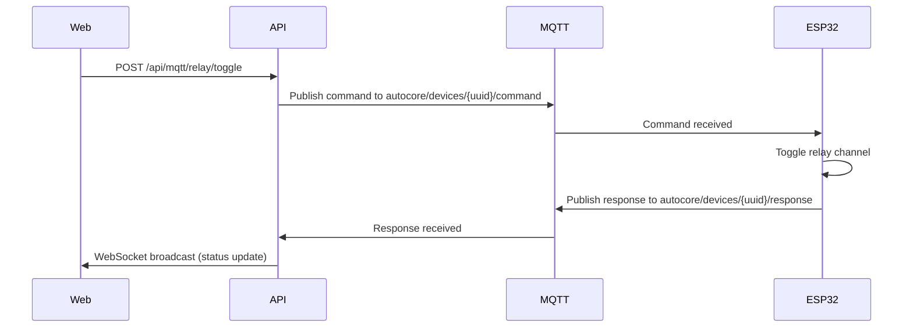
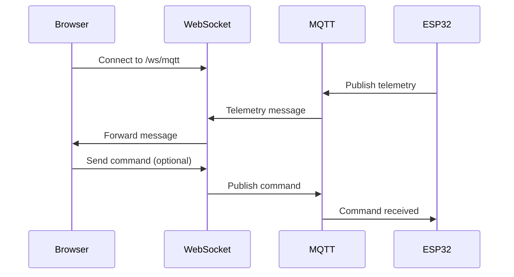

# Arquitetura do Sistema

Documentação da arquitetura do Config-App Backend.

## 📋 Visão Geral

O Config-App Backend é uma API REST moderna construída com FastAPI que serve como interface central de configuração para o ecossistema AutoCore. O sistema gerencia dispositivos ESP32, interfaces de usuário, controle de relés e monitoramento em tempo real.

## 🏗️ Arquitetura de Alto Nível

```
┌─────────────────────────────────────────────────────────┐
│                    Clients                              │
│  ┌─────────────┐ ┌─────────────┐ ┌─────────────────────┐ │
│  │ Web Browser │ │ Mobile App  │ │ ESP32 Devices       │ │
│  │ (Dashboard) │ │ (Control)   │ │ (Self-registration) │ │
│  └─────────────┘ └─────────────┘ └─────────────────────┘ │
└─────────────────┬───────────────────────────────────────┘
                  │ HTTP/HTTPS + WebSocket
┌─────────────────▼───────────────────────────────────────┐
│                Config-App API                          │
│         ┌─────────────────────────────────────┐        │
│         │            FastAPI                  │        │
│         │  ┌───────────┐ ┌─────────────────┐  │        │
│         │  │ REST API  │ │ WebSocket       │  │        │
│         │  │ Endpoints │ │ /ws/mqtt        │  │        │
│         │  └───────────┘ └─────────────────┘  │        │
│         └─────────────────────────────────────┘        │
│         ┌─────────────────────────────────────┐        │
│         │         Services Layer             │        │
│         │ ┌─────────┐ ┌─────────┐ ┌─────────┐ │        │
│         │ │  MQTT   │ │  Macro  │ │Telegram │ │        │
│         │ │Monitor  │ │Executor │ │Notifier │ │        │
│         │ └─────────┘ └─────────┘ └─────────┘ │        │
│         └─────────────────────────────────────┘        │
│         ┌─────────────────────────────────────┐        │
│         │        Repository Layer            │        │
│         │ ┌─────────┐ ┌─────────┐ ┌─────────┐ │        │
│         │ │Devices  │ │ Relays  │ │ Config  │ │        │
│         │ │  Repo   │ │  Repo   │ │  Repo   │ │        │
│         │ └─────────┘ └─────────┘ └─────────┘ │        │
│         └─────────────────────────────────────┘        │
└─────────────────┬───────────────────────────────────────┘
                  │ SQL Queries
┌─────────────────▼───────────────────────────────────────┐
│           Shared Database Layer                        │
│              PostgreSQL                                │
│   ┌─────────────┐ ┌─────────────┐ ┌─────────────────┐  │
│   │   Devices   │ │   Screens   │ │     Relays      │  │
│   │    Table    │ │   Tables    │ │    Tables       │  │
│   └─────────────┘ └─────────────┘ └─────────────────┘  │
└─────────────────────────────────────────────────────────┘

                  │ MQTT Protocol
┌─────────────────▼───────────────────────────────────────┐
│                MQTT Broker                             │
│              Eclipse Mosquitto                         │
│  ┌─────────────────────────────────────────────────────┐│
│  │ Topics: autocore/devices/{uuid}/command             ││
│  │         autocore/devices/{uuid}/response            ││
│  │         autocore/devices/{uuid}/status              ││
│  └─────────────────────────────────────────────────────┘│
└─────────────────────────────────────────────────────────┘
```

## 🔧 Componentes Principais

### 1. FastAPI Application (main.py)
- **Responsabilidade**: Ponto de entrada principal
- **Funcionalidades**:
  - Configuração da aplicação
  - Middleware CORS
  - Registro de routers
  - Lifespan management
  - Configuração WebSocket

### 2. API Layer
#### REST Endpoints
- **Dispositivos**: CRUD para dispositivos ESP32
- **Telas**: Configuração de interfaces
- **Relés**: Controle de placas e canais
- **Configuração**: Geração de configs completas
- **Sistema**: Status e health checks

#### WebSocket
- **Endpoint**: `/ws/mqtt`
- **Funcionalidade**: Streaming de mensagens MQTT em tempo real
- **Uso**: Monitoramento e debug de comunicação IoT

### 3. Services Layer
#### MQTT Monitor (`mqtt_monitor.py`)
- **Responsabilidade**: Cliente MQTT integrado
- **Funcionalidades**:
  - Conexão persistente com broker
  - Publicação de comandos
  - Subscrição a tópicos de dispositivos
  - Bridge entre MQTT e WebSocket

#### Macro Executor (`macro_executor.py`)
- **Responsabilidade**: Execução de sequências automatizadas
- **Funcionalidades**:
  - Execução de comandos em sequência
  - Delays configuráveis
  - Tratamento de erros
  - Status de execução

### 4. Repository Layer
#### Shared Repositories
- **Local**: `../../../database/shared/repositories/`
- **Padrão**: Repository pattern para abstração de dados
- **Principais**:
  - `devices`: Gerenciamento de dispositivos
  - `relays`: Controle de relés
  - `config`: Configurações de telas
  - `telemetry`: Dados de sensores
  - `events`: Log de eventos

### 5. Models Layer
#### Pydantic Models (`api/models/`)
- **Propósito**: Validação e serialização de dados
- **Estrutura**:
  - Request models (entrada)
  - Response models (saída)
  - Domain models (negócio)

### 6. Database Layer
#### PostgreSQL Compartilhado
- **Localização**: `../../../database/`
- **Característica**: Banco compartilhado entre múltiplas aplicações
- **Acesso**: Via repositories padronizados

## 📊 Fluxos de Dados

### 1. Auto-Registro de Dispositivo ESP32


### 2. Configuração de Tela


### 3. Controle de Relé via MQTT


### 4. Streaming MQTT via WebSocket


## 🔄 Patterns Utilizados

### 1. Repository Pattern
```python
# Abstração de acesso a dados
class DeviceRepository:
    def get_all(self) -> List[Device]:
        pass
    
    def get_by_uuid(self, uuid: str) -> Optional[Device]:
        pass
    
    def create(self, device_data: dict) -> Device:
        pass
```

### 2. Dependency Injection
```python
# Injeção de dependências via FastAPI
from fastapi import Depends

async def get_current_user(token: str = Depends(get_auth_token)) -> User:
    return validate_token(token)

@app.get("/api/protected")
async def protected_endpoint(user: User = Depends(get_current_user)):
    return {"user": user.username}
```

### 3. Event-Driven Architecture
```python
# Registro de eventos para auditoria
events.log(
    event_type="device",
    source="config-app",
    action="create",
    target=f"device_{device.id}",
    payload={"device_uuid": device.uuid}
)
```

### 4. Strategy Pattern
```python
# Diferentes estratégias de normalização
class DeviceTypeNormalizer:
    def normalize(self, device_type: str) -> str:
        strategies = {
            "ESP32_DISPLAY": "esp32_display",
            "ESP32DISPLAY": "esp32_display",
            "esp32-display": "esp32_display"
        }
        return strategies.get(device_type.upper(), device_type)
```

## 🚦 Estados e Ciclo de Vida

### Estado de Dispositivos
```
┌─────────────┐    register    ┌─────────────┐
│    New      │──────────────→│  Offline    │
│ (not saved) │                │  (created)  │
└─────────────┘                └─────────────┘
                                      │
                                   online
                                      ▼
                               ┌─────────────┐    disconnect   ┌─────────────┐
                               │   Online    │──────────────→│  Offline    │
                               │  (active)   │                │  (inactive) │
                               └─────────────┘                └─────────────┘
                                      │                              │
                                   error                         reconnect
                                      ▼                              │
                               ┌─────────────┐                      │
                               │    Error    │──────────────────────┘
                               │  (needs     │        recover
                               │  attention) │
                               └─────────────┘
```

### Ciclo de Vida de Configuração
```
Screen Created → Items Added → ESP32 Requests Config → Display Updated
      │               │                    │                  │
      ▼               ▼                    ▼                  ▼
  [Database]    [Database]         [API Response]     [Device Render]
```

## 🔐 Segurança

### Modelo de Segurança Atual
- **Status**: ⚠️ SEM AUTENTICAÇÃO (desenvolvimento)
- **Acesso**: Todos os endpoints públicos
- **Proteção**: Apenas via rede local/VPN

### Modelo de Segurança Planejado
```
Request → Load Balancer → API Gateway → JWT Validation → Rate Limiting → API Logic
                                                ↓
                                         User Context
                                               ↓
                                         Permission Check
```

## 📊 Performance

### Características de Performance
- **Latência Típica**: < 100ms para endpoints GET
- **Throughput**: ~1000 requests/second
- **Concurrent WebSocket**: ~100 conexões simultâneas
- **Database Pool**: 10 conexões simultâneas

### Otimizações Implementadas
- **Connection Pooling**: SQLAlchemy pool
- **Async Processing**: FastAPI async/await
- **Caching**: Response caching para configurações
- **Lazy Loading**: Carregamento sob demanda de dados

## 📈 Escalabilidade

### Dimensionamento Horizontal
```
Load Balancer
      │
   ┌──┴──┐
   │     │
API-1   API-2   API-3 (múltiplas instâncias)
   │     │       │
   └──┬──┴───────┘
      │
 Shared Database
```

### Limitações Atuais
- **Database**: Single point of failure
- **MQTT**: Single broker connection per instance
- **WebSocket**: Não compartilhado entre instâncias

### Melhorias Futuras
- Database clustering/replication
- MQTT broker clustering
- Redis para session/cache sharing
- WebSocket via Redis pub/sub

## 🛠️ Extensibilidade

### Pontos de Extensão
1. **Novos Tipos de Dispositivo**: Adicionar em `utils/normalizers.py`
2. **Novos Endpoints**: Criar router em `api/routes/`
3. **Novos Serviços**: Adicionar em `services/`
4. **Novos Eventos MQTT**: Expandir `mqtt_monitor.py`

### Plugin Architecture (Futuro)
```python
# Sistema de plugins para novos tipos de dispositivo
class DevicePlugin:
    def register_device(self, device_data: dict) -> Device:
        pass
    
    def generate_config(self, device: Device) -> dict:
        pass
```

## 📋 Documentação Relacionada

- [Schema do Banco de Dados](database-schema.md)
- [Diagrama de Componentes](component-diagram.md)  
- [Diagramas de Sequência](sequence-diagrams.md)
- [Visão Geral do Sistema](system-overview.md)

---

*Esta documentação reflete o estado atual do sistema e é atualizada conforme mudanças na arquitetura.*