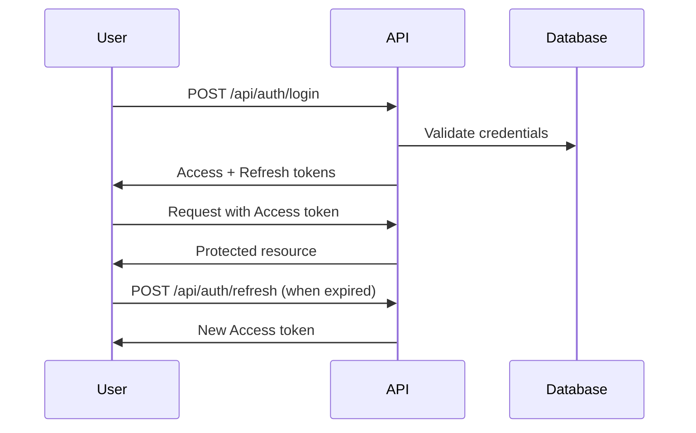
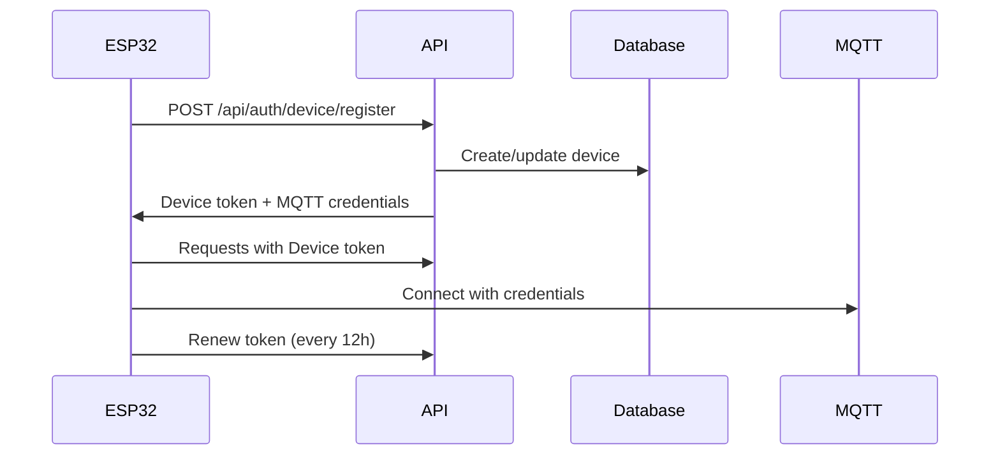

# Documentação de Segurança

Políticas, práticas e implementações de segurança para o Config-App Backend.

## 📋 Índice

### 🔒 Fundamentos
- [Políticas de Segurança](security-policies.md) - Diretrizes gerais de segurança
- [Melhores Práticas](best-practices.md) - Práticas recomendadas

### 🔐 Autenticação e Autorização  
- [Autenticação](authentication.md) - Sistema de autenticação
- [Autorização](authorization.md) - Controle de acesso

## ⚠️ Estado Atual da Segurança

### 🚨 ATENÇÃO - Ambiente de Desenvolvimento
**A API atualmente opera SEM AUTENTICAÇÃO** para facilitar desenvolvimento e integração com dispositivos ESP32.

#### Riscos Atuais
- **Acesso Público**: Todos os endpoints são acessíveis sem credenciais
- **Dados Expostos**: Configurações e telemetria sem proteção
- **Controle Irrestrito**: Qualquer um pode controlar dispositivos
- **Logs Expostos**: WebSocket MQTT aberto publicamente

#### Mitigações Temporárias
- **Rede Local**: API deve rodar apenas em redes privadas
- **Firewall**: Bloquear acesso externo à porta 8081
- **VPN**: Acessar apenas via VPN corporativa
- **Monitoramento**: Logs de todas as requisições

## 🎯 Modelo de Segurança Planejado

### Arquitetura de Segurança
```
┌─────────────────────────────────────────────────────────┐
│                  Internet/WAN                          │
└─────────────────┬───────────────────────────────────────┘
                  │ HTTPS + Certificate Pinning
┌─────────────────▼───────────────────────────────────────┐
│              Load Balancer                             │
│         (SSL Termination + WAF)                       │
└─────────────────┬───────────────────────────────────────┘
                  │ mTLS
┌─────────────────▼───────────────────────────────────────┐
│           API Gateway/Proxy                            │
│     (Rate Limiting + Auth + Logging)                  │
└─────────────────┬───────────────────────────────────────┘
                  │ JWT Tokens
┌─────────────────▼───────────────────────────────────────┐
│            Config-App API                              │
│        (FastAPI + Auth Middleware)                    │
└─────────────────┬───────────────────────────────────────┘
                  │ Encrypted Connection
┌─────────────────▼───────────────────────────────────────┐
│         PostgreSQL Database                           │
│    (Row Level Security + Audit)                      │
└─────────────────────────────────────────────────────────┘
```

## 🔐 Níveis de Acesso

### 1. Administrador (admin)
**Permissões Totais**
- Gerenciamento de usuários e permissões
- Configurações globais do sistema
- Acesso a logs e auditoria
- Controle total de dispositivos
- Backup e restore do sistema

**Endpoints**:
- `GET/POST/PUT/DELETE /api/*` - Acesso total
- `GET /api/admin/*` - Endpoints administrativos
- `GET /api/audit/*` - Logs de auditoria

### 2. Operador (operator)  
**Controle Operacional**
- Configuração de dispositivos
- Gerenciamento de telas e UI
- Controle de relés
- Monitoramento de telemetria
- Execução de macros

**Endpoints**:
- `GET /api/devices` - Listar dispositivos
- `PATCH /api/devices/{id}` - Atualizar dispositivos
- `POST /api/relays/*/toggle` - Controlar relés
- `GET/POST /api/screens` - Gerenciar telas
- `WS /ws/mqtt` - WebSocket (read-only)

### 3. Visualizador (viewer)
**Apenas Leitura**
- Visualização de dashboards
- Monitoramento de telemetria
- Status de dispositivos
- Logs básicos (sem dados sensíveis)

**Endpoints**:
- `GET /api/devices` - Listar (dados limitados)
- `GET /api/telemetry/*` - Dados de telemetria  
- `GET /api/status` - Status do sistema
- `WS /ws/mqtt` - WebSocket (filtered)

### 4. Dispositivo (device)
**Auto-Gestão**
- Auto-registro no sistema
- Atualização de status próprio
- Envio de telemetria
- Recebimento de comandos

**Endpoints**:
- `POST /api/devices` - Auto-registro
- `PATCH /api/devices/{own_id}` - Atualizar próprio status
- `POST /api/telemetry` - Enviar telemetria
- `GET /api/config/full/{own_uuid}` - Própria configuração

## 🔑 Autenticação

### JWT Tokens
```json
{
  "sub": "user_id_or_device_uuid",
  "username": "admin",
  "roles": ["admin", "operator"],
  "permissions": ["devices:write", "relays:control"],
  "device_uuid": "esp32-001",  // Para dispositivos
  "iat": 1642867200,
  "exp": 1642870800
}
```

### Tipos de Token

#### 1. Access Token (1 hora)
- Usado para autenticação de requisições
- Contém roles e permissions
- Expira rapidamente para reduzir riscos
- Incluso no header: `Authorization: Bearer <token>`

#### 2. Refresh Token (30 dias)
- Usado para renovar access tokens
- Armazenado de forma segura (httpOnly cookie)
- Pode ser revogado individualmente
- Rotacionado a cada uso

#### 3. Device Token (24 horas)
- Específico para dispositivos ESP32
- Contém device_uuid e permissions limitadas
- Renovado automaticamente pelo dispositivo
- Inclui credenciais MQTT

### Fluxo de Autenticação

#### Usuários


#### Dispositivos ESP32


## 🛡️ Autorização

### RBAC (Role-Based Access Control)
```python
# Decorator para verificar permissões
from functools import wraps
from fastapi import HTTPException, Depends

def require_permission(permission: str):
    def decorator(func):
        @wraps(func)
        async def wrapper(*args, current_user=Depends(get_current_user), **kwargs):
            if not current_user.has_permission(permission):
                raise HTTPException(403, f"Permission required: {permission}")
            return await func(*args, **kwargs)
        return wrapper
    return decorator

# Uso nos endpoints
@app.patch("/api/devices/{device_id}")
@require_permission("devices:write")
async def update_device(device_id: int, current_user: User = Depends(get_current_user)):
    # Implementação
```

### Middleware de Autenticação
```python
from fastapi import Request, HTTPException
from jose import jwt, JWTError

async def auth_middleware(request: Request, call_next):
    # Endpoints públicos
    public_paths = ["/", "/api/health", "/docs", "/openapi.json"]
    
    if request.url.path in public_paths:
        response = await call_next(request)
        return response
    
    # Verificar token
    authorization = request.headers.get("Authorization")
    if not authorization or not authorization.startswith("Bearer "):
        raise HTTPException(401, "Authentication required")
    
    try:
        token = authorization.split(" ")[1]
        payload = jwt.decode(token, SECRET_KEY, algorithms=[ALGORITHM])
        request.state.user = payload
    except JWTError:
        raise HTTPException(401, "Invalid token")
    
    response = await call_next(request)
    return response
```

## 🔒 Proteção de Dados

### Dados Sensíveis
#### Criptografia em Trânsito
- **HTTPS obrigatório** em produção
- **TLS 1.3** mínimo
- **Certificate pinning** para apps móveis
- **mTLS** entre serviços internos

#### Criptografia em Repouso
- **Database encryption** (PostgreSQL TDE)
- **Secrets encryption** (Kubernetes secrets)
- **Backup encryption** (AES-256)

### Sanitização de Logs
```python
import re
import logging

class SanitizingFormatter(logging.Formatter):
    """Remove dados sensíveis dos logs"""
    
    SENSITIVE_PATTERNS = [
        (r'"password":\s*"[^"]*"', '"password": "***"'),
        (r'"token":\s*"[^"]*"', '"token": "***"'),
        (r'"secret":\s*"[^"]*"', '"secret": "***"'),
        (r'Bearer\s+[A-Za-z0-9\-_]+\.[A-Za-z0-9\-_]+\.[A-Za-z0-9\-_]+', 'Bearer ***'),
    ]
    
    def format(self, record):
        message = super().format(record)
        for pattern, replacement in self.SENSITIVE_PATTERNS:
            message = re.sub(pattern, replacement, message)
        return message
```

## 🚨 Monitoramento de Segurança

### Logs de Auditoria
```python
def log_security_event(event_type: str, user_id: str, details: dict):
    """Registra eventos de segurança"""
    security_logger.warning(f"🔐 SECURITY EVENT", extra={
        "event_type": event_type,
        "user_id": user_id,
        "timestamp": datetime.utcnow().isoformat(),
        "ip_address": get_client_ip(),
        "user_agent": get_user_agent(),
        "details": details
    })

# Eventos importantes
log_security_event("LOGIN_SUCCESS", user.id, {"username": user.username})
log_security_event("LOGIN_FAILED", None, {"username": attempted_username})
log_security_event("PERMISSION_DENIED", user.id, {"endpoint": request.url.path})
log_security_event("DEVICE_REGISTERED", device.id, {"device_uuid": device.uuid})
```

### Rate Limiting
```python
from slowapi import Limiter, _rate_limit_exceeded_handler
from slowapi.util import get_remote_address
from slowapi.errors import RateLimitExceeded

limiter = Limiter(key_func=get_remote_address)

# Rate limits por endpoint
@app.post("/api/auth/login")
@limiter.limit("5/minute")  # Max 5 tentativas por minuto
async def login(request: Request, credentials: LoginRequest):
    pass

@app.get("/api/devices")
@limiter.limit("100/minute")  # Max 100 requests por minuto
async def get_devices(request: Request):
    pass

# Rate limit para dispositivos
@app.post("/api/devices")
@limiter.limit("1/minute")  # Apenas 1 registro por minuto
async def create_device(request: Request, device: DeviceBase):
    pass
```

### Detecção de Anomalias
```python
class SecurityMonitor:
    """Monitor de segurança para detectar anomalias"""
    
    def __init__(self):
        self.failed_logins = defaultdict(int)
        self.suspicious_ips = set()
    
    def check_failed_login(self, ip: str, username: str):
        """Detecta tentativas de login suspeitas"""
        self.failed_logins[ip] += 1
        
        if self.failed_logins[ip] > 10:  # 10 falhas
            self.suspicious_ips.add(ip)
            self.alert_security_team(f"Possible brute force from {ip}")
    
    def check_unusual_activity(self, user_id: str, endpoint: str):
        """Detecta atividade incomum"""
        # Verificar padrões anômalos
        # Ex: admin acessando endpoints de dispositivo
        # Ex: usuário fazendo muitas requisições rapidamente
        pass
```

## 🔥 Plano de Resposta a Incidentes

### Severidade dos Incidentes

#### 🔴 Crítico
- **Acesso não autorizado** a dados sensíveis
- **Controle comprometido** de dispositivos críticos
- **Vazamento de credenciais** ou tokens
- **Injeção de código** malicioso

**Resposta**: Imediata (< 15 minutos)

#### 🟠 Alto
- **Tentativas de brute force** bem-sucedidas
- **Exploração de vulnerabilidades** conhecidas
- **Bypass de autenticação** em endpoints específicos
- **DoS/DDoS** afetando disponibilidade

**Resposta**: Rápida (< 1 hora)

#### 🟡 Médio
- **Múltiplas tentativas de login** falhadas
- **Padrões de acesso anômalos**
- **Vulnerabilidades** não críticas descobertas
- **Configurações** de segurança incorretas

**Resposta**: Moderada (< 4 horas)

### Procedimentos de Resposta

#### 1. Contenção Imediata
```bash
# Bloquear IP suspeito
iptables -A INPUT -s SUSPICIOUS_IP -j DROP

# Revogar tokens comprometidos
kubectl exec deployment/config-app -- python -c "revoke_all_tokens()"

# Desabilitar usuário suspeito
kubectl exec deployment/config-app -- python -c "disable_user('suspicious_user')"

# Modo de manutenção
kubectl scale deployment/config-app --replicas=0
```

#### 2. Investigação
- Analisar logs de auditoria
- Identificar escopo do comprometimento  
- Documentar evidências
- Determinar causa raiz

#### 3. Recuperação
- Aplicar correções de segurança
- Restaurar sistemas afetados
- Validar integridade dos dados
- Reativar serviços gradualmente

#### 4. Pós-Incidente
- Atualizar políticas de segurança
- Melhorar detecção de ameaças
- Treinar equipe em novos procedimentos
- Comunicar stakeholders

## ✅ Checklist de Implementação

### Fase 1: Autenticação Básica
- [ ] Implementar JWT tokens
- [ ] Criar endpoints de login/logout
- [ ] Middleware de autenticação
- [ ] Hash seguro de senhas (bcrypt)
- [ ] Refresh token mechanism

### Fase 2: Autorização
- [ ] Sistema RBAC completo
- [ ] Decorators de permissão
- [ ] Autorização por endpoint
- [ ] Autenticação de dispositivos
- [ ] Scopes granulares

### Fase 3: Hardening
- [ ] HTTPS obrigatório
- [ ] Rate limiting
- [ ] Input validation
- [ ] SQL injection prevention
- [ ] XSS protection

### Fase 4: Monitoramento
- [ ] Logs de auditoria
- [ ] Alertas de segurança
- [ ] Métricas de falhas
- [ ] Dashboard de segurança
- [ ] Detecção de anomalias

### Fase 5: Compliance
- [ ] Documentação de segurança
- [ ] Políticas de acesso
- [ ] Procedimentos de incidente
- [ ] Treinamento da equipe
- [ ] Testes de penetração

## 📚 Recursos Adicionais

### Ferramentas de Segurança
- **Bandit** - Scanner de vulnerabilidades Python
- **Safety** - Checker de dependências vulneráveis  
- **OWASP ZAP** - Teste de penetração web
- **Semgrep** - Análise estática de código
- **Trivy** - Scanner de vulnerabilidades em containers

### Padrões e Frameworks
- **OWASP Top 10** - Principais riscos de segurança web
- **NIST Cybersecurity Framework** - Framework de cibersegurança
- **ISO 27001** - Padrão de gestão de segurança da informação
- **CIS Controls** - Controles críticos de segurança

### Treinamentos Recomendados
- Secure coding practices
- OWASP security awareness
- Incident response procedures
- DevSecOps best practices

---

*A segurança é responsabilidade de toda a equipe. Mantenha-se atualizado e reporte sempre questões de segurança!*