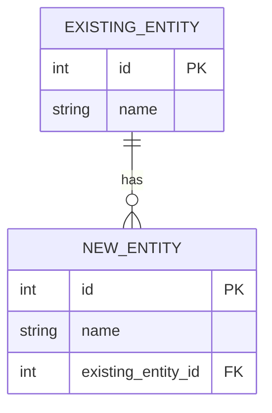
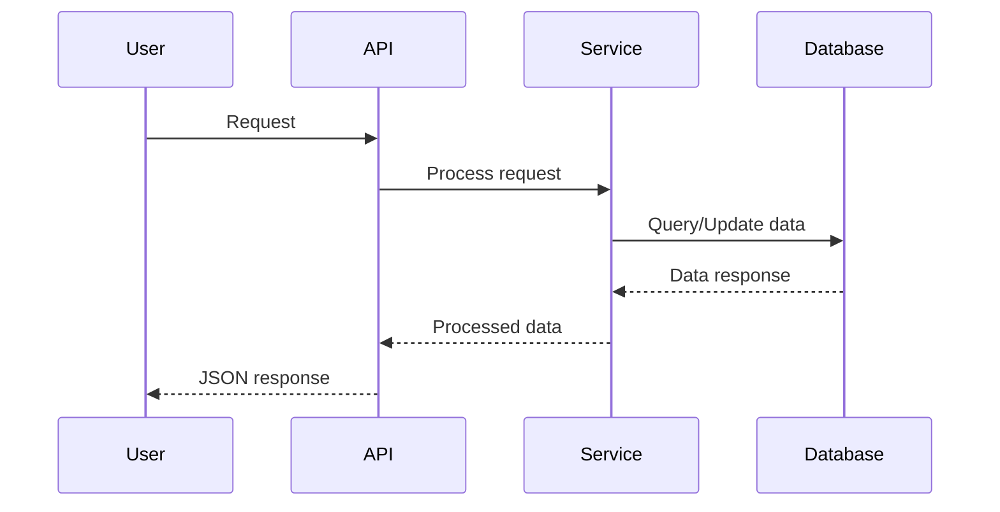

# Feature - [Nome da Feature]

Template para documentar novas funcionalidades do Config-App Backend.

## 📋 Informações Básicas

- **Status**: `Planejado|Em Desenvolvimento|Concluído|Depreciado`
- **Versão**: `v2.x.x`
- **Prioridade**: `Alta|Média|Baixa`
- **Responsável**: `@nome-desenvolvedor`
- **Data de Início**: `DD/MM/YYYY`
- **Data de Conclusão**: `DD/MM/YYYY`

## 📝 Descrição

### Problema que Resolve
[Descreva claramente o problema ou necessidade que esta feature atende]

### Solução Proposta
[Descreva como a feature resolve o problema identificado]

### Valor para o Usuário
[Explique o benefício que a feature traz para os usuários finais]

## 🎯 Objetivos

### Objetivo Principal
[Descreva o objetivo principal da feature]

### Objetivos Secundários
- [ ] Objetivo secundário 1
- [ ] Objetivo secundário 2
- [ ] Objetivo secundário 3

## 👥 Stakeholders

### Usuários Impactados
- **Administradores**: Como são impactados
- **Operadores**: Como são impactados  
- **Dispositivos ESP32**: Como são impactados
- **Sistemas Externos**: Como são impactados

### Equipes Envolvidas
- **Backend**: Responsabilidades específicas
- **Frontend**: Interfaces necessárias
- **DevOps**: Infraestrutura e deploy
- **QA**: Estratégia de testes

## 🏗️ Arquitetura

### Componentes Afetados
```
┌─────────────────────────────────────────────────────────┐
│                  [Component 1]                         │
│              [Detailed Description]                    │
└─────────────────┬───────────────────────────────────────┘
                  │ [Connection Type]
┌─────────────────▼───────────────────────────────────────┐
│                  [Component 2]                         │
│              [Detailed Description]                    │
└─────────────────┬───────────────────────────────────────┘
                  │ [Connection Type]  
┌─────────────────▼───────────────────────────────────────┐
│                  [Component 3]                         │
│              [Detailed Description]                    │
└─────────────────────────────────────────────────────────┘
```

### Novos Componentes
| Componente | Responsabilidade | Tecnologia |
|------------|------------------|------------|
| `[Component]` | [Responsibility] | [Tech Stack] |

### Componentes Modificados
| Componente | Modificações | Impacto |
|------------|--------------|---------|
| `[Component]` | [Changes] | `Alto|Médio|Baixo` |

## 📊 Modelo de Dados

### Novas Entidades
```python
class NewEntity(BaseModel):
    """Descrição da nova entidade"""
    id: int
    name: str
    description: Optional[str] = None
    config_json: Optional[str] = None
    is_active: bool = True
    created_at: datetime
    updated_at: datetime
    
    class Config:
        orm_mode = True
```

### Modificações em Entidades Existentes
```python
# Alterações na tabela existing_table
ALTER TABLE existing_table ADD COLUMN new_field VARCHAR(100);
ALTER TABLE existing_table ADD COLUMN another_field INTEGER DEFAULT 0;
```

### Relacionamentos


## 🔗 API Endpoints

### Novos Endpoints
| Método | Endpoint | Descrição | Autenticação |
|--------|----------|-----------|--------------|
| `GET` | `/api/[resource]` | Lista recursos | ✅ |
| `POST` | `/api/[resource]` | Cria recurso | ✅ |
| `GET` | `/api/[resource]/{id}` | Busca por ID | ✅ |
| `PATCH` | `/api/[resource]/{id}` | Atualiza recurso | ✅ |
| `DELETE` | `/api/[resource]/{id}` | Remove recurso | ✅ |

### Endpoints Modificados
| Endpoint | Modificações | Backward Compatible |
|----------|--------------|-------------------|
| `/api/existing` | Novos campos na response | ✅ Sim |
| `/api/another` | Novo parâmetro opcional | ✅ Sim |

## 🔧 Implementação

### Estrutura de Arquivos
```
api/
├── models/
│   ├── [new_model].py         # Novo modelo Pydantic
│   └── [existing_model].py    # Modificações
├── routes/
│   ├── [new_resource].py      # Novos endpoints
│   └── [existing_routes].py   # Modificações
├── services/
│   ├── [new_service].py       # Nova lógica de negócio
│   └── [existing_service].py  # Modificações
└── utils/
    └── [new_utility].py       # Novos utilitários
```

### Fluxo de Dados


### Configurações Necessárias
```python
# Novas variáveis de ambiente
NEW_FEATURE_ENABLED: bool = True
NEW_FEATURE_CONFIG: str = "default_value"
NEW_FEATURE_TIMEOUT: int = 30
```

## 🧪 Testes

### Estratégia de Testes
- **Testes Unitários**: Cobertura mínima de 90%
- **Testes de Integração**: Fluxos principais
- **Testes de API**: Todos os endpoints novos
- **Testes de Performance**: Benchmarks específicos

### Casos de Teste Principais
1. **Criação de Recurso**
   - ✅ Sucesso com dados válidos
   - ❌ Falha com dados inválidos
   - ❌ Falha sem autenticação

2. **Busca de Recurso**
   - ✅ Encontrado
   - ❌ Não encontrado
   - ❌ Sem permissão

3. **Atualização de Recurso**
   - ✅ Atualização parcial
   - ✅ Atualização completa
   - ❌ Recurso inexistente

### Dados de Teste
```python
# Fixtures para testes
@pytest.fixture
def sample_new_entity():
    return {
        "name": "Test Entity",
        "description": "Entity for testing",
        "is_active": True
    }

@pytest.fixture
def created_entity(sample_new_entity):
    # Criar entidade no banco de testes
    pass
```

## 📈 Métricas e Monitoramento

### Métricas de Sucesso
| Métrica | Objetivo | Baseline |
|---------|----------|----------|
| Response Time | < 200ms | N/A |
| Error Rate | < 1% | N/A |
| Adoption Rate | > 80% | 0% |

### Monitoramento
- **Dashboards**: Grafana dashboard específico
- **Alertas**: Configurar para erros e latência
- **Logs**: Structured logging para eventos importantes

### KPIs
- **Functional**: Número de recursos criados/dia
- **Technical**: Latência média dos endpoints
- **Business**: Impacto na eficiência operacional

## 📋 Checklist de Implementação

### Desenvolvimento
- [ ] Modelos de dados implementados
- [ ] Migrations criadas e testadas
- [ ] Endpoints implementados
- [ ] Validações de input
- [ ] Lógica de negócio
- [ ] Testes unitários (>90% cobertura)
- [ ] Testes de integração
- [ ] Documentação da API
- [ ] Code review aprovado

### Deploy
- [ ] Variáveis de ambiente configuradas
- [ ] Migrations executadas em staging
- [ ] Testes end-to-end em staging
- [ ] Performance testada
- [ ] Rollback plan definido
- [ ] Monitoramento configurado
- [ ] Deploy em produção
- [ ] Smoke tests em produção

### Pós-Deploy
- [ ] Métricas coletadas
- [ ] Feedback dos usuários
- [ ] Documentação atualizada
- [ ] Training materials criados
- [ ] Lessons learned documentadas

## 🔄 Migration Plan

### Base de Dados
```sql
-- Migration script
BEGIN;

-- Criar nova tabela
CREATE TABLE new_entities (
    id SERIAL PRIMARY KEY,
    name VARCHAR(100) NOT NULL,
    description TEXT,
    is_active BOOLEAN DEFAULT TRUE,
    created_at TIMESTAMP DEFAULT NOW(),
    updated_at TIMESTAMP DEFAULT NOW()
);

-- Adicionar índices
CREATE INDEX idx_new_entities_name ON new_entities(name);
CREATE INDEX idx_new_entities_active ON new_entities(is_active);

-- Migrar dados existentes (se necessário)
-- INSERT INTO new_entities (name, description) 
-- SELECT name, description FROM existing_table;

COMMIT;
```

### Rollback Plan
```sql
-- Rollback script
BEGIN;

-- Remover nova tabela
DROP TABLE IF EXISTS new_entities CASCADE;

-- Remover colunas adicionadas (se aplicável)
-- ALTER TABLE existing_table DROP COLUMN IF EXISTS new_field;

COMMIT;
```

### Feature Flags
```python
# Usar feature flags para rollout gradual
if config.NEW_FEATURE_ENABLED:
    # Nova implementação
    return new_implementation()
else:
    # Implementação original
    return legacy_implementation()
```

## 🚀 Rollout Strategy

### Fases do Rollout
1. **Fase 1** (5%): Internal testing
2. **Fase 2** (25%): Power users
3. **Fase 3** (50%): Half of user base  
4. **Fase 4** (100%): All users

### Critérios de Avanço
- Error rate < 1%
- Performance metrics within SLA
- Positive user feedback
- No critical bugs reported

## 📚 Documentação

### Para Desenvolvedores
- [Guia de Desenvolvimento](../development/README.md)
- [API Reference](../api/README.md)
- Código com comentários detalhados

### Para Usuários
- User guide atualizado
- API documentation updates
- Migration guide (se breaking changes)

### Para Operações
- Runbooks atualizados
- Monitoring guide
- Troubleshooting guide

## ⚠️ Riscos e Mitigações

### Riscos Técnicos
| Risco | Probabilidade | Impacto | Mitigação |
|-------|---------------|---------|-----------|
| Performance degradation | Média | Alto | Load testing, optimization |
| Data corruption | Baixa | Crítico | Backup, transactions |
| Breaking changes | Baixa | Alto | Backward compatibility |

### Riscos de Negócio
| Risco | Probabilidade | Impacto | Mitigação |
|-------|---------------|---------|-----------|
| User adoption | Média | Médio | Training, documentation |
| Operational overhead | Baixa | Médio | Automation, monitoring |

## 🔮 Trabalho Futuro

### Melhorias Planejadas
- [ ] Otimização de performance
- [ ] Recursos adicionais
- [ ] Integração com sistemas externos

### Dependências
- Feature B depende desta feature
- Migração de sistema legado
- Atualização de infraestrutura

## 📞 Contatos

### Responsáveis Técnicos
- **Lead Developer**: @nome-dev
- **Architect**: @nome-architect
- **DevOps**: @nome-devops

### Stakeholders
- **Product Owner**: @nome-po
- **Technical Lead**: @nome-tl

---

## ✏️ Como Usar Este Template

1. **Copie este arquivo** para `docs/features/[nome-feature].md`
2. **Preencha todas as seções** relevantes para sua feature
3. **Remova seções** não aplicáveis
4. **Adicione diagramas** e detalhes técnicos específicos
5. **Revise com a equipe** antes de iniciar implementação
6. **Mantenha atualizado** durante desenvolvimento

### Placeholders a Substituir
- `[Nome da Feature]` → Nome descritivo da feature
- `[resource]` → Nome do recurso/endpoint
- `@nome-*` → Nomes reais das pessoas
- `[Component]`, `[Tech Stack]` → Tecnologias específicas
- `DD/MM/YYYY` → Datas reais

### Seções Opcionais
Remova se não aplicável:
- Migration Plan (se não há mudanças no DB)
- Rollout Strategy (se deploy simples)
- Feature Flags (se não usar)

---

*Template atualizado em: 22/01/2025*