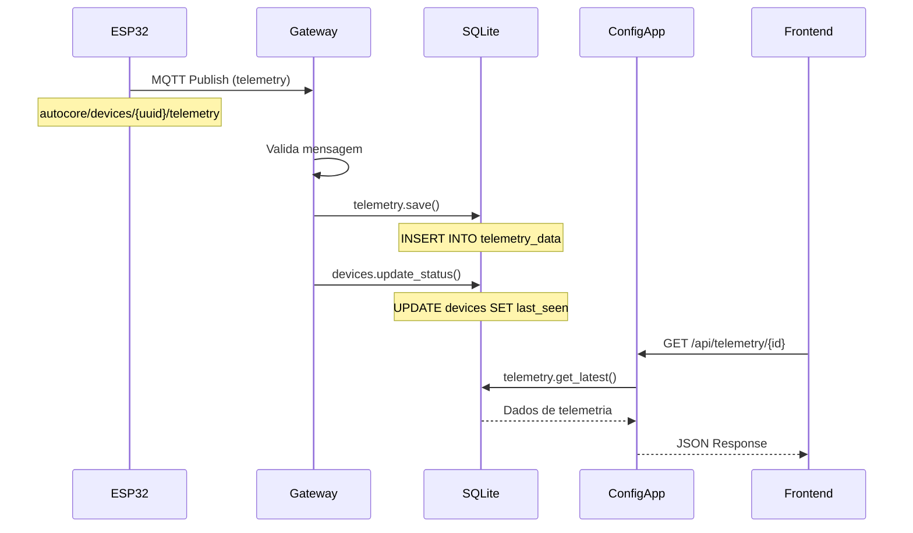
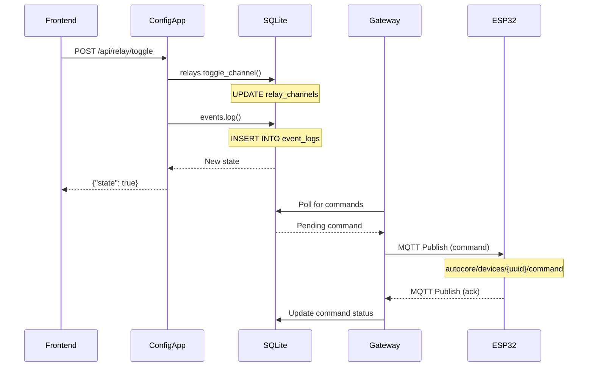
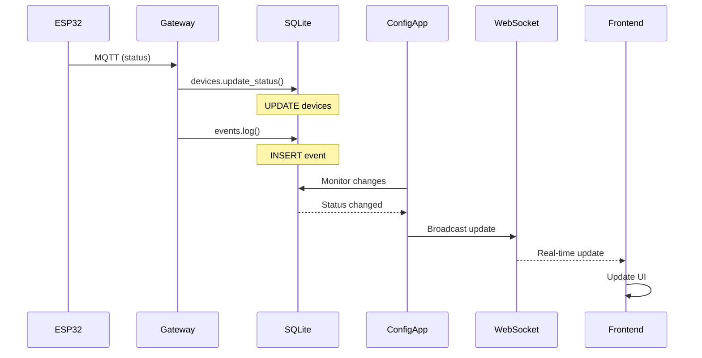
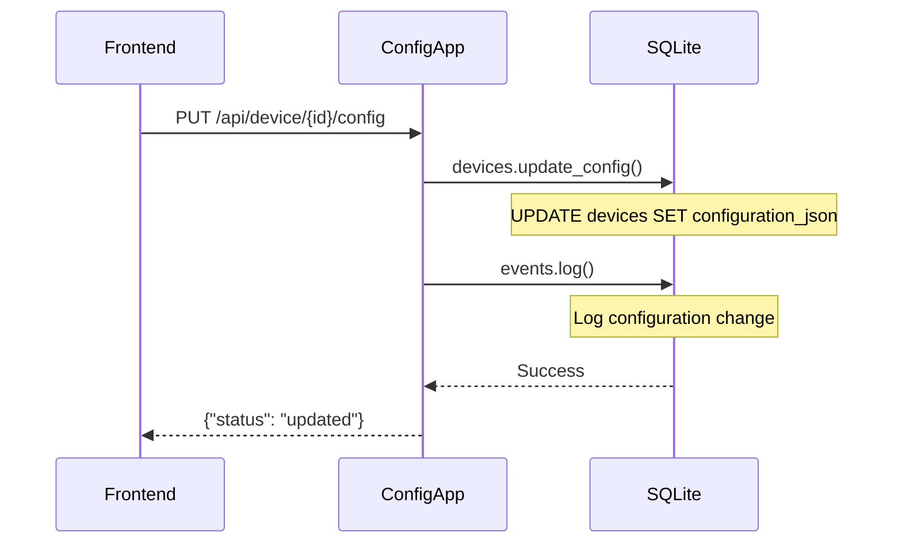
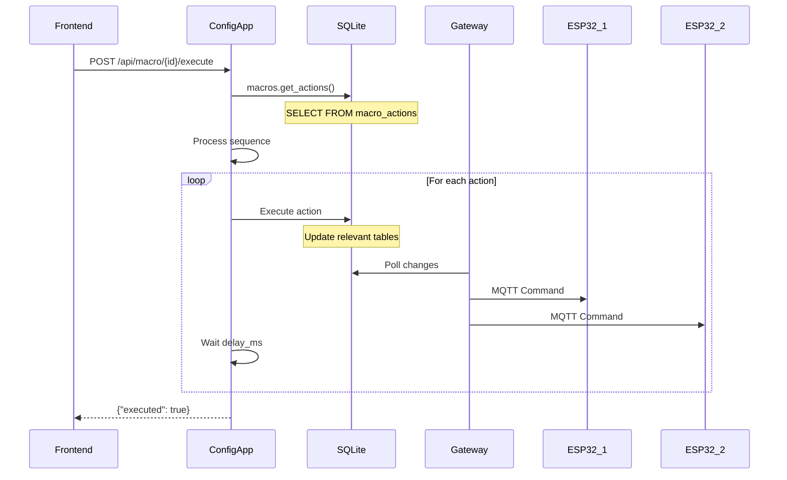
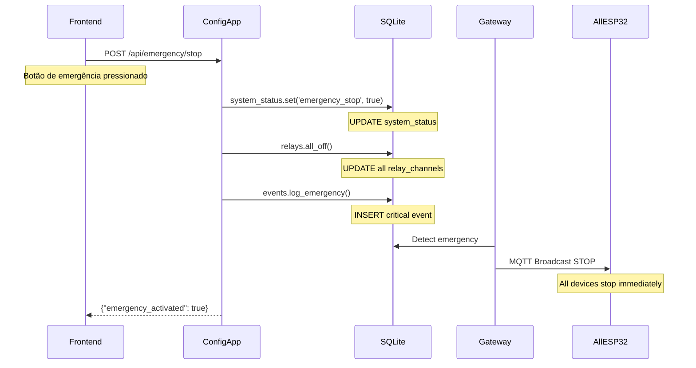
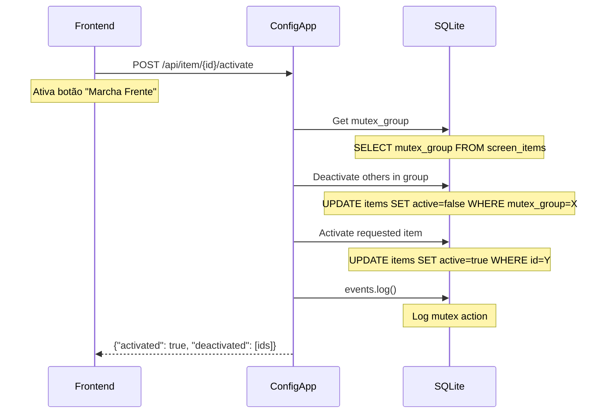

# 🔄 Fluxo de Dados - AutoCore System

## 📊 Visão Geral

Este documento descreve como os dados fluem entre os componentes do sistema AutoCore, todos usando o banco de dados SQLite compartilhado através do Repository Pattern.

## 🏗️ Arquitetura de Componentes

```
┌─────────────┐     MQTT      ┌─────────────┐     HTTP/WS    ┌─────────────┐
│   ESP32     │ ───────────→  │   Gateway   │  ←─────────→   │  Config App │
│  Devices    │ ←───────────   │    MQTT     │                │   Backend   │
└─────────────┘                └─────────────┘                └─────────────┘
                                      ↓↑                             ↓↑
                               ┌─────────────────────────────────────────┐
                               │          SQLite Database                │
                               │        (database/shared/)               │
                               │      Repository Pattern Layer           │
                               └─────────────────────────────────────────┘
                                              ↓↑
                                      ┌─────────────┐
                                      │   Frontend  │
                                      │  (Browser)  │
                                      └─────────────┘
```

## 📝 Cenários de Fluxo de Dados

### 1️⃣ Telemetria: ESP32 → Gateway → Database → Config App



**Código Gateway:**
```python
# gateway/message_handler.py
async def handle_telemetry(topic, payload):
    device = devices.get_by_uuid(extract_uuid(topic))
    data = json.loads(payload)
    
    for key, value in data.items():
        telemetry.save(
            device_id=device['id'],
            data_type='sensor',
            key=key,
            value=value['value'],
            unit=value.get('unit')
        )
```

**Código Config App:**
```python
# config-app/backend/api/routes/telemetry.py
@router.get("/telemetry/{device_id}")
async def get_telemetry(device_id: int):
    return telemetry.get_latest(device_id, limit=100)
```

### 2️⃣ Comando: Frontend → Config App → Database → Gateway → ESP32



**Código Config App:**
```python
# config-app/backend/api/routes/relays.py
@router.post("/relay/{channel_id}/toggle")
async def toggle_relay(channel_id: int):
    new_state = relays.toggle_channel(channel_id)
    
    events.log(
        event_type='command',
        source='config_app',
        action='relay_toggle',
        payload={'channel': channel_id, 'state': new_state}
    )
    
    # Gateway vai detectar a mudança e enviar comando
    return {"state": new_state}
```

**Código Gateway:**
```python
# gateway/command_monitor.py
async def monitor_commands():
    while True:
        # Verifica comandos pendentes
        pending = relays.get_pending_commands()
        
        for cmd in pending:
            # Envia via MQTT
            await mqtt_client.publish(
                f"autocore/devices/{cmd['uuid']}/command",
                json.dumps(cmd['payload'])
            )
        
        await asyncio.sleep(0.5)  # Poll a cada 500ms
```

### 3️⃣ Status Update: ESP32 → Gateway → Database → Frontend (Real-time)



### 4️⃣ Configuração: Frontend → Config App → Database



### 5️⃣ Macro Execution: Frontend → Config App → Database → Gateway → Multiple ESP32



### 6️⃣ Emergency Stop: Frontend → Config App → Database → Gateway → All ESP32



### 7️⃣ Mutex Control: Frontend → Config App → Database (Exclusão Mútua)



## 🗄️ Responsabilidades por Tabela

### Quem Escreve (Write)

| Tabela | Gateway | Config App | Descrição |
|--------|---------|------------|-----------|
| `devices` | ✅ Status, IP | ✅ Config, Nome | Gateway atualiza status, Config atualiza configurações |
| `telemetry_data` | ✅ | ❌ | Apenas Gateway salva telemetria |
| `event_logs` | ✅ | ✅ | Ambos registram eventos |
| `relay_channels` | ❌ | ✅ | Config App controla estados |
| `screens` | ❌ | ✅ | Config App gerencia telas |
| `can_signals` | ❌ | ✅ | Config App configura CAN |
| `users` | ❌ | ✅ | Config App gerencia usuários |
| `macros` | ❌ | ✅ | Config App cria e gerencia macros |
| `macro_actions` | ❌ | ✅ | Config App define sequências |
| `system_status` | ✅ | ✅ | Ambos podem atualizar estado do sistema |

### Quem Lê (Read)

| Tabela | Gateway | Config App | Descrição |
|--------|---------|------------|-----------|
| `devices` | ✅ | ✅ | Ambos precisam ler dispositivos |
| `telemetry_data` | ❌ | ✅ | Config App lê para mostrar na UI |
| `event_logs` | ❌ | ✅ | Config App lê para auditoria |
| `relay_channels` | ✅ | ✅ | Gateway lê estados, Config lê/escreve |
| `screens` | ❌ | ✅ | Apenas Config App |
| `can_signals` | ✅ | ✅ | Gateway usa para processar, Config configura |
| `macros` | ✅ | ✅ | Gateway executa, Config gerencia |
| `system_status` | ✅ | ✅ | Ambos verificam estado do sistema |

## 🔄 Padrões de Sincronização

### 1. Polling (Gateway)
```python
# Gateway faz polling para comandos pendentes
async def poll_commands():
    while True:
        commands = db.get_pending_commands()
        for cmd in commands:
            await process_command(cmd)
        await asyncio.sleep(0.5)
```

### 2. WebSocket (Config App → Frontend)
```python
# Config App notifica frontend via WebSocket
@app.websocket("/ws")
async def websocket_endpoint(websocket: WebSocket):
    await manager.connect(websocket)
    
    # Monitor de mudanças
    async for change in database_changes():
        await manager.broadcast(change)
```

### 3. Event-Driven (MQTT)
```python
# Gateway reage a eventos MQTT
@mqtt_client.on_message
async def on_mqtt_message(topic, payload):
    if "telemetry" in topic:
        await handle_telemetry(topic, payload)
    elif "status" in topic:
        await handle_status(topic, payload)
```

## 🆕 Novos Fluxos de Controle Avançado

### 1. Mutex Groups (Exclusão Mútua)
```python
# Config App gerencia botões mutuamente exclusivos
@router.post("/screen/item/{item_id}/activate")
async def activate_mutex_item(item_id: int):
    item = screen_items.get(item_id)
    
    if item['mutex_group']:
        # Desativa todos do mesmo grupo
        screen_items.deactivate_mutex_group(item['mutex_group'])
    
    # Ativa o item solicitado
    screen_items.activate(item_id)
    return {"status": "activated"}
```

### 2. Hold/Momentary Controls
```python
# Frontend envia duração do hold
@router.post("/control/hold")
async def hold_control(data: HoldRequest):
    # Ativa controle
    relays.activate(data.channel_id)
    
    # Aguarda duração especificada
    await asyncio.sleep(data.hold_duration_ms / 1000)
    
    # Desativa automaticamente
    relays.deactivate(data.channel_id)
    return {"held_for_ms": data.hold_duration_ms}
```

### 3. Emergency Stop Global
```python
# Sistema de parada de emergência
@router.post("/emergency/stop")
async def emergency_stop():
    # Atualiza status global
    system_status.set('emergency_stop', True)
    
    # Desliga todos os relés
    relays.all_off()
    
    # Notifica todos os dispositivos
    await mqtt.broadcast('autocore/emergency/stop', {'stop': True})
    
    # Log crítico
    events.log_critical('emergency_stop', 'Sistema parado por emergência')
    
    return {"emergency": "activated"}

@router.post("/emergency/reset")
async def reset_emergency():
    # Verifica permissão
    if not user.has_permission('emergency_reset'):
        raise HTTPException(403)
    
    system_status.set('emergency_stop', False)
    await mqtt.broadcast('autocore/emergency/reset', {'stop': False})
    
    return {"emergency": "reset"}
```

### 4. Macro Execution Engine
```python
# Execução de macros com sequência
@router.post("/macro/{macro_id}/execute")
async def execute_macro(macro_id: int):
    macro = macros.get(macro_id)
    actions = macro_actions.get_by_macro(macro_id)
    
    for action in sorted(actions, key=lambda x: x['sequence']):
        # Verifica condições
        if action['condition_check']:
            if not evaluate_condition(action['condition_check']):
                continue
        
        # Executa ação baseada no tipo
        if action['action_type'] == 'relay':
            relays.set_state(action['action_target'], action['action_payload'])
        elif action['action_type'] == 'delay':
            await asyncio.sleep(action['delay_ms'] / 1000)
        elif action['action_type'] == 'mqtt_publish':
            await mqtt.publish(action['action_target'], action['action_payload'])
        
        # Aguarda delay antes da próxima
        if action['delay_ms'] > 0:
            await asyncio.sleep(action['delay_ms'] / 1000)
    
    return {"macro_executed": macro['name']}
```

## 🚀 Otimizações Implementadas

### 1. Write Batching
```python
# Gateway agrupa escritas
telemetry_buffer = []

async def save_telemetry_batch():
    if telemetry_buffer:
        telemetry.save_batch(telemetry_buffer)
        telemetry_buffer.clear()
```

### 2. Connection Pooling
```python
# Compartilhamento de conexões
from database.shared.connection import get_engine

engine = get_engine()  # Pool compartilhado
```

### 3. Caching
```python
# Config App cacheia dados frequentes
from functools import lru_cache

@lru_cache(maxsize=128)
def get_device_cached(device_id):
    return devices.get_by_id(device_id)
```

## 📈 Métricas de Performance

### Volume de Dados Esperado

| Operação | Frequência | Volume/dia |
|----------|------------|------------|
| Telemetria | 1/seg/device | ~864k registros |
| Status Update | 1/min/device | ~14.4k registros |
| Commands | ~100/dia | 100 registros |
| Config Changes | ~10/dia | 10 registros |

### Com Limpeza Automática

| Operação | Retenção | Volume Total |
|----------|----------|--------------|
| Telemetria | 7 dias | ~6M registros → 100k (agregado) |
| Events | 30 dias | ~500k registros |
| Configs | Permanente | ~1k registros |
| **Total DB Size** | - | **< 50MB** |

## 🔐 Segurança do Fluxo

1. **Validação em Todas Camadas**
   - ESP32: Valida comandos
   - Gateway: Valida MQTT
   - Config App: Valida API requests
   - Database: Constraints e triggers

2. **Auditoria Completa**
   - Todos comandos são logados
   - Eventos incluem user_id
   - Timestamps em todas operações

3. **Isolamento**
   - Gateway não expõe database
   - Config App não acessa MQTT diretamente
   - Frontend só acessa via API

## 🎯 Conclusão

O fluxo de dados do AutoCore é:
- ✅ **Eficiente** - Mínima latência
- ✅ **Resiliente** - Falhas isoladas
- ✅ **Escalável** - Pronto para crescer
- ✅ **Auditável** - Tudo é rastreado
- ✅ **Seguro** - Múltiplas validações
- 🆕 **Avançado** - Controles complexos (mutex, hold, macros)
- 🆕 **Seguro** - Sistema de emergência integrado

Com o Repository Pattern compartilhado, ambos os sistemas (Gateway e Config App) trabalham harmoniosamente com o mesmo banco de dados sem conflitos.

---

**Última Atualização:** 07 de agosto de 2025  
**Maintainer:** Lee Chardes