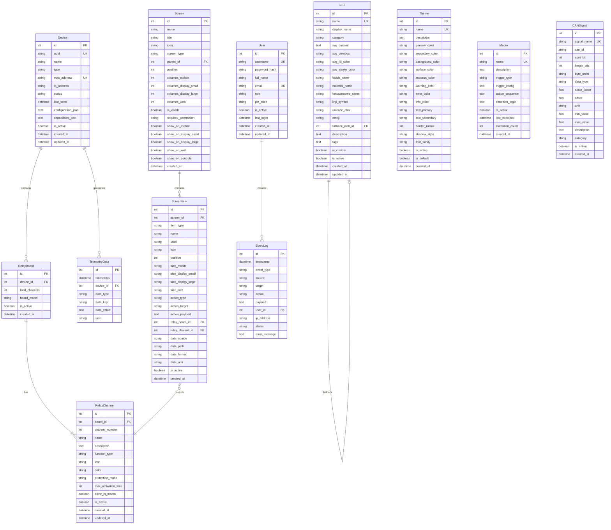

# 📊 Database Schema Documentation

Documentação completa do schema do banco de dados AutoCore - estrutura, relacionamentos e constraints.

## 📋 Visão Geral

O schema do AutoCore foi projetado para suportar sistemas IoT com ESP32, interfaces touchscreen e controle de relés. Organizado em domínios funcionais com integridade referencial rigorosa.

### 🎯 Design Principles
- **Normalização**: 3NF para eliminar redundâncias
- **Integridade**: Foreign keys e check constraints
- **Performance**: Índices otimizados para queries frequentes
- **Flexibilidade**: JSON fields para configurações dinâmicas
- **Escalabilidade**: Preparado para PostgreSQL

## 🏗️ Schema Overview

### Database Statistics
```
Tables: 12 core tables
Columns: ~95 total columns  
Indexes: 25+ optimized indexes
Constraints: 15+ validation rules
Relationships: 20+ foreign keys
Size: ~1.2MB (development data)
```

### Table Categories
| Domain | Tables | Purpose |
|--------|--------|---------|
| **Hardware** | Device, RelayBoard, RelayChannel | ESP32 devices e controle |
| **Interface** | Screen, ScreenItem | UI components |
| **Users** | User, EventLog | Authentication & audit |
| **Data** | TelemetryData, CANSignal | Sensors & protocols |
| **Resources** | Icon, Theme, Macro | Assets & automation |

## 📊 Entity Relationship Diagram



## 🔑 Primary Keys & Indexes

### Primary Keys
Todas as tabelas usam `id INTEGER PRIMARY KEY` como chave primária sequencial.

### Unique Constraints
| Table | Unique Fields | Purpose |
|-------|---------------|---------|
| Device | uuid | Device identification |
| Device | mac_address | Network identification |
| RelayBoard | (board_id, channel_number) | Channel uniqueness |
| User | username | Login identification |
| User | email | Email uniqueness |
| Icon | name | Icon reference |
| Theme | name | Theme selection |
| Macro | name | Macro identification |
| CANSignal | signal_name | Signal mapping |

### Performance Indexes
| Index | Table | Columns | Usage |
|-------|-------|---------|-------|
| idx_devices_uuid | devices | uuid | Device lookup |
| idx_devices_status | devices | status | Status filtering |
| idx_relay_channels_board | relay_channels | board_id | Board channels |
| idx_screen_items_screen_pos | screen_items | screen_id, position | Ordered items |
| idx_events_timestamp | event_logs | timestamp | Time queries |
| idx_telemetry_timestamp | telemetry_data | timestamp, device_id | Device data |
| idx_icons_category | icons | category | Icon browsing |

## 🛡️ Data Integrity

### Foreign Key Constraints
| Child Table | Parent Table | On Delete | Purpose |
|-------------|--------------|-----------|---------|
| relay_boards | devices | CASCADE | Remove boards with device |
| relay_channels | relay_boards | CASCADE | Remove channels with board |
| screen_items | screens | CASCADE | Remove items with screen |
| screen_items | relay_boards | SET NULL | Preserve item if board removed |
| screen_items | relay_channels | SET NULL | Preserve item if channel removed |
| telemetry_data | devices | CASCADE | Remove data with device |
| event_logs | users | NULL | Preserve logs if user removed |
| icons | icons | SET NULL | Remove fallback reference |

### Check Constraints
| Constraint | Table | Rule | Purpose |
|------------|-------|------|---------|
| check_item_action_consistency | screen_items | DISPLAY/GAUGE → no action | UI logic |
| check_relay_control_requirements | screen_items | RELAY_CONTROL → board+channel IDs | Hardware link |
| check_display_data_requirements | screen_items | DISPLAY/GAUGE → data source | Data binding |

### Data Validation Rules

#### Device Types
```sql
type IN ('esp32_relay', 'esp32_display', 'sensor_board', 'gateway')
```

#### Device Status
```sql
status IN ('online', 'offline', 'error', 'maintenance')
```

#### Screen Item Types
```sql
item_type IN ('DISPLAY', 'BUTTON', 'SWITCH', 'GAUGE')
```

#### Action Types
```sql
action_type IN ('RELAY_CONTROL', 'COMMAND', 'MACRO', 'NAVIGATION', 'PRESET') OR action_type IS NULL
```

#### Function Types
```sql
function_type IN ('toggle', 'momentary', 'pulse', 'timer') OR function_type IS NULL
```

#### Protection Modes
```sql
protection_mode IN ('none', 'interlock', 'exclusive', 'timed')
```

#### User Roles
```sql
role IN ('admin', 'manager', 'operator', 'viewer', 'maintenance')
```

## 📊 Data Types & Storage

### String Fields
| Type | Max Length | Usage | Example |
|------|------------|-------|---------|
| VARCHAR(17) | 17 | MAC address | 24:6F:28:XX:XX:XX |
| VARCHAR(36) | 36 | UUID | 550e8400-e29b-41d4-a716-446655440000 |
| VARCHAR(50) | 50 | Names, types | esp32_relay |
| VARCHAR(100) | 100 | Titles, labels | Bomba Principal |
| VARCHAR(255) | 255 | Password hash | $2b$12$... |
| TEXT | Unlimited | JSON, descriptions | Configuration data |

### Numeric Fields
| Type | Range | Usage | Example |
|------|-------|-------|---------|
| INTEGER | -2³¹ to 2³¹-1 | IDs, counts | 1, 16, 255 |
| REAL | Float | Scale factors | 1.0, 0.1 |
| BOOLEAN | True/False | Flags | is_active |

### Date/Time Fields
```sql
created_at DATETIME DEFAULT CURRENT_TIMESTAMP
updated_at DATETIME DEFAULT CURRENT_TIMESTAMP ON UPDATE CURRENT_TIMESTAMP
timestamp DATETIME DEFAULT CURRENT_TIMESTAMP
last_seen DATETIME NULL
```

### JSON Fields (SQLite → PostgreSQL)
| Field | Current | PostgreSQL Target |
|-------|---------|------------------|
| configuration_json | TEXT | JSONB |
| capabilities_json | TEXT | JSONB |
| action_payload | TEXT | JSONB |
| trigger_config | TEXT | JSONB |
| action_sequence | TEXT | JSONB |
| condition_logic | TEXT | JSONB |
| tags | TEXT | TEXT[] |

## 🔍 Query Patterns

### Device Hierarchy
```sql
-- Get device with all relay channels
SELECT d.name, rb.total_channels, rc.name as channel_name
FROM devices d
JOIN relay_boards rb ON d.id = rb.device_id
JOIN relay_channels rc ON rb.id = rc.board_id
WHERE d.uuid = ?
ORDER BY rb.id, rc.channel_number;
```

### Screen Composition
```sql
-- Get screen with ordered items
SELECT s.title, si.label, si.position, si.item_type
FROM screens s
JOIN screen_items si ON s.id = si.screen_id
WHERE s.name = ?
ORDER BY si.position;
```

### Event Auditing
```sql
-- Get user actions in time range
SELECT el.timestamp, u.username, el.event_type, el.target
FROM event_logs el
LEFT JOIN users u ON el.user_id = u.id
WHERE el.timestamp BETWEEN ? AND ?
ORDER BY el.timestamp DESC;
```

### Telemetry Aggregation
```sql
-- Get latest telemetry per device
SELECT td.device_id, td.data_key, td.data_value, td.timestamp
FROM telemetry_data td
INNER JOIN (
    SELECT device_id, data_key, MAX(timestamp) as max_timestamp
    FROM telemetry_data
    GROUP BY device_id, data_key
) latest ON td.device_id = latest.device_id 
    AND td.data_key = latest.data_key 
    AND td.timestamp = latest.max_timestamp;
```

## 📈 Performance Considerations

### Index Strategy
- **Selective indexes**: Fields with high cardinality
- **Composite indexes**: Multi-column queries
- **Partial indexes**: Filtered conditions (PostgreSQL)

### Query Optimization
- **Avoid N+1**: Use JOINs or IN clauses
- **Limit results**: LIMIT clause for pagination
- **Index hints**: PostgreSQL query planner

### Storage Optimization
- **Normalize repetitive data**: Separate tables for constants
- **Compress JSON**: PostgreSQL JSONB compression
- **Partition large tables**: Time-based partitioning

## 🔗 Navigation

### Schema Documentation
- [ER Diagram](./er-diagram.md) - Visual relationships
- [Table Definitions](./table-definitions.md) - Detailed schemas
- [Indexes](./indexes.md) - Performance optimization
- [Constraints](./constraints.md) - Data integrity

### Related Documentation
- [Models](../models/) - SQLAlchemy implementation
- [Migrations](../migrations/) - Schema evolution
- [Performance](../performance/) - Query optimization

---

**Schema Version**: v2.1.0  
**Last Updated**: 2025-08-22  
**Next Review**: v2.2.0 (PostgreSQL preparation)