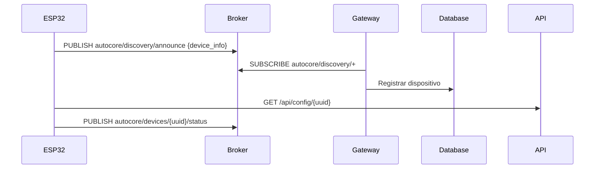
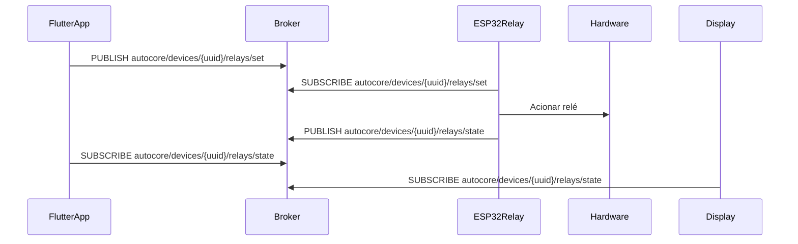
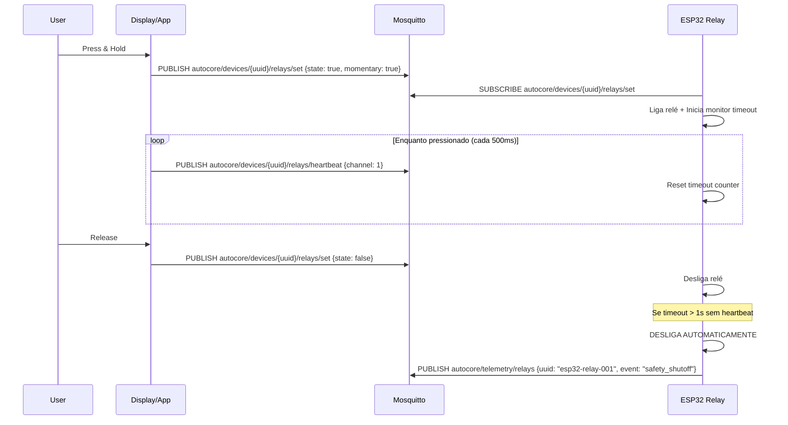
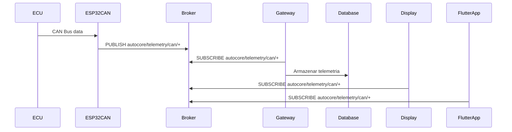
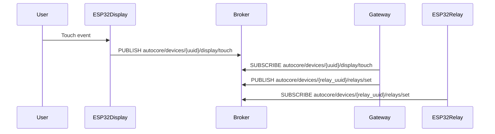
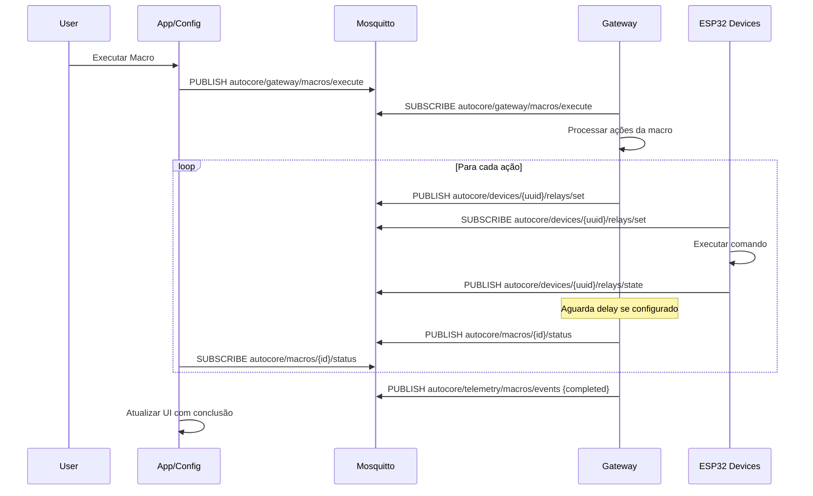
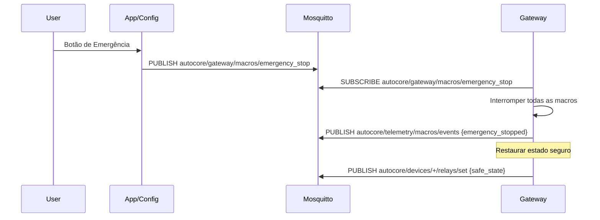

# 📡 Arquitetura MQTT - AutoCore

## Visão Geral

O AutoCore utiliza MQTT como protocolo principal de comunicação entre todos os componentes do sistema. O Mosquitto atua como broker central, coordenando mensagens entre dispositivos ESP32, aplicações web, mobile e o gateway.

> **📌 Nota Importante:** A partir da versão 2.0, toda configuração de dispositivos é feita via **API REST**. O MQTT é usado exclusivamente para telemetria, comandos, status e heartbeat em tempo real.

## 🏗️ Componentes do Sistema

### 1. Mosquitto Broker
- **Função**: Broker MQTT central
- **Porta**: 1883 (desenvolvimento), 8883 (produção com TLS)
- **Host**: Raspberry Pi Zero 2W (mesmo do Gateway)
- **Configuração**: 
  - Mensagens retidas para status
  - QoS 0 para telemetria (performance)
  - QoS 1 para comandos (garantia de entrega)
  - QoS 2 para comandos críticos de segurança (exatamente uma vez)

### 2. AutoCore Gateway
- **Função**: Coordenador central e bridge
- **Responsabilidades**:
  - Descoberta automática de dispositivos
  - Roteamento inteligente de mensagens
  - Persistência de dados em SQLite
  - Bridge para serviços cloud (futuro)
  - Gerenciamento de autenticação
  - Monitoramento de saúde do sistema

### 3. Interfaces de Controle (Clientes MQTT)

#### Config App (Web) 
- **Função**: Interface de configuração e monitoramento
- **Papel no Sistema**:
  - Configuração inicial de dispositivos
  - Monitoramento em tempo real via WebSocket
  - Simuladores para desenvolvimento/teste
  - Debug e troubleshooting
- **Controle de Relés**:
  - Interface de teste e validação
  - Não requer heartbeat (ambiente controlado)

#### ESP32 Display
- **Função**: Interface física no veículo
- **Papel no Sistema**:
  - Controle local via tela touch
  - Visualização de telemetria em tempo real
  - **ENVIA HEARTBEATS** para relés momentâneos
  - Renderização de telas configuráveis
- **Responsabilidades Críticas**:
  - Manter heartbeat enquanto botão pressionado
  - Parar heartbeat ao soltar ou perder touch
  - Feedback visual do estado dos relés

#### Flutter App (Mobile/Desktop)
- **Função**: Controle remoto multiplataforma
- **Papel no Sistema**:
  - Controle total do veículo via smartphone
  - **ENVIA HEARTBEATS** para relés momentâneos
  - Notificações push de alertas
  - Visualização de telemetria
- **Responsabilidades Críticas**:
  - Manter heartbeat durante press & hold
  - Gerenciar reconexão em caso de perda de rede
  - Modo offline com sincronização posterior

### 4. Dispositivos ESP32 (Hardware)

#### ESP32 Relay
- **Função**: Controle de relés automotivos
- **Características**:
  - 16/32 canais por placa
  - Proteção por senha/confirmação
  - Estado persistente em caso de reset

#### ESP32 CAN
- **Função**: Interface com ECU do veículo
- **Características**:
  - Leitura de sinais CAN Bus
  - Suporte FuelTech, MegaSquirt, Haltech
  - Tradução CAN → MQTT

#### ESP32 Sensor
- **Função**: Leitura de sensores analógicos/digitais
- **Características**:
  - Temperatura, pressão, nível
  - Calibração remota
  - Filtros de ruído

### 5. Flutter App (Mobile/Desktop)
- **Função**: Controle remoto completo
- **Plataformas**: iOS, Android, Windows, macOS, Linux
- **Características**:
  - Controle de relés
  - Visualização de telemetria
  - Notificações push
  - Modo offline com sincronização

## 🎯 Matriz de Responsabilidades

| Componente | Publica | Subscreve | Heartbeat | Responsabilidade Principal |
|------------|---------|-----------|-----------|---------------------------|
| **ESP32 Relay** | - Estado dos relés<br>- Telemetria<br>- Safety events | - Comandos de controle<br>- Heartbeats | **RECEBE** e monitora | Executar comandos com segurança |
| **ESP32 Display** | - Touch events<br>- Comandos relé<br>- Heartbeats<br>- Comandos macro | - Estado dos relés<br>- Telemetria CAN<br>- Status de macros | **ENVIA** continuamente | Interface local no veículo |
| **Flutter App** | - Comandos relé<br>- Heartbeats<br>- Comandos macro | - Estado dos relés<br>- Telemetria<br>- Status de macros | **ENVIA** continuamente | Controle remoto completo |
| **Config App** | - Comandos teste<br>- Comandos macro | - Todos (monitor)<br>- Estados<br>- Status de macros | Não necessário | Configuração via API e debug |
| **Gateway** | - Roteamento<br>- Agregações<br>- Comandos<br>- Status de macros | - Tudo (broker)<br>- Comandos de macro | Não aplicável | Coordenação, persistência e **execução de macros** |
| **ESP32 CAN** | - Telemetria CAN<br>- Status | - Comandos | Não aplicável | Bridge CAN→MQTT |
| **ESP32 Sensor** | - Dados sensores<br>- Status | - Comandos<br>- Calibração | Não aplicável | Aquisição de dados |

## 📊 Estrutura de Tópicos MQTT

### Convenção de Nomenclatura
```
autocore/{categoria}/{device_uuid}/{recurso}/{ação}
```

### Padrão de UUID
```
{tipo}-{função}-{número}
```
Exemplos:
- `esp32-relay-001` - Primeiro módulo de relés
- `esp32-display-001` - Primeiro display
- `esp32-can-001` - Primeiro módulo CAN
- `gateway-main-001` - Gateway principal

### Categorias Principais

#### 1. Dispositivos (`devices`)
```
# Status do dispositivo
autocore/devices/{uuid}/status
autocore/devices/{uuid}/announce

# Recursos específicos por tipo
autocore/devices/{uuid}/relays/state
autocore/devices/{uuid}/relays/set
autocore/devices/{uuid}/relays/heartbeat
autocore/devices/{uuid}/display/screen
autocore/devices/{uuid}/display/touch
autocore/devices/{uuid}/sensors/data
```

#### 2. Telemetria (`telemetry`)
```
# Dados de sensores
autocore/telemetry/sensors/{sensor_id}
autocore/telemetry/can/{signal_name}
autocore/telemetry/calculated/{metric}

# Telemetria de dispositivos (UUID no payload, não no tópico)
autocore/telemetry/relays/data
autocore/telemetry/displays/data

# Agregações
autocore/telemetry/summary/minute
autocore/telemetry/summary/hour
```

#### 3. Sistema (`system`)
```
# Gateway
autocore/gateway/status
autocore/gateway/stats
autocore/gateway/commands/{action}

# Descoberta
autocore/discovery/announce
autocore/discovery/request

# Broadcast
autocore/system/broadcast
autocore/system/alert
autocore/system/update
```

#### 4. Comandos (`commands`)
```
# Comandos globais
autocore/commands/all/{action}
autocore/commands/group/{group_id}/{action}
autocore/commands/device/{uuid}/{action}
```

#### 5. Macros (`macros`)
```
# Comandos de macro via gateway
autocore/gateway/macros/execute
autocore/gateway/macros/stop
autocore/gateway/macros/emergency_stop

# Macros específicas por ID
autocore/macros/{macro_id}/execute
autocore/macros/{macro_id}/status
autocore/macros/{macro_id}/stop

# Telemetria e eventos de macros
autocore/telemetry/macros/events
autocore/telemetry/macros/status
```


## 🔄 Fluxos de Comunicação

### 1. Descoberta de Dispositivo

#### Descoberta Inicial
Dispositivos descobrem o broker através de:
1. **mDNS/Bonjour**: Busca por `_mqtt._tcp.local`
2. **IP Fixo**: Configurado em firmware (fallback)
3. **DHCP Option**: Opção customizada 224 com IP do broker

#### Anúncio de Dispositivo
```json
{
  "protocol_version": "2.1.0",
  "uuid": "esp32-relay-001",
  "type": "esp32_relay",
  "firmware_version": "1.0.0",
  "capabilities": ["relay_control", "telemetry", "ota"],
  "mac_address": "AA:BB:CC:DD:EE:FF",
  "ip_address": "192.168.1.100"
}
```



### 2. Comando de Relé Toggle (App → ESP32)


### 2.1. Comando de Relé Momentâneo com Heartbeat


### 3. Telemetria CAN


### 4. Evento Touch no Display


### 5. Execução de Macro


### 6. Parada de Emergência de Macros


## 📦 Formato de Mensagens (Payloads)

### Versionamento de Protocolo
Todos os payloads devem incluir versão do protocolo para compatibilidade:
```json
{
  "protocol_version": "2.1.0",
  "uuid": "esp32-relay-001",
  ...
}
```

### Status do Dispositivo
```json
{
  "protocol_version": "2.1.0",
  "uuid": "esp32-relay-001",
  "type": "esp32_relay",
  "status": "online",
  "timestamp": "2025-08-08T10:30:00Z",
  "uptime": 3600,
  "firmware_version": "1.0.0",
  "ip_address": "192.168.1.100",
  "wifi_signal": -65,
  "free_memory": 45000
}
```

### Estado de Relés
```json
{
  "protocol_version": "2.1.0",
  "uuid": "esp32-relay-001",
  "board_id": 1,
  "timestamp": "2025-08-08T10:30:00Z",
  "channels": {
    "1": true,
    "2": false,
    "3": true,
    "4": false
  }
}
```

### Comando de Relé Toggle
```json
{
  "protocol_version": "2.1.0",
  "channel": 1,
  "state": true,
  "function_type": "toggle",
  "user": "mobile_app",
  "timestamp": "2025-08-08T10:30:00Z"
}
```

### Comando de Relé Momentâneo
```json
{
  "protocol_version": "2.1.0",
  "channel": 1,
  "state": true,
  "function_type": "momentary",
  "momentary": true,
  "user": "display_touch",
  "timestamp": "2025-08-08T10:30:00Z"
}
```

### Heartbeat de Relé Momentâneo
```json
{
  "protocol_version": "2.1.0",
  "channel": 1,
  "source_uuid": "esp32-display-001",
  "target_uuid": "esp32-relay-001",
  "timestamp": "2025-08-08T10:30:00Z",
  "sequence": 42
}
```

### Telemetria de Relay (Evento de Mudança)
```json
{
  "protocol_version": "2.1.0",
  "uuid": "esp32-relay-001",
  "board_id": 1,
  "timestamp": "2025-08-12T12:46:34.914991",
  "event": "relay_change",
  "channel": 2,
  "state": false,
  "trigger": "simulator"
}
```

### Evento de Safety Shutoff
```json
{
  "protocol_version": "2.1.0",
  "uuid": "esp32-relay-001",
  "board_id": 1,
  "event": "safety_shutoff",
  "channel": 1,
  "reason": "heartbeat_timeout",
  "timeout_ms": 1000,
  "last_heartbeat": "2025-08-08T10:30:00Z",
  "timestamp": "2025-08-08T10:30:01Z"
}
```

### Telemetria CAN
```json
{
  "protocol_version": "2.1.0",
  "uuid": "esp32-can-001",
  "timestamp": "2025-08-08T10:30:00Z",
  "signals": {
    "RPM": {
      "value": 2500,
      "unit": "rpm",
      "can_id": "0x200"
    },
    "TPS": {
      "value": 45.2,
      "unit": "%",
      "can_id": "0x201"
    },
    "ECT": {
      "value": 87.5,
      "unit": "°C",
      "can_id": "0x202"
    }
  }
}
```

### Evento Touch
```json
{
  "protocol_version": "2.1.0",
  "uuid": "esp32-display-001",
  "screen_id": 1,
  "item_id": 5,
  "action": "tap",
  "position": {
    "x": 150,
    "y": 200
  },
  "timestamp": "2025-08-08T10:30:00Z"
}
```

### Comando de Execução de Macro
```json
{
  "protocol_version": "2.2.0",
  "uuid": "config-app-001",
  "macro_id": 1,
  "macro_name": "Ligar Faróis e Pisca",
  "command": "execute",
  "timestamp": "2025-08-08T10:30:00Z",
  "source": "web_interface",
  "user": "operator"
}
```

### Status de Macro
```json
{
  "protocol_version": "2.2.0",
  "uuid": "gateway-main-001",
  "macro_id": 1,
  "macro_name": "Ligar Faróis e Pisca",
  "status": "running",
  "current_action": 3,
  "total_actions": 5,
  "started_at": "2025-08-08T10:30:00Z",
  "timestamp": "2025-08-08T10:30:02Z"
}
```

### Evento de Conclusão de Macro
```json
{
  "protocol_version": "2.2.0",
  "uuid": "gateway-main-001",
  "macro_id": 1,
  "macro_name": "Ligar Faróis e Pisca",
  "event": "completed",
  "started_at": "2025-08-08T10:30:00Z",
  "completed_at": "2025-08-08T10:30:05Z",
  "duration_ms": 5000,
  "actions_executed": 5,
  "result": "success",
  "timestamp": "2025-08-08T10:30:05Z"
}
```

### Comando de Parada de Emergência de Macros
```json
{
  "protocol_version": "2.2.0",
  "uuid": "mobile-app-001",
  "command": "emergency_stop",
  "scope": "all",
  "reason": "user_requested",
  "timestamp": "2025-08-08T10:30:00Z",
  "user": "operator"
}
```


## 🔒 Segurança

### Sistema de Heartbeat para Relés Momentâneos

#### Problema Resolvido
Relés momentâneos (buzina, guincho, partida) devem desligar automaticamente se:
- Perda de conexão de rede
- Travamento do aplicativo
- Falha no cliente MQTT
- Timeout de comunicação

#### Implementação
1. **Cliente (Display/App)**:
   - Envia heartbeat a cada 500ms enquanto botão pressionado
   - Para heartbeat ao soltar botão
   - Envia comando OFF explícito ao soltar

2. **ESP32 Relay**:
   - Monitora heartbeats recebidos
   - Timeout de 1 segundo sem heartbeat
   - Desliga automaticamente por segurança
   - Publica evento `safety_shutoff` para auditoria

3. **Parâmetros Configuráveis**:
   - `heartbeat_interval`: 500ms (frequência de envio)
   - `heartbeat_timeout`: 1000ms (timeout para desligar)
   - `retry_count`: 3 (tentativas antes de desligar)

#### Tipos de Relé
- **Toggle**: Liga/desliga com clique simples
- **Momentary**: Liga enquanto pressionado (requer heartbeat)
- **Pulse**: Liga por tempo determinado e desliga
- **Timed**: Liga com timer configurável

### Sistema de Segurança para Macros

#### Restrições de Canais em Macros
Macros **NÃO podem** controlar:
- Canais momentâneos (buzina, guincho, partida)
- Canais marcados com `allow_in_macro = false`
- Canais que requerem heartbeat contínuo

#### Comando de Emergência MQTT
Parada imediata de todas as macros em execução:
```
Tópico: autocore/gateway/macros/emergency_stop
Payload: {
  "protocol_version": "2.2.0",
  "command": "emergency_stop",
  "scope": "all"
}
```

#### Monitoramento de Execução
- Timeout máximo por macro: 60 segundos
- Limite de ações por macro: 50
- Delay mínimo entre ações: 100ms
- Log de auditoria para todas as execuções

### Desenvolvimento
- Sem autenticação (rede local isolada)
- Conexões não criptografadas
- Todas as mensagens em texto claro
- Simuladores para teste sem hardware

### Produção (Planejado)
- TLS/SSL na porta 8883
- Autenticação por usuário/senha
- ACL (Access Control Lists) por tópico
- Tokens JWT para comandos críticos
- Criptografia de payloads sensíveis
- Rate limiting por cliente

## 📈 Quality of Service (QoS)

### QoS 0 - Fire and Forget
- Telemetria de sensores
- Status periódico
- Dados não críticos

### QoS 1 - At Least Once
- Comandos de relés
- Alertas
- Heartbeats

### QoS 2 - Exactly Once
- Atualizações de firmware
- Comandos críticos de segurança
- Comandos financeiros (futuro)

## 🔄 Retained Messages

Mensagens que devem ser retidas:
- `autocore/devices/{uuid}/status` - Último status conhecido
- `autocore/devices/{uuid}/relays/state` - Estado atual dos relés
- `autocore/gateway/status` - Status do gateway

## 📝 Last Will Testament (LWT)

Configuração obrigatória para todos os dispositivos:

### Formato do LWT
```json
{
  "uuid": "{device-uuid}",
  "status": "offline",
  "timestamp": "2025-08-08T10:30:00Z",
  "reason": "unexpected_disconnect",
  "last_seen": "2025-08-08T10:29:55Z"
}
```

### Configuração
- **Tópico**: `autocore/devices/{uuid}/status`
- **QoS**: 1
- **Retain**: true
- **Enviado quando**: Conexão perdida inesperadamente

## 📊 Métricas e Monitoramento

### Métricas Coletadas
- Mensagens por segundo
- Latência média
- Dispositivos online
- Taxa de erro
- Uso de banda

### Tópicos de Monitoramento
```
autocore/metrics/messages_per_second
autocore/metrics/connected_clients
autocore/metrics/average_latency
autocore/metrics/error_rate
```

## 🔢 Limites do Sistema

### Limites Operacionais
- **Tamanho máximo de payload**: 256KB (recomendado: < 64KB)
- **Taxa máxima de mensagens**: 100 msgs/segundo por dispositivo
- **Número máximo de dispositivos**: 100 simultâneos
- **Timeout de conexão**: 30 segundos
- **Tempo máximo de reconexão**: 5 minutos com backoff exponencial

### Prioridade de Mensagens
Ordem de processamento em caso de fila:
1. **Safety/Emergency** - Comandos de segurança, shutoff
2. **Commands** - Comandos de controle
3. **Status** - Atualizações de estado
4. **Telemetry** - Dados de sensores

## ❌ Tratamento de Erros

### Formato de Mensagem de Erro
```json
{
  "protocol_version": "2.1.0",
  "uuid": "esp32-relay-001",
  "error_code": "ERR_001",
  "error_type": "COMMAND_FAILED",
  "error_message": "Relay channel 5 not available",
  "timestamp": "2025-08-08T10:30:00Z",
  "context": {
    "command": "set",
    "channel": 5,
    "requested_state": true
  }
}
```

### Tópico de Erros
```
autocore/errors/{uuid}/{error_type}
```

### Códigos de Erro Padronizados
| Código | Tipo | Descrição |
|--------|------|-----------|
| ERR_001 | COMMAND_FAILED | Comando não pode ser executado |
| ERR_002 | INVALID_PAYLOAD | Formato de payload inválido |
| ERR_003 | TIMEOUT | Timeout de operação |
| ERR_004 | UNAUTHORIZED | Não autorizado |
| ERR_005 | DEVICE_BUSY | Dispositivo ocupado |
| ERR_006 | HARDWARE_FAULT | Falha de hardware |
| ERR_007 | NETWORK_ERROR | Erro de rede |
| ERR_008 | PROTOCOL_MISMATCH | Versão de protocolo incompatível |

## 🚀 Otimizações

### Para Raspberry Pi Zero 2W
1. **Batch de mensagens** - Agrupar telemetria em intervalos
2. **Compressão** - gzip para payloads grandes
3. **Rate limiting** - Máximo 10 msgs/segundo por dispositivo
4. **Cache local** - SQLite para dados históricos
5. **Filtros no broker** - Reduzir tráfego desnecessário

### Para ESP32
1. **Buffer de mensagens** - Queue para reconexão
2. **Heartbeat de status** - 30 segundos (não confundir com heartbeat momentâneo de 500ms)
3. **Payload mínimo** - Apenas campos alterados
4. **Sleep mode** - Entre transmissões

## 🔮 Evolução Futura

### Fase 1 - Local (Atual)
- Comunicação local via Mosquitto
- Sem autenticação
- Interface web de configuração

### Fase 2 - Segurança
- TLS/SSL
- Autenticação e autorização
- Logs de auditoria

### Fase 3 - Cloud Bridge
- Bridge para AWS IoT / Azure IoT
- Backup em cloud
- Análise de dados históricos

### Fase 4 - IA e Automação
- Detecção de anomalias
- Automações baseadas em padrões
- Manutenção preditiva

## 📝 Boas Práticas

### Nomenclatura de Tópicos
- Usar lowercase com underscore
- UUID único por dispositivo
- Versioning em tópicos críticos
- Evitar caracteres especiais

### Payloads
- JSON para legibilidade
- MessagePack para performance (futuro)
- Sempre incluir timestamp
- Versioning de schema

### Conexão
- Reconnect automático com backoff
- Last Will Testament configurado (ver seção LWT)
- Client ID único e persistente
- Clean session = false para QoS > 0

## 🛠️ Ferramentas de Debug

### Linha de Comando
```bash
# Subscrever em todos os tópicos
mosquitto_sub -h localhost -t "autocore/#" -v

# Publicar mensagem de teste
mosquitto_pub -h localhost -t "autocore/test" -m '{"test": true}'

# Monitor de performance
mosquitto_sub -h localhost -t "$SYS/#" -v
```

### GUI
- MQTT Explorer (Windows/Mac/Linux)
- MQTT.fx (Java-based)
- MQTTLens (Chrome extension)

### Programático
- Config App - Monitor MQTT
- Flutter App - Debug console
- Gateway logs - `/var/log/autocore/`

---

**Última Atualização:** 13 de Agosto de 2025  
**Versão:** 2.2.0  
**Maintainer:** AutoCore Team

### Changelog
- v2.2.0 (13/08/2025) - Adicionada documentação completa de Macros via MQTT
  - Nova seção de tópicos para macros (gateway e específicas por ID)
  - Payloads padronizados para comandos e status de macros
  - Fluxos de execução e parada de emergência
  - Segurança específica para macros (restrições e comando de emergência)
  - Atualizada matriz de responsabilidades incluindo macros
- v2.2.0 - Adicionado versionamento de protocolo em todos os payloads
- v2.2.0 - Definido padrão de UUID ({tipo}-{função}-{número})
- v2.2.0 - Adicionada seção de Last Will Testament (LWT)
- v2.2.0 - Adicionados limites operacionais do sistema
- v2.2.0 - Adicionado tratamento de erros e códigos padronizados
- v2.2.0 - Esclarecido processo de descoberta de dispositivos
- v2.2.0 - Corrigido tópicos de telemetria (UUID apenas no payload)
- v2.2.0 - Removida duplicação de ESP32 Display
- v2.2.0 - Corrigido QoS 2 (apenas para comandos críticos, não configuração)
- v2.1.0 - Removida configuração via MQTT (migrado para API REST)
- v2.1.0 - Atualizada estrutura de tópicos e fluxos
- v2.0.0 - Adicionado sistema de heartbeat para relés momentâneos
- v2.0.0 - Documentado papel específico de cada componente
- v2.0.0 - Adicionada matriz de responsabilidades
- v1.0.0 - Documentação inicial da arquitetura MQTT