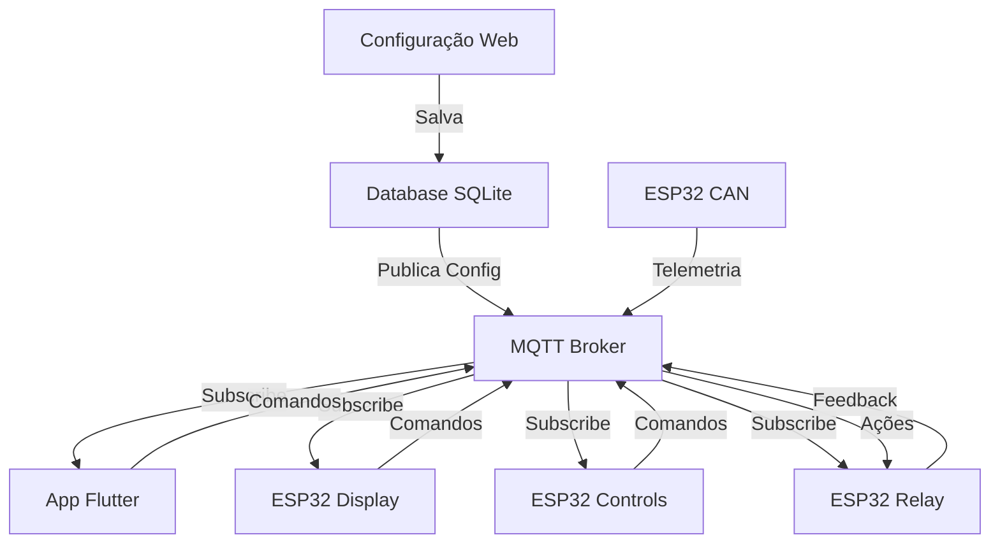

# 🚗 AutoCore - Visão Técnica do Projeto

## 🎯 Objetivo

Desenvolver um sistema modular e configurável de controle veicular que permita a automação e monitoramento completo de veículos off-road, com foco em:

- **Flexibilidade**: Sistema 100% configurável via interface web
- **Escalabilidade**: Adicionar novos módulos conforme necessidade
- **Confiabilidade**: Comunicação robusta e redundante
- **Usabilidade**: Múltiplas interfaces intuitivas

## 🏗️ Arquitetura do Sistema

### Componentes Principais

| Componente | Tecnologia | Função | Status |
|------------|------------|---------|--------|
| **Gateway** | Python/MQTT | Bridge central de comunicação | 🟢 Em desenvolvimento |
| **Database** | SQLite/SQLAlchemy | Armazenamento e configurações | 🟢 Estruturado |
| **Config App** | FastAPI + Alpine.js | Interface de configuração web | 🟡 Planejado |
| **ESP32 Modules** | C++/Arduino | Módulos de controle | 🟡 Firmware base criado |
| **Mobile App** | Flutter | Interface de controle móvel | 🔴 Não iniciado |

## 🏗️ Princípios de Design

### 1. **Configuração Dinâmica**
- Nenhum hardcode de funcionalidades
- Tudo baseado em configurações do banco de dados
- Interface de configuração simplificada

### 2. **Modularidade**
- Cada componente é independente
- Comunicação padronizada via MQTT
- Fácil adição/remoção de módulos

### 3. **Robustez**
- Sistema tolerante a falhas
- Reconexão automática
- Cache local de configurações

### 4. **Performance**
- Resposta em tempo real (<100ms)
- Otimização para hardware limitado
- Gerenciamento eficiente de recursos

## 📊 Fluxo de Dados

## 🔐 Segurança

### Níveis de Segurança:
1. **Rede WiFi**: WPA2/WPA3 com senha forte
2. **MQTT**: Autenticação por usuário/senha
3. **Comandos Críticos**: Confirmação dupla
4. **Logs**: Auditoria completa de ações

## 📈 Fases de Desenvolvimento

### Fase 1: Infraestrutura Base ✅
- [x] Definição da arquitetura
- [x] Estrutura de pastas organizada
- [x] Documentação completa
- [x] Database com SQLAlchemy Models
- [x] Repository Pattern implementado
- [x] Sistema de auto-migration (Alembic)

### Fase 2: Gateway Central 🚧
- [x] Estrutura base Python
- [x] Integração com database/shared
- [ ] Broker MQTT (Mosquitto)
- [ ] Bridge MQTT-Database
- [ ] API de telemetria

### Fase 3: Interface de Configuração 🚧
- [x] Decisão: FastAPI + Alpine.js + Tailwind (CDN)
- [x] Estrutura de pastas criada
- [ ] Backend FastAPI
- [ ] Frontend sem build (HTML + Alpine.js)
- [ ] CRUD de dispositivos
- [ ] Gerador de configuração JSON

### Fase 4: Dispositivos ESP32
- [ ] Firmware base MQTT
- [ ] ESP32 Relay
- [ ] ESP32 Display
- [ ] ESP32 Controls
- [ ] ESP32 CAN

### Fase 5: App Flutter
- [ ] Estrutura base
- [ ] Parser de configuração
- [ ] Interface dinâmica
- [ ] Comunicação MQTT

### Fase 6: Integração
- [ ] Testes de integração
- [ ] Otimizações
- [ ] Documentação final

### Fase 7: Extras
- [ ] Sistema multimídia
- [ ] Recursos avançados
- [ ] Apps complementares

## 🔄 Ciclo de Vida da Configuração

1. **Criação**: Admin cria configuração via Streamlit
2. **Validação**: Sistema valida integridade
3. **Distribuição**: Config publicada via MQTT
4. **Cache**: Dispositivos salvam localmente
5. **Aplicação**: Interfaces se reconfiguram
6. **Feedback**: Status reportado ao gateway

## 📋 Requisitos Técnicos Atualizados

### Gateway (Raspberry Pi Zero 2W)
- **Hardware**: Raspberry Pi Zero 2W (512MB RAM)
- **OS**: Raspberry Pi OS Lite (64-bit)
- **Python**: 3.9+ com venvs isolados por serviço
- **Storage**: SanDisk Ultra 64GB Class 10/U1
- **Network**: WiFi 2.4GHz
- **Consumo**: ~0.4W idle, ~1W load

### ESP32
- **Framework**: ESP-IDF 4.4+ ou Arduino Core 2.0+
- **Partição**: OTA habilitado
- **WiFi**: Cliente com reconexão automática
- **MQTT**: QoS 1 mínimo para comandos

### App Flutter
- **Dart**: 2.19+
- **Flutter**: 3.10+
- **Min SDK**: Android 21, iOS 12
- **Packages principais**: mqtt_client, get_x, hive

## 🎨 Padrões de Código

### Python (Gateway/Database/Config-App)
- PEP 8 compliance
- Type hints obrigatório
- Docstrings em todas as funções
- Ambientes virtuais isolados por serviço
- Repository Pattern para acesso a dados
- Testes unitários com pytest

### ESP32 (C++)
- Nomenclatura camelCase
- Comentários em inglês
- Modularização em bibliotecas

### Flutter (Dart)
- Effective Dart guidelines
- Clean Architecture
- Widget tests obrigatórios

## 📦 Estrutura do Banco de Dados

### Tabelas Principais:
- `devices` - Dispositivos cadastrados
- `functions` - Funcionalidades disponíveis
- `screens` - Configuração de telas
- `relays` - Mapeamento de relés
- `can_signals` - Sinais CAN configurados
- `themes` - Temas visuais
- `logs` - Auditoria de sistema

## 💾 Estratégia de Armazenamento

### Cartão SD: SanDisk Ultra 64GB
- **Espaço total**: 59.6GB real
- **Uso estimado**: ~3GB (5%)
- **Configuração**: Otimizada para 64GB
- **Retenção de dados**: 60 dias telemetria, 90 dias logs
- **Backups**: 30 backups diários mantidos

### Ambientes Python (.venv)
- **database/.venv**: ~50MB (SQLAlchemy, Alembic)
- **gateway/.venv**: ~40MB (paho-mqtt, asyncio)
- **config-app/backend/.venv**: ~60MB (FastAPI, uvicorn)
- **Total**: ~150MB
- **Estratégia**: Venvs isolados para deploy independente

## 🚀 Deploy e Operação

### Systemd Services
- `autocore-gateway.service` - Bridge MQTT
- `autocore-config-app.service` - Interface web
- Deploy independente por serviço
- Rollback granular
- Logs separados por serviço

### Scripts de Automação
- `setup_environments.sh` - Cria todos os venvs
- `deploy/deploy.sh` - Deploy por serviço
- `Makefile` - Comandos facilitados

## 🚀 Próximos Passos Imediatos

1. **Implementar Gateway MQTT** - Conectar com Mosquitto
2. **Desenvolver Backend Config-App** - FastAPI + endpoints
3. **Criar Frontend Config-App** - HTML + Alpine.js
4. **Testar integração Database** - Repository Pattern
5. **Configurar Mosquitto** - Autenticação e tópicos

## 📖 Documentação Complementar

- [STORAGE_REFERENCE.md](STORAGE_REFERENCE.md) - Referência completa de armazenamento
- [VENV_DEPLOYMENT.md](VENV_DEPLOYMENT.md) - Guia de deploy com venvs isolados
- [SD_OPTIMIZATION_GUIDE.md](SD_OPTIMIZATION_GUIDE.md) - Otimizações por tamanho de SD
- [database/CLAUDE.md](../database/CLAUDE.md) - Instruções para o projeto Database
- [config-app/CLAUDE.md](../config-app/CLAUDE.md) - Instruções para Config App

---

*Documento em constante evolução - Última atualização: 07 de agosto de 2025*
