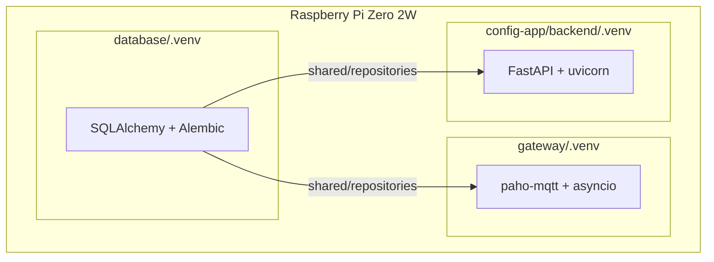

# 🚀 Guia de Deploy com Ambientes Virtuais Isolados

## 🎯 Arquitetura de Deploy

O AutoCore utiliza uma arquitetura de **microserviços com ambientes Python isolados**, garantindo deploy independente e segurança operacional.



## 📦 1. Preparação dos Ambientes

### Estrutura de Diretórios

```bash
# Criar estrutura no Raspberry Pi
ssh pi@raspberrypi
mkdir -p /home/pi/autocore
cd /home/pi/autocore
git clone https://github.com/leechardes/autocore.git .
```

### Setup Automatizado

```bash
# Executar script de setup que cria todos os venvs
chmod +x setup_environments.sh
./setup_environments.sh

# Ou usar Makefile
make setup
```

### Setup Manual (se preferir)

```bash
# Database
cd database
python3 -m venv .venv --system-site-packages
source .venv/bin/activate
pip install -r requirements.txt
deactivate

# Gateway
cd ../gateway
python3 -m venv .venv --system-site-packages
source .venv/bin/activate
pip install -r requirements.txt
deactivate

# Config-App
cd ../config-app/backend
python3 -m venv .venv --system-site-packages
source .venv/bin/activate
pip install -r requirements.txt
deactivate
```

## 🏭 2. Configuração dos Serviços

### Instalar Systemd Services

```bash
# Copiar arquivos de serviço
sudo cp deploy/systemd/*.service /etc/systemd/system/

# Recarregar systemd
sudo systemctl daemon-reload

# Habilitar serviços
sudo systemctl enable autocore-gateway
sudo systemctl enable autocore-config-app
```

### Estrutura dos Services

#### autocore-gateway.service
```ini
[Unit]
Description=AutoCore Gateway - MQTT Bridge
After=network.target mosquitto.service

[Service]
Type=simple
User=pi
WorkingDirectory=/home/pi/autocore/gateway
Environment="PATH=/home/pi/autocore/gateway/.venv/bin:/usr/bin"
Environment="PYTHONPATH=/home/pi/autocore/database"
ExecStart=/home/pi/autocore/gateway/.venv/bin/python main.py
Restart=always
RestartSec=10

[Install]
WantedBy=multi-user.target
```

#### autocore-config-app.service
```ini
[Unit]
Description=AutoCore Config App
After=network.target autocore-gateway.service

[Service]
Type=simple
User=pi
WorkingDirectory=/home/pi/autocore/config-app/backend
Environment="PATH=/home/pi/autocore/config-app/backend/.venv/bin:/usr/bin"
Environment="PYTHONPATH=/home/pi/autocore/database"
ExecStart=/home/pi/autocore/config-app/backend/.venv/bin/uvicorn main:app --host 0.0.0.0 --port 8000
Restart=always
RestartSec=10

[Install]
WantedBy=multi-user.target
```

## 🔄 3. Processo de Deploy

### Deploy Completo (Primeira vez)

```bash
# 1. Inicializar banco de dados
cd /home/pi/autocore/database
source .venv/bin/activate
python src/cli/manage.py init
deactivate

# 2. Iniciar todos os serviços
sudo systemctl start autocore-gateway
sudo systemctl start autocore-config-app

# 3. Verificar status
sudo systemctl status autocore-gateway
sudo systemctl status autocore-config-app
```

### Deploy Incremental (Atualizações)

#### Opção 1: Script Automatizado

```bash
# Deploy apenas do gateway
./deploy/deploy.sh gateway deploy

# Deploy apenas do config-app
./deploy/deploy.sh config-app deploy

# Deploy de todos
./deploy/deploy.sh all deploy
```

#### Opção 2: Deploy Manual

```bash
# Exemplo: Atualizar apenas o Gateway
cd /home/pi/autocore/gateway

# 1. Pull das mudanças
git pull origin main

# 2. Ativar venv e atualizar dependências
source .venv/bin/activate
pip install -r requirements.txt --upgrade
deactivate

# 3. Reiniciar serviço
sudo systemctl restart autocore-gateway

# 4. Verificar logs
journalctl -u autocore-gateway -f
```

## 🔄 4. Rollback

### Rollback Rápido

```bash
# Voltar para versão anterior do código
cd /home/pi/autocore/gateway
git checkout HEAD~1

# Reinstalar dependências da versão anterior
source .venv/bin/activate
pip install -r requirements.txt --force-reinstall
deactivate

# Reiniciar serviço
sudo systemctl restart autocore-gateway
```

### Rollback com Tag

```bash
# Listar tags disponíveis
git tag -l

# Voltar para versão específica
git checkout v1.0.0

# Atualizar dependências
source .venv/bin/activate
pip install -r requirements.txt
deactivate

# Reiniciar
sudo systemctl restart autocore-gateway
```

## 📦 5. Gerenciamento de Dependências

### Estrutura de requirements.txt

#### database/requirements.txt
```txt
# ORM e Migrations
sqlalchemy==2.0.23
alembic==1.13.0

# CLI
click==8.1.7

# Utilities
python-dotenv==1.0.0
```

#### gateway/requirements.txt
```txt
# MQTT
paho-mqtt==1.6.1

# Async
aiofiles==23.2.1
aiodns==3.1.1

# Config
python-dotenv==1.0.0
```

#### config-app/backend/requirements.txt
```txt
# Web Framework
fastapi==0.104.1
uvicorn[standard]==0.24.0

# Forms e Files
python-multipart==0.0.6

# Config
python-dotenv==1.0.0
pydantic==2.5.0
```

### Atualizar Dependências

```bash
# Atualizar todas as dependências
make update-deps

# Ou manualmente para um projeto
cd gateway
source .venv/bin/activate
pip list --outdated
pip install -r requirements.txt --upgrade
deactivate
```

## 📋 6. Checklist de Deploy

### Pré-Deploy

- [ ] Backup do banco de dados
- [ ] Verificar espaço em disco (> 20% livre)
- [ ] Testar localmente
- [ ] Revisar logs de erro atuais
- [ ] Documentar mudanças

### Durante Deploy

- [ ] Pull do código mais recente
- [ ] Atualizar dependências no venv correto
- [ ] Aplicar migrations se necessário
- [ ] Reiniciar serviços um por vez
- [ ] Monitorar logs durante restart

### Pós-Deploy

- [ ] Verificar status de todos os serviços
- [ ] Testar endpoints da API
- [ ] Verificar interface web
- [ ] Monitorar logs por 5 minutos
- [ ] Verificar uso de memória

## 📊 7. Monitoramento

### Comandos Úteis

```bash
# Status dos serviços
systemctl status autocore-*

# Logs em tempo real
journalctl -u autocore-gateway -f
journalctl -u autocore-config-app -f

# Uso de recursos
htop

# Processos Python
ps aux | grep python

# Uso de disco por venv
du -sh /home/pi/autocore/*/.venv

# Conexões de rede
ss -tulpn | grep python
```

### Script de Monitoramento

```bash
#!/bin/bash
# monitor_services.sh

echo "=== AutoCore Services Monitor ==="
echo "Time: $(date)"
echo ""

for service in autocore-gateway autocore-config-app; do
    echo "[$service]"
    systemctl is-active $service
    echo "Memory: $(systemctl show $service | grep MemoryCurrent | cut -d= -f2)"
    echo "CPU: $(systemctl show $service | grep CPUUsageNSec | cut -d= -f2)"
    echo ""
done

echo "[Disk Usage]"
df -h /
echo ""

echo "[Database Size]"
ls -lh /home/pi/autocore/database/autocore.db
```

## ⚠️ 8. Troubleshooting

### Serviço não inicia

```bash
# Ver logs detalhados
journalctl -u autocore-gateway -n 50 --no-pager

# Testar manualmente
cd /home/pi/autocore/gateway
source .venv/bin/activate
python main.py
# Ver erros diretamente
```

### ImportError após deploy

```bash
# Verificar venv
which python
# Deve mostrar: /home/pi/autocore/[projeto]/.venv/bin/python

# Reinstalar dependências
pip install -r requirements.txt --force-reinstall
```

### Serviço reinicia constantemente

```bash
# Ver motivo do crash
journalctl -u autocore-gateway -p err

# Aumentar delay de restart
sudo systemctl edit autocore-gateway
# Adicionar:
[Service]
RestartSec=30
```

### Permissão negada

```bash
# Verificar proprietário
ls -la /home/pi/autocore/

# Corrigir permissões
sudo chown -R pi:pi /home/pi/autocore/
```

## 🎆 9. Deploy em Produção

### Configurações de Produção

```bash
# 1. Desabilitar debug
export PYTHONOPTIMIZE=1

# 2. Configurar logs rotativos
sudo tee /etc/logrotate.d/autocore << EOF
/var/log/autocore/*.log {
    daily
    rotate 7
    compress
    missingok
    notifempty
}
EOF

# 3. Limites de recursos
sudo systemctl edit autocore-gateway
[Service]
MemoryLimit=100M
CPUQuota=50%

# 4. Monitoramento automático
crontab -e
*/5 * * * * /home/pi/autocore/scripts/monitor_services.sh
```

### Segurança

```bash
# 1. Firewall
sudo ufw allow 8000/tcp  # Config-app
sudo ufw allow 1883/tcp  # MQTT
sudo ufw enable

# 2. Fail2ban para SSH
sudo apt install fail2ban
sudo systemctl enable fail2ban

# 3. Desabilitar senha root
sudo passwd -l root
```

## 📝 10. Documentação de Deploy

### Registro de Deploys

```bash
# deploy_log.md
## Deploy History

### 2025-08-07 - v1.0.0
- Initial deployment
- Services: gateway, config-app
- Database initialized

### 2025-08-14 - v1.0.1
- Updated gateway MQTT handling
- Fixed memory leak in config-app
- No database changes
```

### Tags e Releases

```bash
# Criar tag antes do deploy
git tag -a v1.0.1 -m "Fix memory leak"
git push origin v1.0.1

# Deploy da tag
git checkout v1.0.1
./deploy/deploy.sh all deploy
```

---

**Última Atualização:** 07 de agosto de 2025  
**Autor:** Lee Chardes  
**Versão:** 1.0.0