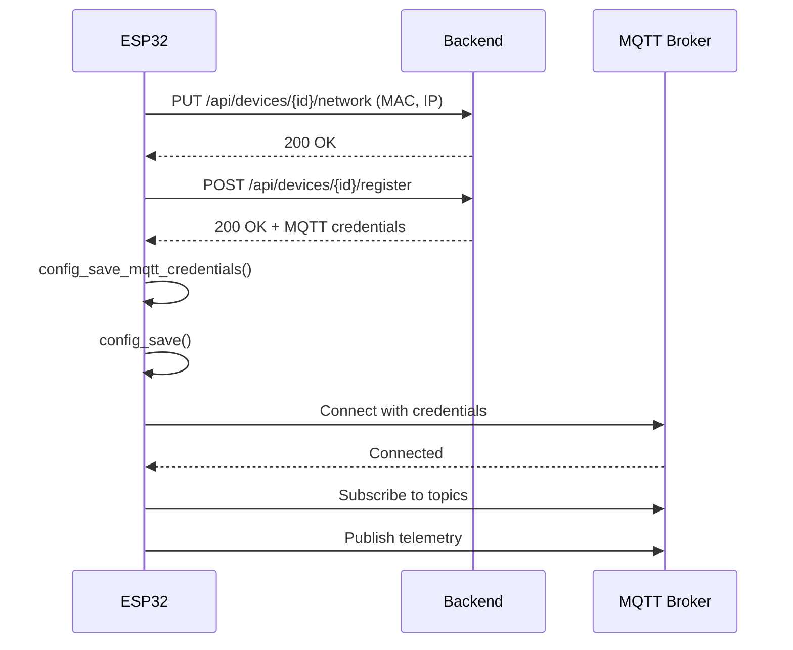

# 📋 Análise Completa do Sistema de Configuração ESP32-Relay

**Projeto:** ESP32-Relay
**Localização:** `/Users/leechardes/Projetos/AutoCore/firmware/esp-idf/esp32-relay`
**Versão:** v2.0
**Data da Análise:** 13/08/2025

## 🎯 Objetivo

Este documento fornece uma análise completa e detalhada do sistema de configuração do projeto ESP32-Relay para permitir a replicação exata no projeto ESP32-Display.

## 📁 Estrutura Geral do Projeto

```
esp32-relay/
├── components/                    # Componentes modulares
│   ├── config_manager/           # Gerenciamento de configuração e NVS
│   ├── network/                  # WiFi, HTTP server, MQTT
│   ├── relay_control/           # Controle de relés
│   └── web_interface/           # Interface web embarcada
├── main/                        # Aplicação principal
├── www/                         # Assets web (HTML, CSS, JS)
├── partitions.csv              # Tabela de partições
├── sdkconfig.defaults          # Configurações padrão SDK
└── CMakeLists.txt              # Build system
```

## 🔧 1. SISTEMA DE CONFIGURAÇÃO (config_manager)

### 1.1 Estrutura de Dados

**Arquivo:** `components/config_manager/include/config_manager.h`

```c
typedef struct {
    // Identificação do dispositivo
    char device_id[CONFIG_DEVICE_ID_MAX_LEN];           // 64 bytes
    char device_name[CONFIG_DEVICE_NAME_MAX_LEN];       // 128 bytes
    uint8_t relay_channels;                             // Número de canais
    bool configured;                                    // Flag de configuração
    
    // Configuração WiFi
    char wifi_ssid[CONFIG_WIFI_SSID_MAX_LEN];          // 32 bytes
    char wifi_password[CONFIG_WIFI_PASSWORD_MAX_LEN];   // 64 bytes
    
    // Configuração Backend
    char backend_ip[CONFIG_IP_STR_MAX_LEN];            // 16 bytes
    uint16_t backend_port;                              // Porta do backend
    
    // Configuração MQTT (legado)
    char mqtt_broker[CONFIG_IP_STR_MAX_LEN];           // 16 bytes
    uint16_t mqtt_port;                                 // Porta MQTT
    char mqtt_user[CONFIG_MQTT_USER_MAX_LEN];          // 64 bytes
    char mqtt_password[CONFIG_MQTT_PASSWORD_MAX_LEN];   // 64 bytes
    bool mqtt_registered;                              // Flag registro
    
    // Configuração MQTT v2.2.0 (smart registration)
    bool device_registered;                            // Registrado no backend
    char mqtt_broker_host[64];                         // Host MQTT do backend
    uint16_t mqtt_broker_port;                         // Porta MQTT do backend
    char mqtt_username[32];                            // Usuário MQTT
    char mqtt_password_new[64];                        // Senha MQTT (nova)
    char mqtt_topic_prefix[32];                        // Prefixo dos tópicos
    uint32_t last_registration;                        // Timestamp último registro
    
    // Estados dos relés (16 canais máximo)
    uint8_t relay_states[CONFIG_ESP32_RELAY_MAX_CHANNELS];
} device_config_t;
```

### 1.2 Constantes de Configuração

```c
#define CONFIG_NAMESPACE "esp32_relay"
#define CONFIG_DEVICE_ID_MAX_LEN 64
#define CONFIG_DEVICE_NAME_MAX_LEN 128
#define CONFIG_WIFI_SSID_MAX_LEN 32
#define CONFIG_WIFI_PASSWORD_MAX_LEN 64
#define CONFIG_IP_STR_MAX_LEN 16
#define CONFIG_MQTT_USER_MAX_LEN 64
#define CONFIG_MQTT_PASSWORD_MAX_LEN 64
```

### 1.3 Funções Principais

#### Inicialização
```c
esp_err_t config_manager_init(void);
```
- Abre namespace NVS "esp32_relay"
- Inicializa com configuração padrão
- Gera device_id baseado no Flash chip ID (permanente)
- Gera device_name baseado no MAC (formato: "ESP32-Relay-XXXXXX")
- Carrega configuração salva do NVS
- **IMPORTANTE:** Device ID e device name são sempre regenerados (não salvos no NVS)

#### Gerenciamento de Dados
```c
device_config_t* config_get(void);           // Retorna ponteiro para config
esp_err_t config_save(void);                 // Salva no NVS
esp_err_t config_load(void);                 // Carrega do NVS
esp_err_t config_reset(void);                // Reset para padrões
```

#### Configuração WiFi
```c
esp_err_t config_set_wifi(const char* ssid, const char* password);
```
- Define SSID e password
- Marca como configurado (configured = true)
- **Salva automaticamente** no NVS

#### Geração de IDs
```c
esp_err_t config_generate_device_id(char* device_id, size_t max_len);
```
- **Prioridade 1:** Flash chip unique ID (permanente, hardware)
- **Fallback:** MAC address se Flash ID não disponível
- Formato: "esp32-XXXXXXXXXXXXXXXX" (16 hex chars)

#### Configuração do AP
```c
esp_err_t config_get_ap_ssid(char* ap_ssid, size_t max_len);
```
- Formato: "ESP32-Relay-XXXXXX" (últimos 3 bytes do MAC)

### 1.4 Armazenamento NVS

**Namespace:** `esp32_relay`

**Mapeamento de Chaves:**

| Campo de Configuração | Chave NVS | Tipo | Observações |
|----------------------|-----------|------|-------------|
| configured | "configured" | uint8 | 0/1 |
| wifi_ssid | "wifi_ssid" | string | - |
| wifi_password | "wifi_password" | string | - |
| backend_ip | "backend_ip" | string | - |
| backend_port | "backend_port" | uint16 | - |
| relay_channels | "relay_channels" | uint8 | - |
| mqtt_broker | "mqtt_broker" | string | Legado |
| mqtt_port | "mqtt_port" | uint16 | Legado |
| mqtt_user | "mqtt_user" | string | Legado |
| mqtt_password | "mqtt_password" | string | Legado |
| mqtt_registered | "mqtt_registered" | uint8 | Legado |
| device_registered | "dev_registered" | uint8 | v2.2.0 |
| mqtt_broker_host | "mqtt_host" | string | v2.2.0 |
| mqtt_broker_port | "mqtt_port2" | uint16 | v2.2.0 |
| mqtt_username | "mqtt_user2" | string | v2.2.0 |
| mqtt_password_new | "mqtt_pass2" | string | v2.2.0 |
| mqtt_topic_prefix | "mqtt_prefix" | string | v2.2.0 |
| last_registration | "last_reg" | uint32 | v2.2.0 |
| relay_states | "relay_states" | blob | Array 16 bytes |

**NOTA IMPORTANTE:** `device_id` e `device_name` NÃO são salvos no NVS - são sempre regenerados baseados no hardware.

### 1.5 API REST de Configuração v2.2.0

#### Busca de Configuração
```c
esp_err_t config_fetch_from_api(void);
```

**Endpoint:** `GET http://{backend_ip}:{backend_port}/api/devices/{device_id}/config`

**Headers:**
```
Content-Type: application/json
User-Agent: ESP32-Relay/2.0.0
```

#### Aplicação de JSON
```c
esp_err_t config_apply_json(const char *json_config);
```

**Formato JSON esperado:**
```json
{
  "mqtt": {
    "broker_host": "10.0.10.100",
    "broker_port": 1883,
    "username": "esp32_user",
    "password": "mqtt_password",
    "topic_prefix": "devices/esp32-XXXX"
  },
  "relays": {
    "channels": 8,
    "config": [
      {"channel": 1, "state": false},
      {"channel": 2, "state": true}
    ]
  },
  "device": {
    "name": "Relay Principal"
  }
}
```

#### Factory Reset
```c
esp_err_t config_factory_reset(void);
```
- Apaga TODA a partição NVS
- Reinicializa NVS
- Reinicia o dispositivo

## 🌐 2. INTERFACE WEB (web_interface)

### 2.1 Sistema de Arquivos Embarcados

**Arquivo:** `components/web_interface/CMakeLists.txt`
```cmake
EMBED_FILES
    "www/index.html"
    "www/style.css"
    "www/app.js"
```

Os arquivos são embarcados na flash durante a compilação usando símbolos:
```c
extern const uint8_t index_html_start[] asm("_binary_index_html_start");
extern const uint8_t index_html_end[] asm("_binary_index_html_end");
extern const uint8_t style_css_start[] asm("_binary_style_css_start");
extern const uint8_t style_css_end[] asm("_binary_style_css_end");
extern const uint8_t app_js_start[] asm("_binary_app_js_start");
extern const uint8_t app_js_end[] asm("_binary_app_js_end");
```

### 2.2 Estrutura de Arquivos Web

#### 2.2.1 index.html
**Localização:** `components/web_interface/www/index.html`

**Funcionalidades:**
- Interface responsiva para controle de relés
- Exibição de status do dispositivo
- Status de conexão WiFi e MQTT
- Grid dinâmico de relés (1-8)
- Controles "Ligar Todos" e "Desligar Todos"
- Auto-refresh a cada 5 segundos

**Estrutura principal:**
```html
<body>
  <div class="container">
    <header><!-- Título e status --></header>
    <main>
      <section class="device-info"><!-- Info do dispositivo --></section>
      <section class="relay-control">
        <div id="relay-grid"><!-- Relés dinâmicos --></div>
      </section>
      <section class="actions"><!-- Botões de ação --></section>
    </main>
    <footer><!-- Versão --></footer>
  </div>
</body>
```

#### 2.2.2 style.css
**Localização:** `components/web_interface/www/style.css`

**Características:**
- Design moderno com gradientes e sombras
- Responsivo (breakpoint 600px)
- Cores temáticas:
  - Primária: `#667eea` → `#764ba2`
  - Sucesso: `#00d68f`
  - Erro: `#ff4757`
- Animações CSS (pulse, hover effects)
- Grid layout para dispositivos móveis

#### 2.2.3 app.js
**Localização:** `components/web_interface/www/app.js`

**API Endpoints utilizados:**
- `GET /api/info` - Informações do dispositivo
- `GET /api/relays` - Estado dos relés
- `POST /api/relay/{id}` - Controle individual
- `POST /api/relays/all` - Controle todos

**Principais funções:**
```javascript
// Busca dados
async function fetchDeviceInfo()
async function fetchRelayStates()

// Controle
async function toggleRelay(id)
async function setAllRelays(state)

// Interface
function updateDeviceInfoUI()
function updateRelayUI()
function updateConnectionStatus(connected)
```

**Auto-refresh:**
```javascript
// Atualização completa inicial
refreshAll();

// Auto-refresh a cada 5 segundos
setInterval(updateStatus, 5000);
```

## 🌍 3. CONFIGURAÇÃO WEB (HTTP Server)

### 3.1 Servidor de Configuração

**Arquivo:** `components/network/src/http_server_config.c`

### 3.2 Rotas de Configuração

#### 3.2.1 Página de Configuração
**Rota:** `GET /`
**Handler:** `config_page_handler()`

**Funcionalidades:**
- Página HTML completa embarcada no código C
- Formulário de configuração WiFi, Backend e Relés
- Status em tempo real (WiFi, IP, MQTT)
- Design responsivo com CSS inline
- JavaScript para validação e UX

**Campos do formulário:**
```html
<input name="wifi_ssid" type="text" required>
<input name="wifi_password" type="password">
<input name="backend_ip" type="text" pattern="IP_REGEX" required>
<input name="backend_port" type="number" min="1" max="65535" required>
<input name="relay_channels" type="number" min="1" max="16" required>
```

#### 3.2.2 Salvamento de Configuração
**Rota:** `POST /config`
**Handler:** `config_save_handler()`

**Processo:**
1. Recebe dados do formulário (application/x-www-form-urlencoded)
2. Faz URL decode dos valores
3. Valida os parâmetros
4. Atualiza configuração na memória
5. Chama `config_save()` para persistir no NVS
6. Tenta conectar ao WiFi com `wifi_manager_connect()`
7. Retorna página de resposta

**Validações:**
- SSID não pode estar vazio
- Senha WiFi mínimo 8 caracteres (se fornecida)
- IP válido
- Porta entre 1-65535
- Canais entre 1-16

#### 3.2.3 Reinicialização
**Rota:** `POST /restart`
**Handler:** `restart_handler()`

- Responde "OK"
- Delay 1 segundo
- `esp_restart()`

#### 3.2.4 Factory Reset
**Rota:** `POST /reset`
**Handler:** `reset_handler()`

- Responde "OK"
- `nvs_flash_erase()`
- `nvs_flash_init()`
- Delay 1 segundo
- `esp_restart()`

### 3.3 Configuração do Servidor

```c
httpd_config_t config = HTTPD_DEFAULT_CONFIG();
config.lru_purge_enable = true;
config.stack_size = 8192;
config.max_uri_handlers = 8;
```

## 📶 4. GERENCIAMENTO WiFi (wifi_manager)

### 4.1 Estados WiFi

```c
typedef enum {
    WIFI_STATE_DISCONNECTED,
    WIFI_STATE_CONNECTING,
    WIFI_STATE_CONNECTED,
    WIFI_STATE_ERROR,
    WIFI_STATE_AP_MODE
} wifi_state_t;
```

### 4.2 Configurações WiFi

**Constantes (em wifi_manager.h):**
```c
#define WIFI_MAXIMUM_RETRY 5
#define WIFI_CONNECT_TIMEOUT_MS 15000
#define WIFI_AP_CHANNEL 1
#define WIFI_AP_MAX_CONNECTIONS 4
```

### 4.3 Modo Station (STA)

**Função:** `wifi_manager_start_sta()`

**Configuração:**
```c
wifi_config_t wifi_config = {
    .sta = {
        .threshold.authmode = WIFI_AUTH_WPA2_PSK,
        .pmf_cfg.capable = true,
        .pmf_cfg.required = false
    }
};
```

**Processo de conexão:**
1. Configura SSID e password
2. Define modo `WIFI_MODE_STA`
3. Aplica configuração
4. Inicia WiFi (`esp_wifi_start()`)
5. Aguarda conexão com timeout
6. Máximo 5 tentativas de reconexão

### 4.4 Modo Access Point (AP)

**Função:** `wifi_manager_start_ap()`

**Configuração:**
```c
wifi_config_t wifi_config = {
    .ap = {
        .channel = WIFI_AP_CHANNEL,           // Canal 1
        .max_connection = WIFI_AP_MAX_CONNECTIONS,  // 4 conexões
        .authmode = WIFI_AUTH_WPA_WPA2_PSK    // WPA/WPA2
    }
};
```

**SSID do AP:**
- Formato: `CONFIG_ESP32_RELAY_DEFAULT_AP_SSID_PREFIX-XXXXXX`
- Padrão: `ESP32-Relay-XXXXXX` (últimos 3 bytes do MAC)

**Senha do AP:**
- Padrão: `CONFIG_ESP32_RELAY_DEFAULT_AP_PASSWORD`
- Configurável via Kconfig (padrão: "12345678")

**IP fixo:** `192.168.4.1`

### 4.5 Event Handlers

**Eventos tratados:**
- `WIFI_EVENT_STA_START` → Inicia conexão
- `WIFI_EVENT_STA_DISCONNECTED` → Retry/Error
- `IP_EVENT_STA_GOT_IP` → Conectado
- `WIFI_EVENT_AP_START` → AP iniciado
- `WIFI_EVENT_AP_STACONNECTED` → Cliente conectou no AP
- `WIFI_EVENT_AP_STADISCONNECTED` → Cliente desconectou do AP

### 4.6 Callbacks

```c
typedef void (*wifi_connected_cb_t)(void);
typedef void (*wifi_disconnected_cb_t)(void);
typedef void (*wifi_ap_started_cb_t)(void);
```

## 🚀 5. FLUXO DE INICIALIZAÇÃO (main.c)

### 5.1 Sequência de Boot

```c
void app_main(void) {
    // 1. Inicialização básica
    nvs_flash_init();                    // NVS storage
    esp_netif_init();                   // TCP/IP stack
    esp_event_loop_create_default();    // Event loop
    
    // 2. Configuração
    config_manager_init();              // Config + NVS
    
    // 3. Hardware
    relay_control_init();               // GPIO dos relés
    relay_restore_states();             // Estados salvos
    
    // 4. Rede
    wifi_manager_init();                // WiFi
    
    // 5. Callbacks
    wifi_manager_set_connected_cb(wifi_connected_handler);
    wifi_manager_set_disconnected_cb(wifi_disconnected_handler);
    wifi_manager_set_ap_started_cb(wifi_ap_started_handler);
    
    // 6. Lógica de boot inteligente
    if (config->configured && strlen(config->wifi_ssid) > 0) {
        // Tenta STA mode primeiro
        ret = wifi_manager_connect_sta_only(ssid, password, 15000);
        if (ret != ESP_OK) {
            // Falhou - inicia AP mode
            wifi_manager_start_ap(ap_ssid, ap_password);
        }
    } else {
        // Não configurado - direto para AP mode
        wifi_manager_start_ap(ap_ssid, ap_password);
    }
    
    // 7. Loop principal
    while(1) {
        // Monitoramento do sistema
        vTaskDelay(pdMS_TO_TICKS(1000));
    }
}
```

### 5.2 Handler de Conexão WiFi

```c
static void wifi_connected_handler(void) {
    // 1. Log do IP
    wifi_manager_get_ip(ip_str, sizeof(ip_str));
    
    // 2. Inicializa SNTP
    sntp_setservername(0, "pool.ntp.org");
    sntp_init();
    
    // 3. Para AP mode
    wifi_manager_stop_ap();
    
    // 4. Inicia HTTP server
    http_server_init();
    
    // 5. Registro inteligente MQTT v2.2.0
    if (strlen(config->backend_ip) > 0) {
        mqtt_update_device_network_info();   // Atualiza MAC/IP
        mqtt_smart_registration();           // Registro inteligente
        
        if (registro_ok) {
            mqtt_client_init();              // Cliente MQTT
            mqtt_momentary_init();           // Relés momentâneos
            
            // Task MQTT (core 1)
            xTaskCreatePinnedToCore(
                mqtt_task, "mqtt_task", 4096, NULL, 5, 
                &mqtt_task_handle, 1
            );
        }
    }
}
```

### 5.3 Handler de AP Iniciado

```c
static void wifi_ap_started_handler(void) {
    // 1. Log das informações
    ESP_LOGI(TAG, "AP SSID: %s", ap_ssid);
    ESP_LOGI(TAG, "AP Password: %s", CONFIG_ESP32_RELAY_DEFAULT_AP_PASSWORD);
    ESP_LOGI(TAG, "Configuration page: http://192.168.4.1");
    
    // 2. Inicia HTTP server para configuração
    http_server_init();
}
```

### 5.4 Lógica de Boot Inteligente

O sistema implementa uma lógica de boot inteligente:

1. **Verifica configuração:**
   - `config->configured == true`
   - `config->wifi_ssid` não vazio

2. **Se configurado:**
   - Tenta conexão STA com timeout de 15s
   - Se sucesso → continua em STA mode
   - Se falha → inicia AP mode para reconfiguração

3. **Se não configurado:**
   - Inicia diretamente em AP mode
   - Aguarda configuração via web

4. **AP mode sempre ativo quando necessário:**
   - SSID: `ESP32-Relay-XXXXXX`
   - Password: configurável (padrão: "12345678")
   - IP: `192.168.4.1`
   - Página: `http://192.168.4.1`

## 💾 6. SISTEMA DE PARTIÇÕES

### 6.1 Tabela de Partições

**Arquivo:** `partitions.csv`

```
# Name,     Type, SubType, Offset,   Size,     Flags
nvs,        data, nvs,     0x9000,   0x6000,   
phy_init,   data, phy,     0xf000,   0x1000,   
factory,    app,  factory, 0x10000,  0x140000, 
ota_0,      app,  ota_0,   0x150000, 0x140000, 
ota_1,      app,  ota_1,   0x290000, 0x140000, 
ota_data,   data, ota,     0x3D0000, 0x2000,   
config,     data, nvs,     0x3D2000, 0x10000,  
```

### 6.2 Detalhamento das Partições

| Partição | Tipo | Subtipo | Offset | Tamanho | Uso |
|----------|------|---------|--------|---------|-----|
| nvs | data | nvs | 0x9000 | 24KB | NVS padrão do sistema |
| phy_init | data | phy | 0xf000 | 4KB | Calibração RF |
| factory | app | factory | 0x10000 | 1.25MB | App principal |
| ota_0 | app | ota_0 | 0x150000 | 1.25MB | OTA slot 0 |
| ota_1 | app | ota_1 | 0x290000 | 1.25MB | OTA slot 1 |
| ota_data | data | ota | 0x3D0000 | 8KB | Dados OTA |
| config | data | nvs | 0x3D2000 | 64KB | Configurações extras |

### 6.3 Uso da Flash (4MB total)

- **Sistema:** 32KB (NVS + PHY)
- **Aplicação:** 3.75MB (3 slots de 1.25MB)
- **OTA Data:** 8KB
- **Config Extra:** 64KB
- **Reserva:** ~100KB

## ⚙️ 7. CONFIGURAÇÕES SDK

### 7.1 Principais Configurações

**Arquivo:** `sdkconfig.defaults`

#### Sistema
```
CONFIG_ESP_MAIN_TASK_STACK_SIZE=8192
CONFIG_ESP_SYSTEM_EVENT_TASK_STACK_SIZE=4096
CONFIG_ESP_TIMER_TASK_STACK_SIZE=4096
CONFIG_ESP_TASK_WDT_TIMEOUT_S=10
```

#### WiFi
```
CONFIG_ESP32_WIFI_ENABLE_WPA3_SAE=y
CONFIG_ESP32_WIFI_SW_COEXIST_ENABLE=y
CONFIG_ESP32_WIFI_STATIC_RX_BUFFER_NUM=4
CONFIG_ESP32_WIFI_DYNAMIC_RX_BUFFER_NUM=8
CONFIG_ESP32_WIFI_DYNAMIC_TX_BUFFER_NUM=16
```

#### HTTP Server
```
CONFIG_HTTPD_MAX_REQ_HDR_LEN=2048
CONFIG_HTTPD_MAX_URI_LEN=512
CONFIG_HTTP_SERVER_STACK_SIZE=8192
```

#### MQTT
```
CONFIG_MQTT_PROTOCOL_311=y
CONFIG_MQTT_TRANSPORT_SSL=y
CONFIG_MQTT_TRANSPORT_WEBSOCKET=y
```

#### Otimizações
```
CONFIG_COMPILER_OPTIMIZATION_SIZE=y
CONFIG_COMPILER_OPTIMIZATION_ASSERTIONS_SILENT=y
CONFIG_ESP32_DEFAULT_CPU_FREQ_MHZ_240=y
```

### 7.2 Configurações Específicas do Projeto

**Arquivo:** `main/Kconfig.projbuild`

```
config ESP32_RELAY_MAX_CHANNELS
    int "Maximum number of relay channels"
    default 16

config ESP32_RELAY_DEFAULT_AP_SSID_PREFIX
    string "Default AP SSID prefix"
    default "ESP32-Relay"

config ESP32_RELAY_DEFAULT_AP_PASSWORD
    string "Default AP password"
    default "12345678"

config ESP32_RELAY_DEFAULT_BACKEND_IP
    string "Default backend IP address"
    default "10.0.10.100"

config ESP32_RELAY_DEFAULT_BACKEND_PORT
    int "Default backend port"
    default 8081

config ESP32_RELAY_TELEMETRY_INTERVAL
    int "Telemetry publishing interval (seconds)"
    default 30

config ESP32_RELAY_WIFI_TIMEOUT
    int "WiFi connection timeout (seconds)"
    default 15
```

## 🔄 8. REGISTRO INTELIGENTE MQTT v2.2.0

### 8.1 Processo de Registro

1. **Atualização de Informações de Rede:**
   ```c
   esp_err_t mqtt_update_device_network_info(void);
   ```
   - Endpoint: `PUT /api/devices/{device_id}/network`
   - Dados: MAC address, IP atual

2. **Registro Inteligente:**
   ```c
   esp_err_t mqtt_smart_registration(void);
   ```
   - Endpoint: `POST /api/devices/{device_id}/register`
   - Recebe credenciais MQTT do backend

3. **Salvamento de Credenciais:**
   ```c
   esp_err_t config_save_mqtt_credentials(
       const char* broker_host,
       uint16_t broker_port,
       const char* username,
       const char* password,
       const char* topic_prefix
   );
   ```

### 8.2 Fluxo Completo



## 🎯 9. GUIA DE REPLICAÇÃO PARA ESP32-DISPLAY

### 9.1 Arquivos a Copiar/Adaptar

#### Estrutura de Diretórios
```bash
# Criar estrutura
mkdir -p components/{config_manager,network,web_interface,display_control}
mkdir -p components/config_manager/{include,src}
mkdir -p components/network/{include,src}
mkdir -p components/web_interface/{include,src,www}
mkdir -p components/display_control/{include,src}
```

#### Componente config_manager
```bash
# Copiar arquivos base
cp esp32-relay/components/config_manager/include/config_manager.h \
   esp32-display/components/config_manager/include/
cp esp32-relay/components/config_manager/src/config_manager.c \
   esp32-display/components/config_manager/src/
cp esp32-relay/components/config_manager/CMakeLists.txt \
   esp32-display/components/config_manager/
```

#### Web Interface
```bash
# Copiar interface web completa
cp -r esp32-relay/components/web_interface/* \
      esp32-display/components/web_interface/
```

#### Network Component
```bash
# Copiar componentes de rede
cp esp32-relay/components/network/include/{wifi_manager.h,http_server.h} \
   esp32-display/components/network/include/
cp esp32-relay/components/network/src/{wifi_manager.c,http_server_config.c} \
   esp32-display/components/network/src/
```

### 9.2 Adaptações Necessárias

#### 9.2.1 Configurações Específicas

**Alterar em config_manager.h:**
```c
// Trocar namespace
#define CONFIG_NAMESPACE "esp32_display"

// Adaptar estrutura de dados
typedef struct {
    // ... campos comuns ...
    
    // Remover campos de relé
    // uint8_t relay_channels;
    // uint8_t relay_states[CONFIG_ESP32_RELAY_MAX_CHANNELS];
    
    // Adicionar campos de display
    uint8_t display_type;           // Tipo de display
    uint8_t display_brightness;     // Brilho
    char display_config[256];       // Configuração específica
} device_config_t;
```

**Alterar geração de device_id:**
```c
// Em config_generate_device_id()
snprintf(device_id, max_len, "esp32-display-%016llx", flash_id);

// Em config_get_ap_ssid()
snprintf(ap_ssid, max_len, "%s-%02x%02x%02x", 
        "ESP32-Display",  // <- Trocar prefixo
        mac[3], mac[4], mac[5]);
```

#### 9.2.2 Kconfig do Projeto

**Criar main/Kconfig.projbuild:**
```
menu "ESP32 Display Configuration"
    config ESP32_DISPLAY_TYPE_MAX
        int "Maximum display types supported"
        default 8
        
    config ESP32_DISPLAY_DEFAULT_AP_SSID_PREFIX
        string "Default AP SSID prefix"
        default "ESP32-Display"
        
    config ESP32_DISPLAY_DEFAULT_BACKEND_PORT
        int "Default backend port"
        default 8082  # Porta diferente do relay
        
    # ... outras configurações específicas ...
endmenu
```

#### 9.2.3 Interface Web

**Adaptar www/index.html:**
```html
<!-- Trocar título -->
<title>ESP32 Display Control</title>
<h1>ESP32 Display Control</h1>

<!-- Trocar seção de controle -->
<section class="display-control">
    <h2>Controle do Display</h2>
    <div id="display-controls">
        <!-- Controles específicos do display -->
    </div>
</section>
```

**Adaptar www/app.js:**
```javascript
// Trocar endpoints da API
const API_ENDPOINTS = {
    info: '/api/info',
    display: '/api/display',          // <- Novo
    brightness: '/api/brightness',    // <- Novo
    content: '/api/content'           // <- Novo
};

// Adaptar funções de controle
async function updateDisplayContent(content) {
    // Implementação específica
}

async function setBrightness(level) {
    // Implementação específica
}
```

#### 9.2.4 HTTP Server

**Adaptar página de configuração:**
```c
// Em config_page_handler()
offset += snprintf(response + offset, size - offset,
    "      <div class='form-group'>"
    "        <label class='form-label'>📺 Tipo de Display</label>"
    "        <select name='display_type' class='form-input' required>"
    "          <option value='1'>OLED 128x64</option>"
    "          <option value='2'>TFT 320x240</option>"
    "          <option value='3'>E-Paper 2.9\"</option>"
    "        </select>"
    "      </div>"
    "      <div class='form-group'>"
    "        <label class='form-label'>🔆 Brilho Padrão</label>"
    "        <input type='range' name='brightness' class='form-input' "
    "               value='%d' min='0' max='100'>"
    "      </div>",
    config->display_brightness
);
```

#### 9.2.5 Partições

**Adaptar partitions.csv:**
```
# Mesmo layout básico, pode manter igual
# Name,     Type, SubType, Offset,   Size,     Flags
nvs,        data, nvs,     0x9000,   0x6000,   
phy_init,   data, phy,     0xf000,   0x1000,   
factory,    app,  factory, 0x10000,  0x140000, 
ota_0,      app,  ota_0,   0x150000, 0x140000, 
ota_1,      app,  ota_1,   0x290000, 0x140000, 
ota_data,   data, ota,     0x3D0000, 0x2000,   
config,     data, nvs,     0x3D2000, 0x10000,  
```

### 9.3 Componente Display Control

#### 9.3.1 Estrutura

```bash
components/display_control/
├── CMakeLists.txt
├── Kconfig
├── include/
│   └── display_control.h
└── src/
    └── display_control.c
```

#### 9.3.2 Interface Básica

**display_control.h:**
```c
#ifndef DISPLAY_CONTROL_H
#define DISPLAY_CONTROL_H

#include "esp_err.h"
#include <stdint.h>

typedef enum {
    DISPLAY_TYPE_OLED_128x64 = 1,
    DISPLAY_TYPE_TFT_320x240 = 2,
    DISPLAY_TYPE_EPAPER_29 = 3
} display_type_t;

esp_err_t display_control_init(void);
esp_err_t display_set_brightness(uint8_t level);
esp_err_t display_show_content(const char* content);
esp_err_t display_clear(void);

#endif
```

### 9.4 Main Application

**Adaptar main.c:**
```c
#include "display_control.h"  // <- Adicionar

// Na função app_main()
ESP_ERROR_CHECK(display_control_init());    // <- Após relay_control_init()
ESP_LOGI(TAG, "✅ Display control initialized");

// Adaptar callbacks WiFi conforme necessário
// Adaptar handlers MQTT para comandos de display
```

## 📋 10. CHECKLIST DE IMPLEMENTAÇÃO

### ✅ Fase 1: Estrutura Base
- [ ] Criar estrutura de diretórios
- [ ] Copiar e adaptar config_manager
- [ ] Copiar e adaptar network components
- [ ] Adaptar web_interface
- [ ] Configurar Kconfig do projeto

### ✅ Fase 2: Adaptação
- [ ] Modificar device_config_t para display
- [ ] Atualizar namespace NVS
- [ ] Adaptar geração de device_id
- [ ] Modificar prefixo AP
- [ ] Adaptar interface web HTML/CSS/JS

### ✅ Fase 3: Display Control
- [ ] Implementar display_control component
- [ ] Integrar com config_manager
- [ ] Adicionar APIs HTTP para display
- [ ] Implementar controles web

### ✅ Fase 4: Integração
- [ ] Adaptar main.c
- [ ] Configurar partitions.csv
- [ ] Configurar sdkconfig.defaults
- [ ] Testar sistema completo

### ✅ Fase 5: Testes
- [ ] Teste de configuração via web
- [ ] Teste de persistência NVS
- [ ] Teste de AP mode
- [ ] Teste de STA mode
- [ ] Teste de registro MQTT v2.2.0
- [ ] Teste de factory reset
- [ ] Teste de controle do display

## 📝 11. PONTOS CRÍTICOS DE ATENÇÃO

### ⚠️ NVS Namespace
- **OBRIGATÓRIO:** Trocar namespace de "esp32_relay" para "esp32_display"
- Limpar NVS durante desenvolvimento para evitar conflitos

### ⚠️ Device ID Generation
- Manter lógica de Flash chip ID como prioridade
- Adaptar prefixo para "esp32-display-XXXXXXXXXXXXXXXX"
- Device ID e device name NÃO são salvos no NVS

### ⚠️ AP Mode Configuration  
- Trocar prefixo SSID para "ESP32-Display-XXXXXX"
- Manter senha configurável via Kconfig
- IP fixo 192.168.4.1

### ⚠️ Web Interface
- Adaptar todos os textos e labels
- Trocar controles de relé por controles de display
- Manter estrutura responsiva e auto-refresh

### ⚠️ MQTT Integration
- Adaptar tópicos MQTT para display
- Manter lógica de smart registration v2.2.0
- Usar porta backend diferente (8082)

### ⚠️ Build System
- Adaptar todas as referencias em CMakeLists.txt
- Configurar EMBED_FILES corretamente
- Manter dependências necessárias

## 🔚 Conclusão

Este documento fornece uma análise completa do sistema de configuração do ESP32-Relay, detalhando todos os aspectos necessários para replicar o sistema no ESP32-Display. 

**Principais pontos para replicação:**

1. **Sistema NVS robusto** com persistência automática
2. **Interface web completa** embarcada na flash
3. **Lógica de boot inteligente** STA → AP fallback
4. **Configuração via web** com validação
5. **Registro MQTT v2.2.0** automático
6. **Factory reset** completo
7. **Particionamento otimizado** para OTA

A implementação seguindo este guia resultará em um sistema de configuração idêntico, adaptado para as necessidades específicas do ESP32-Display.

---

**Documento gerado em:** 13/08/2025  
**Autor:** Análise Automática do Sistema ESP32-Relay  
**Versão:** 1.0