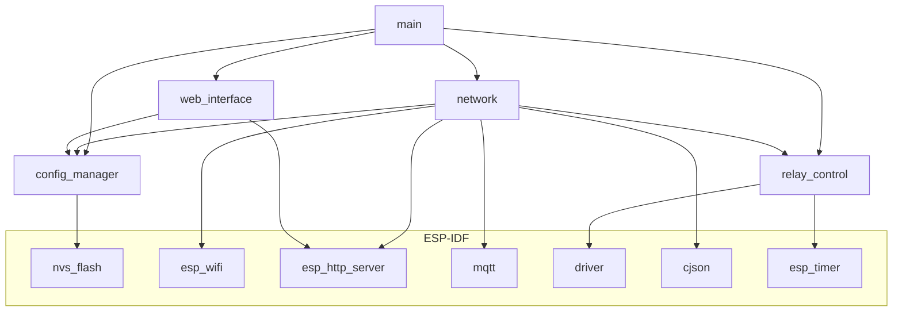

# 🛠️ Guia de Desenvolvimento - ESP32-Relay ESP-IDF

Guia completo para desenvolvedores que desejam contribuir ou modificar o sistema ESP32-Relay.

## 📖 Índice

- [🚀 Setup Inicial](#-setup-inicial)
- [🏗️ Estrutura do Projeto](#%EF%B8%8F-estrutura-do-projeto)
- [🔧 Build System](#-build-system)
- [🧪 Testing](#-testing)
- [🐛 Debugging](#-debugging)
- [📝 Code Standards](#-code-standards)
- [🔄 Git Workflow](#-git-workflow)
- [📦 Releases](#-releases)

## 🚀 Setup Inicial

### Pré-requisitos

```bash
# 1. ESP-IDF v5.0+
curl -fsSL https://raw.githubusercontent.com/espressif/esp-idf/master/tools/install.sh | bash

# 2. Python 3.8+
python3 --version

# 3. Git
git --version

# 4. Build tools
sudo apt install cmake ninja-build ccache libffi-dev libssl-dev dfu-util libusb-1.0-0
```

### Environment Setup

```bash
# 1. Clone repository
git clone https://github.com/AutoCore/firmware.git
cd firmware/esp32-relay-esp-idf

# 2. Setup ESP-IDF
. $HOME/esp/esp-idf/export.sh

# 3. Install dependencies
pip install -r requirements.txt

# 4. Verify installation
idf.py --version
```

### IDE Setup

#### VS Code (Recomendado)

```bash
# Install ESP-IDF extension
code --install-extension espressif.esp-idf-extension
```

**Settings.json:**
```json
{
    "idf.espIdfPath": "/home/user/esp/esp-idf",
    "idf.pythonBinPath": "/home/user/esp/esp-idf/python_env/idf5.0_py3.8_env/bin/python",
    "idf.toolsPath": "/home/user/.espressif",
    "C_Cpp.default.compileCommands": "${workspaceFolder}/build/compile_commands.json"
}
```

#### CLion

```bash
# Open as CMake project
# Set toolchain to ESP-IDF
```

## 🏗️ Estrutura do Projeto

### Arquitetura de Componentes

```
esp32-relay-esp-idf/
├── components/                    # Componentes ESP-IDF
│   ├── config_manager/           # Gerenciamento de configuração
│   ├── network/                  # Componentes de rede
│   ├── relay_control/            # Controle de hardware
│   └── web_interface/            # Interface web
├── main/                         # Aplicação principal
├── docs/                         # Documentação
├── scripts/                      # Scripts de automação
├── test/                         # Testes unitários
├── CMakeLists.txt               # Build principal
├── sdkconfig.defaults           # Configuração padrão
└── partitions.csv              # Tabela de partições
```

### Component Structure

Cada componente segue o padrão ESP-IDF:

```
component_name/
├── CMakeLists.txt              # Build configuration
├── Kconfig                     # Menu configuration options
├── include/                    # Headers públicos
│   └── component_name.h
├── src/                        # Implementação
│   ├── component_impl.c
│   └── internal_functions.c
├── test/                       # Testes do componente
│   └── test_component.c
└── README.md                   # Documentação específica
```

### Dependency Graph



## 🔧 Build System

### Makefile Commands

```bash
# Build commands
make build          # Build projeto
make flash          # Flash firmware
make monitor        # Serial monitor
make clean          # Limpar build
make fullclean      # Limpeza completa
make menuconfig     # Configuração

# Development commands
make debug          # Debug via OpenOCD
make size           # Análise de tamanho
make lint           # Code linting
make format         # Code formatting
make test           # Run tests

# Automation
make all            # build + flash + monitor
make release        # Build para produção
```

### Build Configurations

#### Debug Build
```bash
# Development build with debug symbols
idf.py build -DCMAKE_BUILD_TYPE=Debug \
  -DCONFIG_COMPILER_OPTIMIZATION_DEBUG=y \
  -DCONFIG_ESP32_RELAY_LOG_LEVEL=4
```

#### Release Build
```bash
# Production optimized build
idf.py build -DCMAKE_BUILD_TYPE=Release \
  -DCONFIG_COMPILER_OPTIMIZATION_SIZE=y \
  -DCONFIG_ESP32_RELAY_LOG_LEVEL=2
```

#### Test Build
```bash
# Build with unit tests
idf.py build -DCONFIG_ESP32_RELAY_UNIT_TESTS=y
```

### Custom Build Scripts

**scripts/build_all_variants.sh:**
```bash
#!/bin/bash
# Build all project variants

VARIANTS=("debug" "release" "test")

for variant in "${VARIANTS[@]}"; do
    echo "Building $variant variant..."
    
    case $variant in
        "debug")
            idf.py build -DCMAKE_BUILD_TYPE=Debug
            ;;
        "release") 
            idf.py build -DCMAKE_BUILD_TYPE=Release
            ;;
        "test")
            idf.py build -DCONFIG_ESP32_RELAY_UNIT_TESTS=y
            ;;
    esac
    
    if [ $? -eq 0 ]; then
        echo "✅ $variant build successful"
    else
        echo "❌ $variant build failed"
        exit 1
    fi
done
```

## 🧪 Testing

### Unit Tests

#### Test Structure
```c
// test/test_relay_control.c
#include "unity.h"
#include "relay_control.h"

void setUp(void) {
    // Setup antes de cada teste
    relay_control_init();
}

void tearDown(void) {
    // Cleanup após cada teste
    relay_control_deinit();
}

void test_relay_turn_on(void) {
    // Teste básico
    bool result = relay_turn_on(0);
    TEST_ASSERT_TRUE(result);
    TEST_ASSERT_TRUE(relay_get_state(0));
}

void test_relay_invalid_channel(void) {
    // Teste de erro
    bool result = relay_turn_on(99);
    TEST_ASSERT_FALSE(result);
}

void app_main(void) {
    UNITY_BEGIN();
    
    RUN_TEST(test_relay_turn_on);
    RUN_TEST(test_relay_invalid_channel);
    
    UNITY_END();
}
```

#### Running Tests
```bash
# Build and run unit tests
idf.py build -DCONFIG_ESP32_RELAY_UNIT_TESTS=y
idf.py flash monitor

# Specific test component
idf.py build -DTEST_COMPONENTS="relay_control"
```

### Integration Tests

#### MQTT Integration Test
```python
#!/usr/bin/env python3
"""
Integration test for MQTT functionality
"""

import paho.mqtt.client as mqtt
import json
import time
import requests

class ESP32RelayTestSuite:
    def __init__(self, device_ip, mqtt_broker):
        self.device_ip = device_ip
        self.mqtt_broker = mqtt_broker
        self.client = mqtt.Client()
        
    def test_mqtt_commands(self):
        """Test MQTT command processing"""
        
        # Connect to broker
        self.client.connect(self.mqtt_broker, 1883, 60)
        
        # Subscribe to responses
        self.client.subscribe("autocore/devices/+/telemetry")
        
        # Send test command
        cmd = {"channel": 1, "command": "on", "source": "test"}
        self.client.publish(
            "autocore/devices/esp32_relay_test/relay/command",
            json.dumps(cmd)
        )
        
        # Wait for response
        time.sleep(1)
        
        # Verify relay state via HTTP
        response = requests.get(f"http://{self.device_ip}/api/status")
        status = response.json()
        
        assert status['relay_states'][0] == True, "Relay should be ON"
        print("✅ MQTT command test passed")
        
    def test_heartbeat_system(self):
        """Test momentary relay heartbeat"""
        
        # Activate momentary relay
        cmd = {
            "channel": 2, 
            "command": "on", 
            "is_momentary": True,
            "source": "test"
        }
        self.client.publish(
            "autocore/devices/esp32_relay_test/relay/command",
            json.dumps(cmd)
        )
        
        # Send heartbeats for 2 seconds
        start_time = time.time()
        while (time.time() - start_time) < 2:
            heartbeat = {
                "channel": 2,
                "timestamp": int(time.time())
            }
            self.client.publish(
                "autocore/devices/esp32_relay_test/relay/heartbeat",
                json.dumps(heartbeat)
            )
            time.sleep(0.1)  # 100ms
            
        # Stop heartbeat and wait for timeout
        time.sleep(1.5)  # Should trigger safety shutoff
        
        # Verify relay is OFF
        response = requests.get(f"http://{self.device_ip}/api/status")
        status = response.json()
        
        assert status['relay_states'][1] == False, "Relay should be OFF after timeout"
        print("✅ Heartbeat timeout test passed")

# Run tests
test_suite = ESP32RelayTestSuite("192.168.1.105", "192.168.1.100")
test_suite.test_mqtt_commands()
test_suite.test_heartbeat_system()
```

### Performance Tests

```python
#!/usr/bin/env python3
"""
Performance benchmarks
"""

import time
import requests
import statistics

def benchmark_http_response_time(device_ip, iterations=100):
    """Benchmark HTTP API response time"""
    
    times = []
    
    for i in range(iterations):
        start = time.time()
        response = requests.get(f"http://{device_ip}/api/status")
        end = time.time()
        
        if response.status_code == 200:
            times.append((end - start) * 1000)  # Convert to ms
            
    avg_time = statistics.mean(times)
    min_time = min(times)
    max_time = max(times)
    
    print(f"HTTP Response Time Benchmark:")
    print(f"  Average: {avg_time:.2f}ms")
    print(f"  Min: {min_time:.2f}ms") 
    print(f"  Max: {max_time:.2f}ms")
    
    assert avg_time < 50, f"Average response time {avg_time}ms > 50ms threshold"
    print("✅ HTTP performance test passed")

benchmark_http_response_time("192.168.1.105")
```

## 🐛 Debugging

### Serial Debugging

```bash
# Enhanced monitoring with filters
idf.py monitor \
  --print_filter="ESP32_RELAY*:D,mqtt*:I,wifi*:W" \
  --timestamp

# Save logs to file
idf.py monitor | tee debug_session.log
```

### GDB Debugging

```bash
# Start OpenOCD
openocd -f board/esp32-wrover-kit-3.3v.cfg

# In another terminal, start GDB
xtensa-esp32-elf-gdb build/esp32-relay.elf
(gdb) target remote :3333
(gdb) monitor reset halt
(gdb) break app_main
(gdb) continue
```

### Memory Debugging

```c
// Enable heap tracing
#include "esp_heap_trace.h"

void debug_heap_usage(void) {
    heap_trace_record_t trace_records[100];
    
    heap_trace_init_standalone(trace_records, 100);
    heap_trace_start(HEAP_TRACE_LEAKS);
    
    // Your code here
    
    heap_trace_stop();
    heap_trace_dump();
}
```

### Network Debugging

```bash
# Wireshark capture
tcpdump -i wlan0 -w esp32_traffic.pcap host 192.168.1.105

# MQTT debugging
mosquitto_sub -h 192.168.1.100 -t "#" -v | tee mqtt_debug.log
```

## 📝 Code Standards

### Naming Conventions

```c
// Files: snake_case
relay_control.c, mqtt_handler.h

// Functions: snake_case
esp_err_t relay_turn_on(int channel);
bool mqtt_client_is_connected(void);

// Variables: snake_case
int relay_channel = 0;
bool wifi_connected = false;

// Constants: UPPER_SNAKE_CASE
#define MAX_RELAY_CHANNELS 16
#define MQTT_TIMEOUT_MS 5000

// Types: snake_case_t
typedef struct {
    int channel;
    bool state;
} relay_status_t;

// Enums: UPPER_SNAKE_CASE
typedef enum {
    RELAY_STATE_OFF,
    RELAY_STATE_ON
} relay_state_e;
```

### Header Guards

```c
#pragma once

#include <stdint.h>
#include <stdbool.h>
#include "esp_err.h"

#ifdef __cplusplus
extern "C" {
#endif

// Declarations here

#ifdef __cplusplus
}
#endif
```

### Documentation Standards

```c
/**
 * @brief Turns on a specific relay channel
 * 
 * This function activates the specified relay channel and updates
 * the internal state tracking. The operation is thread-safe.
 * 
 * @param channel Relay channel number (0-15)
 * @return 
 *     - ESP_OK: Success
 *     - ESP_ERR_INVALID_ARG: Invalid channel number
 *     - ESP_ERR_TIMEOUT: Mutex timeout
 * 
 * @note This function is thread-safe
 * @warning Channel numbering is 0-based internally, 1-based in API
 */
esp_err_t relay_turn_on(int channel);
```

### Error Handling

```c
esp_err_t example_function(void) {
    esp_err_t ret = ESP_OK;
    
    // Validate parameters
    if (invalid_param) {
        ESP_LOGE(TAG, "Invalid parameter");
        return ESP_ERR_INVALID_ARG;
    }
    
    // Attempt operation
    ret = some_operation();
    if (ret != ESP_OK) {
        ESP_LOGE(TAG, "Operation failed: %s", esp_err_to_name(ret));
        goto cleanup;
    }
    
    // Success path
    ESP_LOGI(TAG, "Operation successful");
    return ESP_OK;
    
cleanup:
    // Cleanup code
    cleanup_resources();
    return ret;
}
```

### Logging Standards

```c
static const char *TAG = "COMPONENT_NAME";

ESP_LOGE(TAG, "Critical error: %s", error_msg);    // Errors
ESP_LOGW(TAG, "Warning: %s", warning_msg);         // Warnings  
ESP_LOGI(TAG, "Info: %s", info_msg);               // Information
ESP_LOGD(TAG, "Debug: value=%d", debug_value);     // Debug
ESP_LOGV(TAG, "Verbose: detailed info");          // Verbose
```

## 🔄 Git Workflow

### Branch Strategy

```
main (stable)
├── develop (integration)
├── feature/mqtt-heartbeat
├── feature/web-interface
├── bugfix/memory-leak
└── release/v2.1.0
```

### Commit Messages

```bash
# Format: type(scope): description

feat(mqtt): add heartbeat system for momentary relays
fix(wifi): resolve connection timeout issues  
docs(readme): update installation instructions
style(relay): fix code formatting
refactor(config): simplify NVS management
test(mqtt): add integration tests
chore(build): update ESP-IDF to v5.1
```

### Pre-commit Hooks

**.pre-commit-config.yaml:**
```yaml
repos:
- repo: local
  hooks:
  - id: esp-idf-style
    name: ESP-IDF code style
    entry: scripts/check_style.sh
    language: script
    files: \.(c|h)$
    
  - id: build-test
    name: Build test
    entry: idf.py build
    language: system
    always_run: true
```

### Release Process

```bash
# 1. Create release branch
git checkout -b release/v2.1.0 develop

# 2. Update version
echo "2.1.0" > main/version.h

# 3. Update changelog
vim CHANGELOG.md

# 4. Test release
make test

# 5. Merge to main
git checkout main
git merge release/v2.1.0

# 6. Tag release
git tag -a v2.1.0 -m "Release v2.1.0"

# 7. Push
git push origin main --tags
```

## 📦 Releases

### Build Artifacts

```bash
# Generate release artifacts
scripts/generate_release.sh v2.1.0

# Outputs:
# - esp32-relay-v2.1.0.bin (firmware)
# - esp32-relay-v2.1.0-factory.bin (factory image)
# - esp32-relay-v2.1.0.zip (complete package)
# - CHANGELOG.md
# - README.md
```

### Automated Releases

**GitHub Actions (.github/workflows/release.yml):**
```yaml
name: Release

on:
  push:
    tags:
      - 'v*'

jobs:
  build:
    runs-on: ubuntu-latest
    
    steps:
    - uses: actions/checkout@v3
    
    - name: Setup ESP-IDF
      uses: espressif/esp-idf-ci-action@v1
      
    - name: Build firmware
      run: |
        . $IDF_PATH/export.sh
        idf.py build
        
    - name: Create release
      uses: actions/create-release@v1
      with:
        tag_name: ${{ github.ref }}
        release_name: Release ${{ github.ref }}
        body_path: CHANGELOG.md
        draft: false
        prerelease: false
```

### Version Management

**scripts/version_bump.py:**
```python
#!/usr/bin/env python3
"""
Version management script
"""

import re
import sys
from pathlib import Path

def update_version(version_file, new_version):
    """Update version in header file"""
    
    content = Path(version_file).read_text()
    
    # Update version define
    content = re.sub(
        r'#define FIRMWARE_VERSION ".*"',
        f'#define FIRMWARE_VERSION "{new_version}"',
        content
    )
    
    # Update build number
    build_match = re.search(r'#define BUILD_NUMBER (\d+)', content)
    if build_match:
        old_build = int(build_match.group(1))
        new_build = old_build + 1
        content = re.sub(
            r'#define BUILD_NUMBER \d+',
            f'#define BUILD_NUMBER {new_build}',
            content
        )
    
    Path(version_file).write_text(content)
    print(f"✅ Updated version to {new_version}, build {new_build}")

if __name__ == "__main__":
    if len(sys.argv) != 2:
        print("Usage: version_bump.py <new_version>")
        sys.exit(1)
        
    new_version = sys.argv[1]
    update_version("main/version.h", new_version)
```

## 🚀 Contributing

### Pull Request Template

```markdown
## Description
Brief description of changes

## Type of Change
- [ ] Bug fix (non-breaking change that fixes an issue)
- [ ] New feature (non-breaking change that adds functionality) 
- [ ] Breaking change (fix or feature that would cause existing functionality to change)
- [ ] Documentation update

## Testing
- [ ] Unit tests pass
- [ ] Integration tests pass
- [ ] Manual testing completed

## Checklist
- [ ] Code follows style guidelines
- [ ] Self-review completed
- [ ] Code commented where necessary
- [ ] Documentation updated
- [ ] No new warnings introduced
```

### Development Environment

```bash
# Setup development environment
git clone https://github.com/AutoCore/firmware.git
cd firmware/esp32-relay-esp-idf

# Install pre-commit hooks
pre-commit install

# Create feature branch
git checkout -b feature/my-new-feature

# Make changes and commit
git add .
git commit -m "feat(component): add new functionality"

# Push and create PR
git push origin feature/my-new-feature
```

---

## 🔗 Links Relacionados

- [🏗️ Arquitetura](ARCHITECTURE.md) - Arquitetura técnica detalhada
- [📡 Protocolo MQTT](MQTT_PROTOCOL.md) - Especificação do protocolo
- [🔧 API Reference](API.md) - Documentação das APIs
- [⚙️ Configuração](CONFIGURATION.md) - Guia de configuração
- [🚀 Deployment](DEPLOYMENT.md) - Instruções de produção

---

**Documento**: Guia de Desenvolvimento ESP32-Relay  
**Versão**: 2.0.0  
**Última Atualização**: 11 de Agosto de 2025  
**Autor**: AutoCore Team