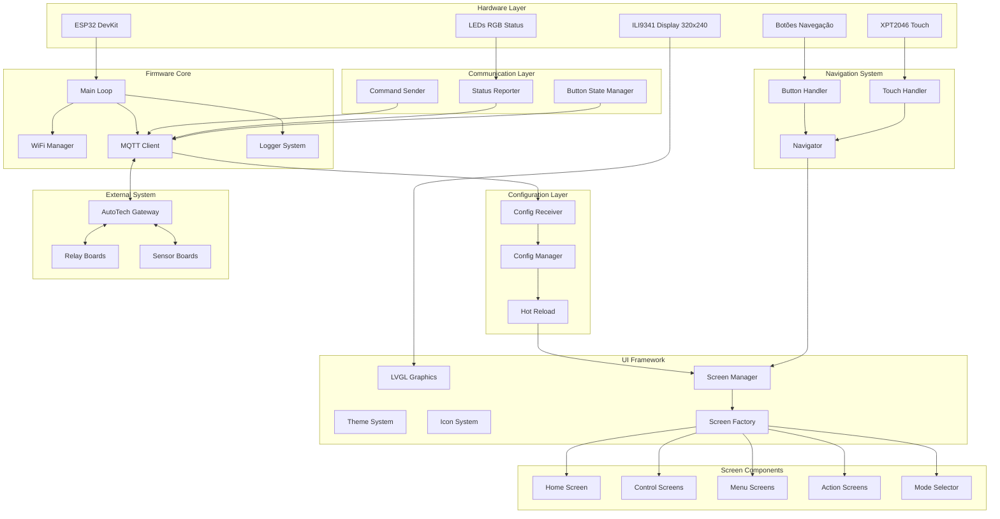
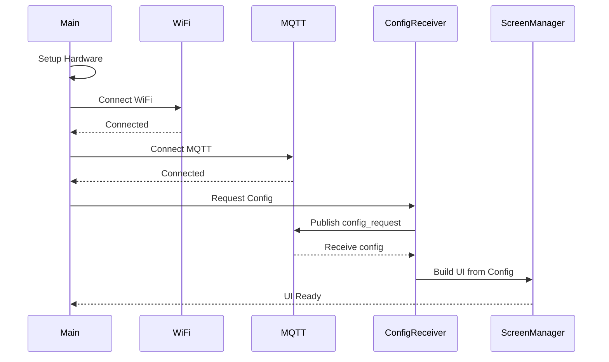
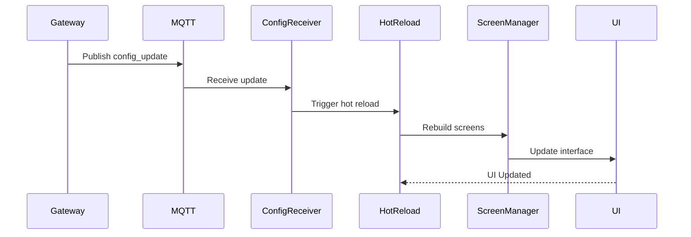
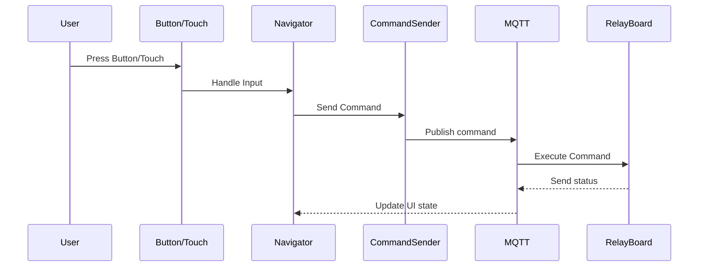

# 🏗️ Arquitetura do Sistema - AutoTech HMI Display v2

## 📋 Índice

- [Visão Geral](#visão-geral)
- [Arquitetura de Componentes](#arquitetura-de-componentes)
- [Fluxo de Dados](#fluxo-de-dados)
- [Comunicação MQTT](#comunicação-mqtt)
- [Sistema de Configuração Dinâmica](#sistema-de-configuração-dinâmica)
- [Decisões Arquiteturais](#decisões-arquiteturais)
- [Padrões de Design](#padrões-de-design)

## 🎯 Visão Geral

O AutoTech HMI Display v2 é um sistema de interface humano-máquina totalmente parametrizável para controle veicular, baseado em ESP32 com display TFT touchscreen. A arquitetura foi projetada com os seguintes princípios:

- **Configuração Dinâmica**: 100% parametrizável via MQTT
- **Zero Hardcode**: Nenhuma configuração fixa no firmware
- **Hot-Reload**: Atualizações sem reinicialização
- **Modularidade**: Componentes isolados e intercambiáveis
- **Escalabilidade**: Suporta sistemas de 1 a 1000+ relés

## 🔧 Arquitetura de Componentes



### 📦 Módulos Principais

#### 1. **Core System**
- **Main Loop**: Coordena todos os componentes
- **Logger**: Sistema de logging configurável
- **WiFi Manager**: Gerenciamento de conexão WiFi
- **MQTT Client**: Cliente MQTT otimizado para ESP32

#### 2. **Configuration System**
- **Config Manager**: Gerencia configurações recebidas
- **Config Receiver**: Recebe configurações via MQTT
- **Hot Reload**: Atualiza UI sem reinicialização

#### 3. **User Interface**
- **Screen Manager**: Gerencia todas as telas
- **Screen Factory**: Cria telas dinamicamente
- **Navigator**: Sistema de navegação
- **Theme System**: Temas visuais configuráveis

#### 4. **Input/Output**
- **Button Handler**: Gerencia botões físicos
- **Touch Handler**: Gerencia touch screen
- **Command Sender**: Envia comandos MQTT
- **Status Reporter**: Reporta status do dispositivo

## 🔄 Fluxo de Dados

### 1. Inicialização do Sistema



### 2. Configuração Dinâmica (Hot-Reload)



### 3. Controle de Dispositivos



## 📡 Comunicação MQTT

### Topologia de Tópicos

```
autotech/
├── gateway/
│   ├── config/
│   │   ├── request          # HMI → Gateway: Solicita configuração
│   │   ├── response         # Gateway → HMI: Envia configuração
│   │   └── update          # Gateway → HMI: Hot-reload
│   └── status              # Gateway status
├── {device_id}/            # hmi_display_1, relay_board_1, etc.
│   ├── status              # Status do dispositivo
│   ├── command             # Comandos para o dispositivo
│   ├── telemetry          # Telemetria do dispositivo
│   └── channel/{n}/        # Status específico de canais
│       ├── status
│       └── command
└── system/
    ├── discovery          # Auto-discovery de novos dispositivos
    └── heartbeat          # Heartbeat global do sistema
```

### Formato das Mensagens

#### Requisição de Configuração
```json
{
  "timestamp": "2025-01-18T00:00:00Z",
  "device_id": "hmi_display_1",
  "type": "config_request",
  "version": "2.0.0"
}
```

#### Comando de Controle
```json
{
  "timestamp": "2025-01-18T00:00:00Z",
  "device_id": "hmi_display_1",
  "target_device": "relay_board_1",
  "command": {
    "type": "relay",
    "channel": 1,
    "action": "toggle",
    "source": "hmi_button"
  }
}
```

#### Status Report
```json
{
  "timestamp": "2025-01-18T00:00:00Z",
  "device_id": "hmi_display_1",
  "status": "online",
  "current_screen": "lighting",
  "backlight": 100,
  "system": {
    "uptime": 3600,
    "free_heap": 180000,
    "wifi_rssi": -65
  }
}
```

## ⚙️ Sistema de Configuração Dinâmica

### Princípios Fundamentais

1. **Zero Hardcode**: Nenhuma configuração fixa no código
2. **Fonte Única**: Toda configuração vem do Gateway
3. **Validação**: Configurações são validadas antes de aplicar
4. **Fallback**: Sistema mantém última configuração válida
5. **Hot-Reload**: Mudanças aplicadas sem reinicialização

### Estrutura da Configuração

```json
{
  "version": "2.0.0",
  "system": {
    "name": "AutoTech Control System",
    "language": "pt-BR",
    "theme": "dark"
  },
  "screens": {
    "home": { /* definição da tela home */ },
    "lighting": { /* definição da tela de iluminação */ }
  },
  "devices": {
    "relay_board_1": { /* configuração da placa de relés */ }
  },
  "presets": {
    "emergency": { /* definição do preset de emergência */ }
  }
}
```

### Fluxo de Hot-Reload

1. **Gateway** publica nova configuração
2. **ConfigReceiver** valida e armazena
3. **ConfigManager** notifica mudança
4. **ScreenManager** reconstrói todas as telas
5. **Navigator** mantém contexto atual
6. **UI** é atualizada instantaneamente

## 🏛️ Decisões Arquiteturais

### 1. **Configuração Dinâmica vs. Estática**
- ✅ **Escolhida**: Configuração 100% dinâmica via MQTT
- ❌ **Rejeitada**: Configuração fixa no código
- **Razão**: Flexibilidade total para diferentes tipos de veículos

### 2. **LVGL vs. Sistema Customizado**
- ✅ **Escolhida**: LVGL como framework gráfico
- ❌ **Rejeitada**: Sistema gráfico próprio
- **Razão**: Maturidade, performance e recursos avançados

### 3. **Arquitetura Monolítica vs. Modular**
- ✅ **Escolhida**: Arquitetura modular com componentes isolados
- ❌ **Rejeitada**: Código monolítico
- **Razão**: Manutenibilidade, testabilidade e reutilização

### 4. **JSON vs. Binário para Configuração**
- ✅ **Escolhida**: JSON para configurações
- ❌ **Rejeitada**: Formato binário
- **Razão**: Legibilidade, debugging e compatibilidade

### 5. **Singleton vs. Dependency Injection**
- ✅ **Escolhida**: Mix: Singletons para recursos globais, DI para componentes
- **Razão**: Simplicidade em ESP32 mantendo flexibilidade

## 🎨 Padrões de Design

### 1. **Factory Pattern**
```cpp
class ScreenFactory {
public:
    static std::unique_ptr<ScreenBase> createScreen(
        const String& type, JsonObject& config);
};
```

### 2. **Observer Pattern**
```cpp
class ConfigManager {
    ConfigChangeCallback onChangeCallback;
public:
    void onChange(ConfigChangeCallback callback);
};
```

### 3. **Strategy Pattern**
```cpp
class Icons {
public:
    static const char* getIcon(const char* iconId);
};
```

### 4. **State Pattern**
```cpp
class Navigator {
    String currentScreen;
    std::vector<String> navigationStack;
};
```

### 5. **Command Pattern**
```cpp
class CommandSender {
public:
    void sendRelayCommand(const String& device, int channel, const String& action);
};
```

## 🔒 Considerações de Segurança

### 1. **Validação de Entrada**
- Todas as configurações são validadas antes de aplicar
- Comandos MQTT são sanitizados
- Limites de memória são respeitados

### 2. **Failsafe Mechanisms**
- Sistema mantém última configuração válida
- Timeout automático para comandos críticos
- Watchdog para detectar travamentos

### 3. **Integridade dos Dados**
- Checksums para validar configurações
- Versionamento para compatibilidade
- Rollback automático em caso de falha

## 📊 Métricas de Performance

### 1. **Memória**
- **Heap Usage**: ~180KB livre de 320KB total
- **Config Size**: Máximo 20KB por configuração
- **MQTT Buffer**: 20KB para grandes configurações

### 2. **Timing**
- **Hot-Reload**: < 2 segundos
- **Screen Transition**: < 200ms
- **MQTT Response**: < 100ms
- **Touch Response**: < 50ms

### 3. **Recursos**
- **CPU Usage**: < 30% em operação normal
- **Network**: < 1KB/s em estado idle
- **Flash**: ~1MB para firmware completo

## 🔮 Extensibilidade

### 1. **Novos Tipos de Tela**
```cpp
class CustomScreen : public ScreenBase {
    // Implementar nova funcionalidade
};

// Registrar no factory
ScreenFactory::registerScreenType("custom", CustomScreen::create);
```

### 2. **Novos Tipos de Item**
```cpp
class CustomItem : public ItemBase {
    // Implementar novo componente
};
```

### 3. **Novos Protocolos**
```cpp
class BluetoothClient : public CommunicationClient {
    // Implementar comunicação Bluetooth
};
```

## 📝 Notas de Implementação

### 1. **Limitações do ESP32**
- Memória limitada: Evitar vazamentos
- Single-core disponível: Evitar bloqueios
- Flash wear: Minimizar escritas

### 2. **Otimizações LVGL**
- Buffer pequeno para economizar RAM
- Fontes otimizadas para caracteres necessários
- Temas simples para melhor performance

### 3. **Gestão de Estado**
- Estado crítico mantido em variáveis globais
- Estado da UI reconstruído a partir da configuração
- Sincronização com sistema externo via MQTT

---

**Versão**: 2.0.0  
**Última Atualização**: Janeiro 2025  
**Autor**: AutoTech Team