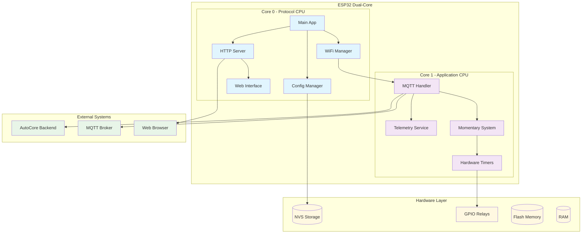
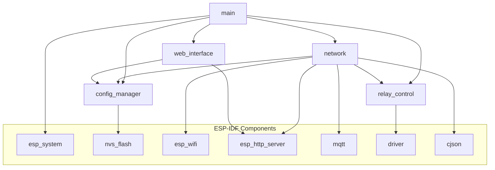
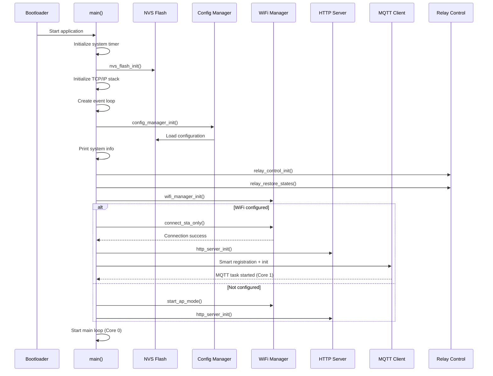
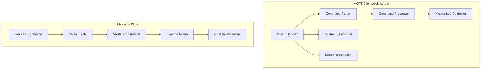

# 🏗️ Arquitetura ESP32-Relay ESP-IDF

Este documento descreve a arquitetura técnica completa do sistema ESP32-Relay implementado em ESP-IDF.

## 📖 Índice

- [🎯 Visão Geral](#-visão-geral)
- [🏛️ Arquitetura de Alto Nível](#%EF%B8%8F-arquitetura-de-alto-nível)
- [🧩 Componentes ESP-IDF](#-componentes-esp-idf)
- [⚙️ Dual-Core Architecture](#%EF%B8%8F-dual-core-architecture)
- [🔄 Fluxo de Inicialização](#-fluxo-de-inicialização)
- [📡 Sistema MQTT](#-sistema-mqtt)
- [⚡ Sistema de Relés Momentâneos](#-sistema-de-relés-momentâneos)
- [💾 Gerenciamento de Memória](#-gerenciamento-de-memória)
- [🔒 Thread Safety](#-thread-safety)
- [📊 Performance & Otimizações](#-performance--otimizações)

## 🎯 Visão Geral

O ESP32-Relay ESP-IDF é um sistema embarcado de alta performance para controle de relés, construído sobre a arquitetura modular do ESP-IDF. O sistema foi projetado para máxima eficiência, confiabilidade e extensibilidade.

### Características Arquiteturais

- **Modularidade**: Componentes independentes com APIs bem definidas
- **Performance**: Dual-core utilization + hardware timers
- **Confiabilidade**: Thread-safe operations + error handling
- **Escalabilidade**: Fácil adição de novos componentes e funcionalidades
- **Manutenibilidade**: Código estruturado + documentação abrangente

## 🏛️ Arquitetura de Alto Nível



## 🧩 Componentes ESP-IDF

O projeto segue a arquitetura de componentes do ESP-IDF, organizados em módulos independentes:

### 📁 Estrutura de Componentes

```
esp32-relay-esp-idf/
├── components/
│   ├── config_manager/          # Gerenciamento de configuração
│   │   ├── include/config_manager.h
│   │   ├── src/config_manager.c
│   │   ├── CMakeLists.txt
│   │   └── Kconfig
│   │
│   ├── network/                 # Componentes de rede
│   │   ├── include/
│   │   │   ├── wifi_manager.h
│   │   │   ├── http_server.h
│   │   │   ├── mqtt_handler.h
│   │   │   ├── mqtt_protocol.h
│   │   │   ├── mqtt_registration.h
│   │   │   ├── mqtt_telemetry.h
│   │   │   └── mqtt_momentary.h
│   │   ├── src/
│   │   │   ├── wifi_manager.c
│   │   │   ├── http_server_config.c
│   │   │   ├── mqtt_handler.c
│   │   │   ├── mqtt_commands.c
│   │   │   ├── mqtt_registration.c
│   │   │   ├── mqtt_telemetry.c
│   │   │   └── mqtt_momentary.c
│   │   ├── CMakeLists.txt
│   │   └── Kconfig
│   │
│   ├── relay_control/           # Controle de hardware
│   │   ├── include/relay_control.h
│   │   ├── src/relay_control.c
│   │   ├── CMakeLists.txt
│   │   └── Kconfig
│   │
│   └── web_interface/           # Interface web embarcada
│       ├── include/web_interface.h
│       ├── src/web_interface.c
│       ├── www/                 # Assets web
│       │   ├── index.html
│       │   ├── style.css
│       │   └── app.js
│       ├── CMakeLists.txt
│       └── Kconfig
│
└── main/                        # Aplicação principal
    ├── main.c
    ├── version.h
    ├── CMakeLists.txt
    └── Kconfig.projbuild
```

### 🔗 Dependências entre Componentes



## ⚙️ Dual-Core Architecture

O ESP32 possui dois cores (CPUs) que são utilizados estrategicamente:

### Core 0 - Protocol CPU
**Responsabilidades:**
- Aplicação principal (main task)
- Gerenciamento WiFi 
- Servidor HTTP
- Interface web
- Configuração do sistema

**Características:**
- Clock: 240MHz
- Stack padrão: 8KB
- Prioridade: Comunicação e configuração

### Core 1 - Application CPU  
**Responsabilidades:**
- Cliente MQTT + telemetria
- Sistema de relés momentâneos
- Timers de alta precisão
- Processamento de comandos

**Características:**
- Clock: 240MHz  
- Stack otimizado: 4KB
- Prioridade: Controle em tempo real

### Task Pinning Strategy

```c
// Core 0 - Protocol tasks
xTaskCreatePinnedToCore(
    wifi_manager_task,
    "wifi_task", 
    4096,
    NULL,
    5,
    &wifi_task_handle,
    0  // Core 0
);

// Core 1 - Application tasks  
xTaskCreatePinnedToCore(
    mqtt_task,
    "mqtt_task",
    4096, 
    NULL,
    5,
    &mqtt_task_handle,
    1  // Core 1
);
```

## 🔄 Fluxo de Inicialização



### Timing de Inicialização

| Etapa | Tempo | Acumulado | Descrição |
|-------|-------|-----------|-----------|
| ESP-IDF Boot | ~200ms | 200ms | Bootloader + partições |
| NVS + TCP/IP | ~100ms | 300ms | Inicialização básica |
| Componentes | ~200ms | 500ms | Config + WiFi + Relay |
| WiFi Connect | ~400ms | 900ms | Conectar à rede |
| MQTT Setup | ~100ms | 1000ms | Registro + conexão |
| **Total** | **~1s** | **1s** | **Sistema operacional** |

## 📡 Sistema MQTT

### Arquitetura MQTT



### Estrutura de Tópicos

```
autocore/devices/{device_uuid}/
├── status              # Status do device (retained)
├── relays/state        # Estado dos relés (retained)
├── telemetry           # Eventos de telemetria
├── relay/command       # Comandos de relé
├── relay/heartbeat     # Heartbeat para momentâneos
└── commands/
    ├── reset           # Reset do sistema
    ├── status          # Solicitar status
    ├── reboot          # Reiniciar device
    └── ota             # Atualização OTA
```

### QoS Strategy

| Tipo de Mensagem | QoS | Retain | Justificativa |
|------------------|-----|---------|---------------|
| **Commands** | 1 | false | Garantir entrega, evitar duplicatas |
| **Status** | 1 | true | Estado atual sempre disponível |
| **Relay States** | 1 | true | Estado crítico dos relés |
| **Telemetry** | 0 | false | Eventos temporais, performance |
| **Heartbeat** | 0 | false | Fluxo contínuo, sem persistência |

## ⚡ Sistema de Relés Momentâneos

### Arquitetura Momentânea

```mermaid
graph TB
    subgraph "Momentary Relay System"
        Command[MQTT Command] 
        Start[Start Monitoring]
        Timer[ESP Timer 100ms]
        Check[Check Heartbeat]
        Timeout[Safety Timeout]
        Shutoff[Emergency Shutoff]
        Telemetry[Safety Telemetry]
    end
    
    subgraph "Data Structures"
        Mutex[Semaphore Mutex]
        Array[momentary_relays[16]]
        Structure[momentary_relay_t]
    end
    
    Command --> Start
    Start --> Timer
    Timer --> Check
    Check --> Timeout
    Timeout --> Shutoff
    Shutoff --> Telemetry
    
    Timer --> Mutex
    Mutex --> Array
    Array --> Structure
```

### Estrutura de Dados

```c
typedef struct {
    bool active;                    // Monitoramento ativo
    int channel;                    // Canal do relé (1-16)
    int64_t last_heartbeat;         // Timestamp último heartbeat (ms)
    esp_timer_handle_t timer;       // Handle do timer ESP
} momentary_relay_t;

// Array global protegido por mutex
static momentary_relay_t momentary_relays[16];
static SemaphoreHandle_t momentary_mutex = NULL;
```

### Fluxo de Controle

1. **Comando Recebido**: `is_momentary: true`
2. **Inicialização**: 
   - Liga relé físico
   - Cria timer de 100ms
   - Marca como ativo
3. **Loop de Monitoramento**:
   - Timer dispara a cada 100ms
   - Verifica timestamp do último heartbeat
   - Se > 1000ms → trigger safety shutoff
4. **Heartbeat Received**:
   - Atualiza timestamp
   - Religa relé se necessário
5. **Safety Shutoff**:
   - Desliga relé físico
   - Para timer
   - Publica telemetria de segurança
   - Desativa monitoramento

### Thread Safety

```c
// Exemplo de acesso thread-safe
esp_err_t mqtt_momentary_heartbeat(int channel) {
    if (xSemaphoreTake(momentary_mutex, pdMS_TO_TICKS(100)) != pdTRUE) {
        return ESP_ERR_TIMEOUT;
    }
    
    // Operações críticas aqui
    momentary_relays[idx].last_heartbeat = esp_timer_get_time() / 1000;
    
    xSemaphoreGive(momentary_mutex);
    return ESP_OK;
}
```

## 💾 Gerenciamento de Memória

### Layout de Memória

```
ESP32 Memory Layout (4MB Flash + 320KB RAM):

Flash (4MB):
├── Bootloader        (~32KB)
├── Partition Table   (~4KB)  
├── Application       (~1.2MB)
│   ├── Code          (~800KB)
│   ├── Read-only     (~400KB)
│   └── Web Assets    (~50KB)
├── NVS Storage       (~16KB)
├── OTA Updates       (~1.2MB) [Reserved]
└── User Data         (~1.5MB) [Available]

RAM (320KB):
├── ESP-IDF System    (~150KB)
├── WiFi Stack        (~25KB)
├── MQTT Stack        (~15KB)
├── HTTP Server       (~10KB)
├── Application       (~45KB)
│   ├── Main Task     (~8KB)
│   ├── MQTT Task     (~4KB)
│   ├── Buffers       (~20KB)
│   └── Variables     (~13KB)
└── Free Heap         (~75KB) [Available]
```

### Otimizações de Memória

**Stack Sizing:**
```c
// Tamanhos otimizados baseados em análise real
#define MAIN_TASK_STACK_SIZE     8192   // 8KB
#define MQTT_TASK_STACK_SIZE     4096   // 4KB
#define HTTP_TASK_STACK_SIZE     4096   // 4KB
#define WIFI_TASK_STACK_SIZE     3072   // 3KB
```

**Buffer Management:**
```c
// Buffers estáticos para evitar malloc/free
static char json_buffer[1024];          // Parser JSON
static char http_response[2048];        // HTTP responses
static char mqtt_payload[512];          // MQTT payloads
```

**Memory Monitoring:**
```c
void memory_monitor_task(void *pvParameters) {
    while (1) {
        uint32_t free_heap = esp_get_free_heap_size();
        uint32_t min_heap = esp_get_minimum_free_heap_size();
        
        if (free_heap < MEMORY_WARNING_THRESHOLD) {
            ESP_LOGW(TAG, "Low memory: %u bytes free", free_heap);
        }
        
        vTaskDelay(pdMS_TO_TICKS(10000)); // Check every 10s
    }
}
```

## 🔒 Thread Safety

### Sincronização de Recursos

O sistema utiliza vários mecanismos de sincronização para garantir thread safety:

**Mutex Semaphores:**
```c
// Proteção de estruturas compartilhadas
static SemaphoreHandle_t config_mutex = NULL;
static SemaphoreHandle_t relay_mutex = NULL;  
static SemaphoreHandle_t momentary_mutex = NULL;
```

**Event Groups:**
```c
// Coordenação entre tasks
static EventGroupHandle_t system_events;

#define WIFI_CONNECTED_BIT    BIT0
#define MQTT_CONNECTED_BIT    BIT1
#define CONFIG_SAVED_BIT      BIT2
```

**Queues:**
```c
// Comunicação segura entre tasks
static QueueHandle_t mqtt_command_queue;
static QueueHandle_t telemetry_queue;
```

### Race Condition Prevention

**Relay State Access:**
```c
bool relay_set_state(int channel, bool state) {
    if (xSemaphoreTake(relay_mutex, pdMS_TO_TICKS(100)) != pdTRUE) {
        return false;
    }
    
    // Operação atômica
    relay_states[channel] = state;
    gpio_set_level(relay_pins[channel], state);
    
    xSemaphoreGive(relay_mutex);
    return true;
}
```

**Configuration Updates:**
```c
esp_err_t config_save(void) {
    if (xSemaphoreTake(config_mutex, pdMS_TO_TICKS(1000)) != pdTRUE) {
        return ESP_ERR_TIMEOUT;
    }
    
    esp_err_t ret = nvs_commit(config_handle);
    
    xSemaphoreGive(config_mutex);
    return ret;
}
```

## 📊 Performance & Otimizações

### Compiler Optimizations

```cmake
# CMakeLists.txt optimizations
set(COMPONENT_ADD_COMPILE_FLAGS "-O2 -ffast-math -funroll-loops")
set(CMAKE_C_FLAGS "${CMAKE_C_FLAGS} -flto") # Link Time Optimization
```

### Hardware-Specific Optimizations

**GPIO Access:**
```c
// Direct register access para performance crítica
#define GPIO_FAST_SET(pin)   (GPIO.out_w1ts = (1ULL << pin))
#define GPIO_FAST_CLEAR(pin) (GPIO.out_w1tc = (1ULL << pin))
```

**Timer Precision:**
```c
// High-resolution timers (1us precision)
esp_timer_create_args_t timer_args = {
    .callback = &momentary_check_callback,
    .arg = (void*)channel,
    .dispatch_method = ESP_TIMER_TASK,
    .name = "momentary_timer"
};
```

**Cache Optimization:**
```c
// IRAM placement para funções críticas
void IRAM_ATTR gpio_interrupt_handler(void *arg) {
    // Handler em IRAM para zero latência
}
```

### Performance Monitoring

**Benchmarking:**
```c
// Macro para medição de performance
#define BENCHMARK_START() int64_t start = esp_timer_get_time()
#define BENCHMARK_END(name) ESP_LOGI(TAG, "%s took %lld us", name, \
                                    esp_timer_get_time() - start)

void some_critical_function() {
    BENCHMARK_START();
    // Função crítica
    BENCHMARK_END("critical_function");
}
```

**Real-time Metrics:**
```c
typedef struct {
    uint32_t http_requests;
    uint32_t mqtt_commands;
    uint32_t relay_switches;
    uint32_t memory_warnings;
    uint64_t uptime_seconds;
} system_metrics_t;
```

### Load Balancing

**Task Priority Assignment:**
```c
#define PRIORITY_CRITICAL    10  // Momentary system
#define PRIORITY_HIGH        8   // MQTT commands
#define PRIORITY_MEDIUM      5   // HTTP server
#define PRIORITY_LOW         2   // Telemetry
#define PRIORITY_IDLE        1   // Background tasks
```

---

## 🔗 Links Relacionados

- [📡 Protocolo MQTT](MQTT_PROTOCOL.md) - Especificação completa do protocolo
- [🔧 API Reference](API.md) - Documentação das APIs  
- [🛠️ Development Guide](DEVELOPMENT.md) - Guia para desenvolvedores
- [🚀 Deployment Guide](DEPLOYMENT.md) - Instruções de produção

---

**Documento**: Arquitetura ESP32-Relay ESP-IDF  
**Versão**: 2.0.0  
**Última Atualização**: 11 de Agosto de 2025  
**Autor**: AutoCore Team