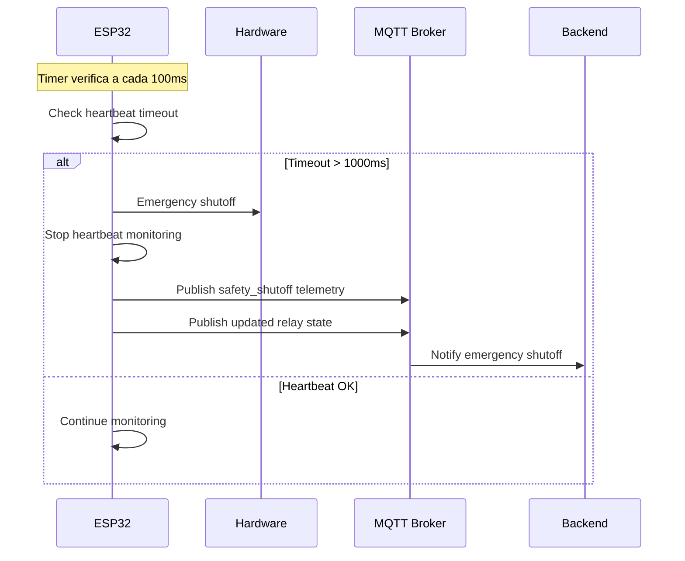

# 📡 Protocolo MQTT - ESP32-Relay AutoCore

## 📋 Visão Geral

Este documento define o protocolo de comunicação MQTT entre o ESP32-Relay e o sistema AutoCore.

## 🔗 Estrutura de Tópicos

### Base Topic Pattern
```
autocore/devices/{device_uuid}/
```

Onde `device_uuid` é o identificador único do dispositivo (ex: `esp32-504d34313221267d`)

## 📤 Tópicos de Publicação (ESP32 → Backend)

### 1. Status do Dispositivo
**Tópico:** `autocore/devices/{uuid}/status`  
**Retain:** true  
**QoS:** 1  
**Payload:**
```json
{
  "uuid": "esp32-504d34313221267d",
  "board_id": 1,
  "status": "online",  // "online" | "offline"
  "timestamp": "2025-08-11T17:30:00",
  "type": "esp32_relay",
  "channels": 16,
  "firmware_version": "2.0.0",
  "ip_address": "10.0.10.130",
  "wifi_rssi": -45,
  "uptime": 3600,
  "free_memory": 200000
}
```

### 2. Estado dos Relés
**Tópico:** `autocore/devices/{uuid}/relays/state`  
**Retain:** true  
**QoS:** 1  
**Payload:**
```json
{
  "uuid": "esp32-504d34313221267d",
  "board_id": 1,
  "timestamp": "2025-08-11T17:30:00",
  "channels": {
    "1": false,
    "2": false,
    "3": true,
    "4": false,
    "5": false,
    "6": false,
    "7": false,
    "8": false,
    "9": false,
    "10": false,
    "11": false,
    "12": false,
    "13": false,
    "14": false,
    "15": false,
    "16": false
  }
}
```

### 3. Telemetria
**Tópico:** `autocore/devices/{uuid}/telemetry`  
**Retain:** false  
**QoS:** 0  
**Payload (Mudança de Estado):**
```json
{
  "uuid": "esp32-504d34313221267d",
  "board_id": 1,
  "timestamp": "2025-08-11T17:30:00",
  "event": "relay_change",
  "channel": 3,
  "state": true,
  "trigger": "mqtt",  // "mqtt" | "web" | "button" | "auto"
  "source": "api"     // origem do comando
}
```

**Payload (Desligamento de Segurança):**
```json
{
  "uuid": "esp32-504d34313221267d",
  "board_id": 1,
  "timestamp": "2025-08-11T17:30:00",
  "event": "safety_shutoff",
  "channel": 3,
  "reason": "heartbeat_timeout",
  "timeout": 1.0
}
```

## 📥 Tópicos de Subscrição (Backend → ESP32)

### 1. Comando de Relé
**Tópico:** `autocore/devices/{uuid}/relay/command`  
**QoS:** 1  
**Payload:**
```json
{
  "channel": 1,        // 1-16 ou "all"
  "command": "on",     // "on" | "off" | "toggle"
  "source": "api",     // origem do comando
  "is_momentary": false,  // opcional: relé momentâneo
  "user": "admin"      // opcional: usuário que executou
}
```

### 2. Comandos Gerais
**Tópico:** `autocore/devices/{uuid}/commands/+`  
**QoS:** 1  

#### Reset Command
**Tópico:** `autocore/devices/{uuid}/commands/reset`
```json
{
  "command": "reset",
  "type": "all"  // "all" | "relays" | "config"
}
```

#### Status Request
**Tópico:** `autocore/devices/{uuid}/commands/status`
```json
{
  "command": "status"
}
```

#### Reboot Command
**Tópico:** `autocore/devices/{uuid}/commands/reboot`
```json
{
  "command": "reboot",
  "delay": 5  // segundos antes de reiniciar
}
```

#### OTA Update
**Tópico:** `autocore/devices/{uuid}/commands/ota`
```json
{
  "command": "ota",
  "url": "http://server/firmware.bin",
  "version": "2.1.0",
  "checksum": "md5hash"
}
```

### 3. Heartbeat (Para Relés Momentâneos)
**Tópico:** `autocore/devices/{uuid}/relay/heartbeat`  
**QoS:** 0  
**Payload:**
```json
{
  "channel": 3,
  "timestamp": 1699999999
}
```

### 4. Sistema de Comandos Unificado
**Tópico:** `autocore/devices/{uuid}/commands/+`  
**QoS:** 1  

Todos os comandos seguem a mesma estrutura base, permitindo extensibilidade:

#### Comando com Channel (para relés)
```json
{
  "channel": 1,        // 1-16 ou "all"
  "command": "on",     // "on" | "off" | "toggle"
  "source": "api",     // origem do comando
  "is_momentary": true, // opcional: relé momentâneo
  "user": "admin"      // opcional: usuário que executou
}
```

#### Comando Geral (sistema)
```json
{
  "command": "reset",  // "reset" | "status" | "reboot" | "ota"
  "type": "all",       // para reset: "all" | "relays" | "config"
  "delay": 5           // para reboot: segundos de delay
}
```

## 🔄 Fluxos de Comunicação

### Fluxo de Inicialização


### Fluxo de Comando de Relé


### Fluxo de Relé Momentâneo

```mermaid
sequenceDiagram
    participant Backend
    participant MQTT Broker  
    participant ESP32
    participant Hardware
    
    Backend->>MQTT Broker: /commands/relay (is_momentary=true)
    MQTT Broker->>ESP32: Deliver command
    ESP32->>Hardware: Liga relé
    ESP32->>ESP32: Start heartbeat monitor (100ms checks)
    ESP32->>MQTT Broker: Publish /relays/state
    ESP32->>MQTT Broker: Publish /telemetry (relay_change)
    
    loop Manter ativo - Every 100ms or less
        Backend->>MQTT Broker: /relay/heartbeat
        MQTT Broker->>ESP32: Heartbeat received
        ESP32->>ESP32: Update last_heartbeat timestamp
        Note over ESP32: Reset inactivity timer
    end
    
    Note over ESP32: Se não receber heartbeat por > 1s
    ESP32->>Hardware: Desliga relé automaticamente
    ESP32->>ESP32: Stop monitoring
    ESP32->>MQTT Broker: Publish /telemetry (safety_shutoff)
    ESP32->>MQTT Broker: Publish /relays/state (updated)
```


### Fluxo de Safety Shutoff


## 🔐 Segurança e Confiabilidade

### Quality of Service (QoS)
- **QoS 0**: Telemetria, heartbeats (fire-and-forget)
- **QoS 1**: Comandos, estados (garantir entrega)
- **QoS 2**: Não utilizado (overhead desnecessário)

### Retained Messages
- **Status**: Sempre retained (último estado conhecido)
- **State**: Sempre retained (estado atual dos relés)
- **Telemetry**: Nunca retained (eventos temporais)
- **Commands**: Nunca retained (evitar comandos duplicados)

### Last Will Testament (LWT)
```json
{
  "topic": "autocore/devices/{uuid}/status",
  "payload": {
    "uuid": "esp32-504d34313221267d",
    "status": "offline",
    "timestamp": "2025-08-11T17:30:00"
  },
  "retain": true,
  "qos": 1
}
```

## 📊 Métricas e Monitoramento

### Publicação Periódica (a cada 30s)
- Estado dos relés
- Status do dispositivo
- Métricas de sistema (memória, uptime, RSSI)

### Eventos Imediatos
- Mudanças de estado de relé
- Comandos recebidos
- Erros e alertas
- Desligamentos de segurança

## 🛠️ Configuração Recomendada

### ESP32 Settings
```c
#define MQTT_QOS_STATUS     1
#define MQTT_QOS_STATE      1
#define MQTT_QOS_TELEMETRY  0
#define MQTT_QOS_COMMANDS   1

#define MQTT_RETAIN_STATUS  true
#define MQTT_RETAIN_STATE   true
#define MQTT_RETAIN_TELEMETRY false

#define MQTT_KEEPALIVE      60    // segundos
#define MQTT_TIMEOUT        5000  // ms
#define TELEMETRY_INTERVAL  30    // segundos

// ⚡ Configurações de Relé Momentâneo
#define MOMENTARY_TIMEOUT_MS        1000  // 1s sem heartbeat = desliga
#define MOMENTARY_CHECK_INTERVAL_MS 100   // Verifica a cada 100ms
#define MOMENTARY_MAX_CHANNELS      16    // Máximo de canais momentâneos simultâneos
```

### Broker Settings
```yaml
# mosquitto.conf
max_keepalive 120
persistent_client_expiration 1d
retain_available true
max_queued_messages 1000
```

## 📝 Notas de Implementação

1. **Parsing JSON**: Usar cJSON para parsing eficiente
2. **Buffer Sizes**: Mínimo 1024 bytes para payloads
3. **Error Handling**: Sempre validar JSON antes de processar
4. **Timestamps**: ISO 8601 ou Unix timestamp
5. **Channel Numbering**: 1-16 (não 0-15)
6. **State Values**: Booleanos, não inteiros

### ⚡ Implementação de Relés Momentâneos

#### Estrutura de Controle (ESP32)
```c
typedef struct {
    bool active;                    // Se está ativo
    int channel;                    // Canal do relé (1-16) 
    int64_t last_heartbeat;         // Timestamp do último heartbeat
    esp_timer_handle_t timer;       // Timer para verificação
} momentary_relay_t;

static momentary_relay_t momentary_relays[16];
static SemaphoreHandle_t momentary_mutex = NULL;
```

#### Fluxo de Ativação
1. **Comando recebido**: Parser detecta `is_momentary: true`
2. **Inicialização**: Liga relé + inicia monitoramento
3. **Timer**: Verifica heartbeat a cada 100ms
4. **Heartbeat**: Atualiza `last_heartbeat` timestamp
5. **Timeout**: Se > 1s sem heartbeat → desliga automaticamente

#### Considerações de Performance
- **Thread Safety**: Mutex protege acesso a estruturas compartilhadas
- **Timer Precision**: ESP-IDF high-resolution timers (microsegundos)
- **Memory Efficiency**: Estruturas estáticas, sem malloc/free
- **CPU Usage**: Core 1 dedicado para MQTT + timers

## 🔄 Versionamento

- **Protocolo Version**: 1.1.0
- **Compatibilidade**: Backward compatible
- **Breaking Changes**: Anunciados com 30 dias de antecedência

### Changelog do Protocolo

#### v1.1.0 (2025-08-11)
- ✅ **NEW**: Sistema de relés momentâneos com heartbeat
- ✅ **NEW**: Safety shutoff automático (1s timeout)
- ✅ **NEW**: Estrutura unificada de comandos
- ✅ **NEW**: Telemetria de eventos de segurança
- 🔧 **IMPROVED**: Performance de parsing (ESP-IDF native)
- 🔧 **IMPROVED**: Thread safety com mutexes
- 🔧 **IMPROVED**: Timer precision (microsegundos)

#### v1.0.0 (2025-08-08)
- 🚀 **INITIAL**: Protocolo base definido
- 🚀 **INITIAL**: Estrutura de tópicos AutoCore
- 🚀 **INITIAL**: Comandos básicos de relé
- 🚀 **INITIAL**: Telemetria e status

---

**Última Atualização:** 11 de Agosto de 2025  
**Versão do Protocolo:** 1.1.0  
**Implementação:** ESP-IDF v2.0.0  
**Maintainer:** AutoCore Team