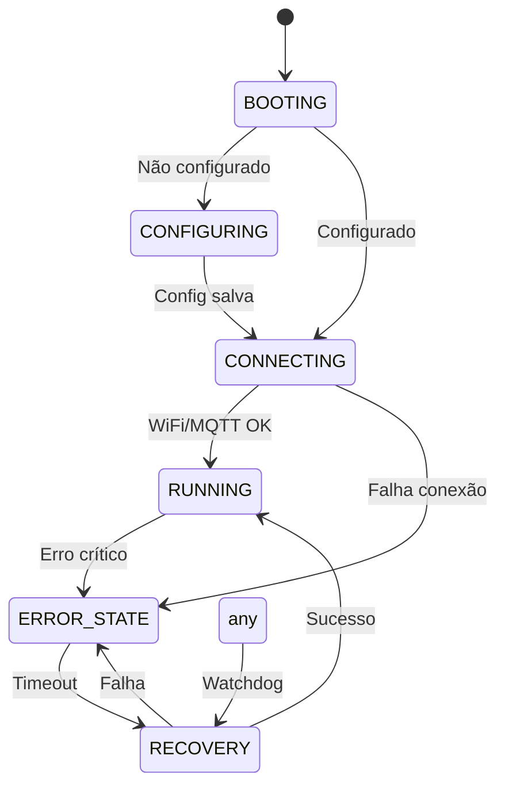

# AutoCore ESP32 Relay Firmware

🚗 **Sistema completo de controle de relés automotivos via MQTT**

[](https://opensource.org/licenses/MIT)
[](https://www.espressif.com/en/products/socs/esp32)
[](https://github.com/leechardes/autocore)

## 🎯 Visão Geral

O **AutoCore ESP32 Relay** é um firmware completo para controle de relés automotivos usando ESP32, integrado ao ecossistema AutoCore. Oferece controle preciso, segurança avançada e interface web moderna para configuração.

### ✨ Características Principais

- 🔧 **Interface de Configuração Web** - Setup inicial via captive portal
- 📡 **Comunicação MQTT** - Integração completa com o sistema AutoCore
- ⚡ **Sistema de Heartbeat** - Segurança para relés momentâneos
- 🛡️ **Proteções Avançadas** - Múltiplas camadas de segurança
- 🔄 **Auto-Recovery** - Sistema watchdog com recuperação automática
- 🎨 **Interface Moderna** - Design responsivo inspirado no shadcn/ui
- 📊 **Telemetria em Tempo Real** - Monitoramento completo do sistema

### 🚦 Fase Atual: SIMULAÇÃO

**IMPORTANTE**: Esta versão está em **FASE 1 - SIMULAÇÃO**, onde todos os comandos são processados mas **NÃO acionam hardware físico**. Ideal para desenvolvimento e testes.

## 🏗️ Arquitetura

### Componentes Principais

```
┌─────────────────┐    ┌─────────────────┐    ┌─────────────────┐
│   Web Server    │    │   MQTT Client   │    │ Relay Controller│
│   (Config)      │◄──►│   (Commands)    │◄──►│   (Hardware)    │
└─────────────────┘    └─────────────────┘    └─────────────────┘
         │                       │                       │
         ▼                       ▼                       ▼
┌─────────────────┐    ┌─────────────────┐    ┌─────────────────┐
│ Config Manager  │    │  MQTT Handler   │    │ Relay Channels  │
│   (NVS/SPIFFS)  │    │ (Message Proc)  │    │  (Individual)   │
└─────────────────┘    └─────────────────┘    └─────────────────┘
         │                       │                       │
         └───────────────────────┼───────────────────────┘
                                 ▼
                    ┌─────────────────┐
                    │    Watchdog     │
                    │   (Safety)      │
                    └─────────────────┘
```

## 🚀 Quick Start

### 1. Hardware Necessário

- **ESP32** (DevKit ou similar)
- **Relés** (conforme necessidade)
- **Alimentação** (5V recomendado)
- **Resistores pull-up** (se necessário)

### 2. Instalação

#### Via PlatformIO (Recomendado)

```bash
# Clone o repositório
git clone https://github.com/leechardes/autocore
cd autocore/firmware/esp32-relay

# Compile e faça upload
pio run -t upload

# Monitor serial
pio device monitor
```

#### Via Arduino IDE

1. Instale as bibliotecas necessárias
2. Configure a placa para ESP32 Dev Module
3. Compile e faça upload

### 3. Configuração Inicial

1. **Access Point**: O ESP32 criará um AP `ESP32_Relay_XXXXX`
2. **Conectar**: Use senha `autocore123`
3. **Configurar**: Acesse `http://192.168.4.1`
4. **Setup WiFi**: Configure credenciais da rede
5. **Backend**: Configure IP do servidor AutoCore
6. **Finalizar**: Salve e aguarde reinicialização

## ⚙️ Configuração

### Arquivo de Configuração

O sistema usa NVS (Non-Volatile Storage) para persistir configurações:

```json
{
  "device_uuid": "esp32-relay-001",
  "device_name": "ESP32 Relay Principal",
  "backend_ip": "192.168.1.100",
  "backend_port": 8000,
  "mqtt_broker": "192.168.1.100",
  "mqtt_port": 1883,
  "wifi_ssid": "MinhaRede",
  "wifi_password": "minha_senha",
  "total_channels": 16
}
```

### Configuração de Canais

Cada canal pode ser configurado individualmente:

```cpp
RelayChannelConfig config;
config.enabled = true;
config.gpio_pin = 4;
config.name = "Buzina";
config.function_type = "momentary";  // toggle, momentary, pulse, timed
config.require_password = true;
config.max_on_time_ms = 5000;       // 5 segundos máximo
```

### Tipos de Relé Suportados

| Tipo | Descrição | Uso Típico |
|------|-----------|------------|
| **toggle** | Liga/desliga com clique | Faróis, setas |
| **momentary** | Liga enquanto pressionado + heartbeat | Buzina, guincho |
| **pulse** | Liga por tempo determinado | Pisca-alerta |
| **timed** | Liga com timer configurável | Aquecimento |

## 📡 Protocolo MQTT

### Tópicos Principais

```
autocore/devices/{uuid}/status          # Status do dispositivo
autocore/devices/{uuid}/relays/command  # Comandos de relé
autocore/devices/{uuid}/relays/state    # Estado dos relés
autocore/devices/{uuid}/heartbeat       # Heartbeat system
autocore/devices/{uuid}/telemetry       # Telemetria
```

### Comandos de Relé

#### Comando Toggle
```json
{
  "channel": 1,
  "state": true,
  "function_type": "toggle",
  "user": "mobile_app",
  "timestamp": "2025-08-08T10:30:00Z"
}
```

#### Comando Momentâneo
```json
{
  "channel": 2,
  "state": true,
  "function_type": "momentary",
  "momentary": true,
  "user": "display_touch",
  "timestamp": "2025-08-08T10:30:00Z"
}
```

#### Heartbeat
```json
{
  "channel": 2,
  "timestamp": "2025-08-08T10:30:00Z",
  "sequence": 42
}
```

## 🛡️ Segurança

### Sistema de Heartbeat

Para relés momentâneos críticos (buzina, guincho):

1. **Cliente** envia heartbeat a cada 500ms
2. **ESP32** monitora recebimento
3. **Timeout** de 1 segundo sem heartbeat
4. **Auto-desligamento** em caso de falha

### Proteções Implementadas

- ✅ **Heartbeat Monitoring** - Relés momentâneos
- ✅ **Max On Time** - Tempo máximo ligado
- ✅ **Password Protection** - Senha para canais sensíveis
- ✅ **Time Windows** - Horários permitidos
- ✅ **Dual Action** - Confirmação dupla
- ✅ **Emergency Stop** - Botão físico de parada
- ✅ **Watchdog System** - Recovery automático

### Emergency Stop

Botão físico (GPIO 0 - BOOT) para parada de emergência:
- Para **todos os relés** imediatamente
- Entra em **modo seguro**
- Requer **reset manual**

## 📊 Telemetria

### Dados Coletados

- **Estado dos relés** - On/off, tempo ligado
- **Heartbeat health** - Status dos heartbeats
- **Uso de memória** - RAM livre
- **Conectividade** - WiFi signal, MQTT status
- **Estatísticas** - Operações, erros, safety shutoffs

### Exemplo de Telemetria

```json
{
  "timestamp": "2025-08-08T10:30:00Z",
  "device_uuid": "esp32-relay-001",
  "channels": [
    {
      "channel": 1,
      "state": true,
      "on_duration": 1500,
      "heartbeat_age": 250
    }
  ],
  "free_memory": 45000,
  "uptime": 3600
}
```

## 🔧 API Web

### Endpoints Principais

```http
GET  /                        # Interface de configuração
GET  /api/status              # Status do dispositivo
GET  /api/config              # Configuração atual
POST /api/config              # Salvar configuração
GET  /api/wifi/scan           # Scan de redes WiFi
POST /api/test                # Testar conexão backend
GET  /api/logs                # Logs do sistema
POST /api/restart             # Reiniciar dispositivo
POST /api/factory-reset       # Reset de fábrica
```

### Interface Web

A interface web oferece:

- 📱 **Design Responsivo** - Funciona em mobile e desktop
- 🎨 **Visual Moderno** - Inspirado no shadcn/ui
- ⚙️ **Configuração Completa** - WiFi, backend, MQTT
- 📊 **Status em Tempo Real** - Telemetria e logs
- 🔍 **Scan WiFi** - Descoberta automática de redes
- 🧪 **Teste de Conexão** - Validação de configurações

## 🧪 Desenvolvimento

### Estrutura do Projeto

```
firmware/esp32-relay/
├── src/                    # Código fonte
│   ├── config/            # Gerenciamento de configuração
│   ├── network/           # WiFi, web server, API client
│   ├── mqtt/              # Cliente e handler MQTT
│   ├── relay/             # Controlador de relés
│   ├── utils/             # Logger, watchdog
│   └── main.cpp           # Loop principal
├── data/                   # Interface web (SPIFFS)
│   ├── index.html         # Página principal
│   ├── style.css          # Estilos modernos
│   └── app.js             # JavaScript interativo
├── platformio.ini         # Configuração do projeto
└── README.md              # Esta documentação
```

### Bibliotecas Utilizadas

```ini
lib_deps = 
    PubSubClient@2.8              # Cliente MQTT
    ArduinoJson@7.0.4            # Parser JSON
    ESPAsyncWebServer@1.2.3      # Servidor web assíncrono
    AsyncTCP@1.1.4               # TCP assíncrono
    WiFiManager@2.0.16-rc.2      # Gerenciamento WiFi
    Preferences@1.0              # NVS storage
    DNSServer                    # DNS para AP mode
```

### Debug e Logs

Sistema de logging com múltiplos níveis:

```cpp
LOG_ERROR("Erro crítico: %s", error.c_str());
LOG_WARN("Aviso: %s", warning.c_str());
LOG_INFO("Informação: %s", info.c_str());
LOG_DEBUG("Debug: %s", debug.c_str());
```

## 🔄 Estados do Sistema



## 📈 Performance

### Requisitos Mínimos

- **RAM**: < 100MB total
- **CPU**: < 10% idle
- **Resposta MQTT**: < 100ms
- **Interface Web**: < 200ms load

### Otimizações

- ⚡ **Zero Build Process** - Frontend via CDN
- 🗜️ **JSON Compactado** - Payloads mínimos
- 🔄 **Buffer Circular** - Logs em memória
- ⏰ **Heartbeat Otimizado** - 500ms interval
- 💾 **NVS Eficiente** - Storage otimizado

## 🔧 Configuração Avançada

### Pinos GPIO Padrão

```cpp
// Canais 1-8
{4, 5, 12, 13, 14, 15, 16, 17}

// Canais 9-16  
{18, 19, 21, 22, 23, 25, 26, 27}

// Controle
#define EMERGENCY_SHUTOFF_PIN 0    // GPIO 0 (BOOT button)
#define STATUS_LED_PIN 2           # LED azul onboard
```

### Timeouts Configuráveis

```cpp
#define HEARTBEAT_TIMEOUT_MS 1000      // 1 segundo
#define MQTT_RECONNECT_INTERVAL 5000   // 5 segundos  
#define STATUS_PUBLISH_INTERVAL 30000  // 30 segundos
#define WATCHDOG_TIMEOUT_S 30          # 30 segundos
```

## 🐛 Troubleshooting

### Problemas Comuns

#### 1. ESP32 não conecta ao WiFi

```bash
# Verificar logs serial
pio device monitor --baud 115200

# Resetar configuração
# Acesse /api/factory-reset via web
```

#### 2. MQTT não conecta

- Verificar broker IP/porta
- Confirmar credenciais
- Testar conectividade de rede

#### 3. Relés não respondem

- **Fase 1**: Normal - apenas simulação
- Verificar configuração dos canais
- Confirmar GPIO pins válidos

#### 4. Interface web não carrega

- Verificar SPIFFS montado
- Usar fallback HTML inline
- Confirmar rede WiFi

### Debug Avançado

```cpp
// Habilitar debug detalhado
mqttClient.setDebug(true);
relayController.setDebugMode(true);
watchdog.setDebugMode(true);
```

### Recovery Manual

1. **Botão BOOT**: Forçar modo configuração
2. **Serial Monitor**: Comando direto
3. **Factory Reset**: Via interface web
4. **Emergency Stop**: GPIO 0 pressed

## 📚 Referências

### Documentação AutoCore

- 📘 [Arquitetura MQTT](../../docs/MQTT_ARCHITECTURE.md)
- 📙 [Config App Backend](../../config-app/backend/README.md)
- 📗 [Deploy Guide](../../deploy/README.md)

### Recursos Externos

- [ESP32 Documentation](https://docs.espressif.com/projects/esp-idf/en/latest/)
- [PlatformIO Guide](https://platformio.org/install)
- [MQTT Protocol](https://mqtt.org/)
- [ArduinoJson](https://arduinojson.org/)

## 🤝 Contribuindo

1. Fork o projeto
2. Crie uma branch: `git checkout -b feature/nova-feature`
3. Commit: `git commit -m 'Add nova feature'`
4. Push: `git push origin feature/nova-feature`
5. Abra um Pull Request

### Guidelines

- Seguir padrões de código existentes
- Documentar funções públicas
- Testar em hardware real
- Atualizar documentação

## 📄 Licença

Este projeto está licenciado sob a MIT License - veja o arquivo [LICENSE](../../LICENSE) para detalhes.

## 👤 Autor

**Lee Chardes**
- GitHub: [@leechardes](https://github.com/leechardes)
- Email: leechardes@gmail.com

---

<div align="center">

**🚗 AutoCore ESP32 Relay - Controle Profissional de Relés Automotivos**

[GitHub](https://github.com/leechardes/autocore) | [Documentação](../../README.md) | [Issues](https://github.com/leechardes/autocore/issues)

</div>