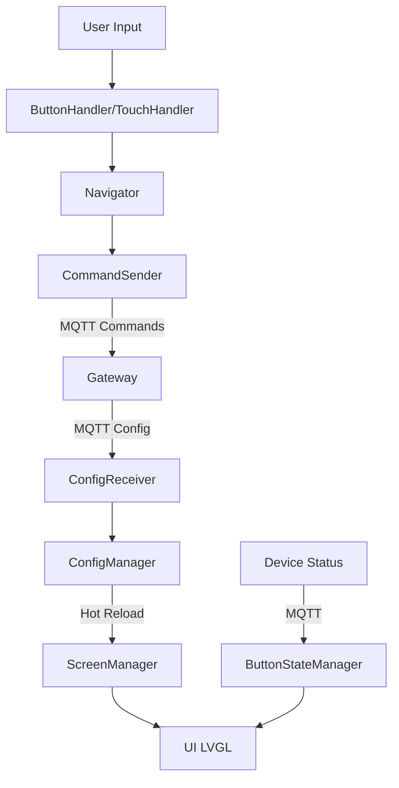

# 🤖 Instruções para Claude - AutoTech HMI Display v2

## 🎯 Contexto Técnico

Você está trabalhando no **AutoTech HMI Display v2**, um firmware para ESP32 que implementa uma interface humano-máquina totalmente parametrizável para controle veicular. Este é um sistema **crítico de segurança** usado em veículos off-road, industriais e embarcações.

### Características Fundamentais
- **100% Parametrizável**: Toda configuração vem via MQTT, zero hardcode
- **Hot-Reload**: Mudanças aplicadas sem reinicialização
- **Multi-Device**: Suporte a múltiplas placas de relés simultaneamente  
- **Failsafe**: Sistema à prova de falhas com interlocks de segurança
- **Real-time**: Comunicação MQTT em tempo real
- **Modular**: Arquitetura completamente modular e extensível

## 🏗️ Arquitetura do Sistema

### Stack Tecnológico
```cpp
ESP32-WROOM-32           // MCU principal
├── ILI9341 (320x240)   // Display TFT SPI
├── XPT2046             // Touch controller
├── WiFi 802.11n        // Conectividade
└── GPIO expandido      // Botões e LEDs

Software Stack:
├── Arduino Framework    // Base
├── LVGL 8.3.11         // Graphics engine
├── TFT_eSPI 2.5.0      // Display driver  
├── ArduinoJson 7.0.2   // JSON parsing
├── PubSubClient 2.8    // MQTT client
└── Custom Architecture  // Nosso sistema
```

### Componentes Principais
```cpp
// Core System
core/
├── Logger.h/cpp         // Sistema de logging configurável
├── MQTTClient.h/cpp     // Cliente MQTT otimizado
└── ConfigManager.h/cpp  // Gerenciador de configurações

// User Interface  
ui/
├── ScreenManager.h/cpp  // Gerencia todas as telas
├── ScreenFactory.h/cpp  // Cria telas dinamicamente
├── Theme.h             // Sistema de temas
└── Icons.h             // Mapeamento de ícones LVGL

// Communication Layer
communication/
├── ConfigReceiver.h/cpp     // Recebe configs via MQTT
├── StatusReporter.h/cpp     // Envia status do sistema
├── ButtonStateManager.h/cpp // Sincroniza estados de botões
└── CommandSender.h/cpp      // Envia comandos para dispositivos

// Navigation System
navigation/
├── Navigator.h/cpp     // Sistema de navegação entre telas
└── ButtonHandler.h/cpp // Gerencia botões físicos + debounce

// Input Handling
input/
└── TouchHandler.h/cpp  // Gerencia touch screen XPT2046
```

### Fluxo de Dados


## 📡 Sistema MQTT

### Topologia de Tópicos
```
autocore/
├── gateway/config/
│   ├── request          # HMI → Gateway: Solicita config
│   ├── response         # Gateway → HMI: Envia config  
│   └── update          # Gateway → HMI: Hot-reload
├── hmi_display_1/
│   ├── status          # HMI → Sistema: Status dispositivo
│   ├── telemetry       # HMI → Sistema: Telemetria detalhada
│   └── heartbeat       # HMI → Sistema: Sinal de vida
├── relay_board_1/
│   ├── status          # Placa → HMI: Status da placa
│   ├── command         # HMI → Placa: Comandos
│   └── channel/1/
│       ├── status      # Canal específico: status
│       └── command     # Canal específico: comando
└── sensor_board_1/
    └── telemetry       # Sensores → HMI: Dados em tempo real
```

### Formato de Mensagens
```json
// Comando para relé
{
  "timestamp": "2025-01-18T12:00:00Z",
  "device_id": "hmi_display_1",
  "target": "relay_board_1",
  "command": {
    "type": "relay",
    "channel": 1,
    "action": "toggle",
    "validate_interlocks": true,
    "source": "hmi_button"
  }
}

// Status do HMI
{
  "timestamp": "2025-01-18T12:00:00Z", 
  "device_id": "hmi_display_1",
  "status": "online",
  "current_screen": "lighting",
  "backlight": 100,
  "system": {
    "uptime": 3600,
    "free_heap": 180000,
    "wifi_rssi": -65
  }
}
```

## ⚙️ Sistema de Configuração

### Estrutura JSON
```json
{
  "version": "2.0.0",
  "system": {
    "name": "AutoTech Control System",
    "language": "pt-BR", 
    "theme": "dark",
    "display": {
      "width": 320, "height": 240,
      "items_per_page": 6,
      "backlight": 100
    }
  },
  "screens": {
    "home": {
      "type": "menu",
      "title": "Menu Principal", 
      "items": [
        {
          "id": "nav_lighting",
          "type": "navigation",
          "icon": "light",
          "label": "Iluminação", 
          "target": "lighting_screen"
        }
      ]
    },
    "lighting_screen": {
      "type": "control",
      "title": "Iluminação",
      "items": [
        {
          "id": "light_high",
          "type": "relay", 
          "icon": "light_high",
          "label": "Farol Alto",
          "device": "relay_board_1",
          "channel": 1,
          "mode": "toggle"
        }
      ]
    }
  },
  "devices": {
    "relay_board_1": {
      "type": "relay_board",
      "channels": 16,
      "interlocks": {
        "1": [2], "2": [1],    // Farol alto/baixo
        "12": [13], "13": [12] // Guincho IN/OUT
      }
    }
  },
  "presets": {
    "emergency": {
      "name": "Emergência",
      "type": "toggle",
      "actions": [
        {
          "device": "relay_board_1", 
          "channels": [3, 4],
          "action": "blink",
          "pattern": {"on_time": 500, "off_time": 500}
        }
      ]
    }
  }
}
```

### Hot-Reload Process
1. Gateway envia `config_update` via MQTT
2. `ConfigReceiver` valida nova configuração 
3. `ConfigManager` faz backup da atual
4. `ScreenManager` reconstrói todas as telas
5. Interface é atualizada em ~2 segundos
6. Usuário não perde contexto de navegação

## 🖥️ Interface LVGL

### Layout System
```cpp
// Tela padrão 320x240 landscape
┌─────────────────────────────────────┐
│ Header (320x40)                     │ ← Título + Status
├─────────────────────────────────────┤
│                                     │
│        Content Grid (320x160)       │ ← 2x3 grid de componentes
│         6 items máximo              │
│                                     │
├─────────────────────────────────────┤
│ Navigation Bar (320x40)             │ ← Home + Paginação
└─────────────────────────────────────┘

// Cada item do grid: 150x60px
// Paginação automática se >6 itens
```

### Tipos de Componente
```cpp
// Navigation Button - Navegar entre telas
{
  "type": "navigation",
  "target": "lighting_screen"  // Tela de destino
}

// Relay Control - Controlar relés
{
  "type": "relay", 
  "device": "relay_board_1",
  "channel": 1,
  "mode": "toggle|momentary|pulse"
}

// Action Button - Executar presets
{
  "type": "action",
  "action": {"type": "preset", "preset": "emergency"}
}

// Mode Selector - Seleção exclusiva
{
  "type": "mode",
  "mode": "4x4_high",
  "exclusive_group": "traction_modes"
}
```

## 🛡️ Sistema de Segurança

### Interlocks de Segurança
```cpp
class InterlockManager {
    // Previne operações conflitantes
    std::map<int, std::vector<int>> rules;
    
    bool validateCommand(int channel, bool enable) {
        // Verifica se canal tem interlocks ativos
        // Exemplo: Farol alto (ch1) bloqueia baixo (ch2)
        if (enable && hasActiveInterlocks(channel)) {
            return false; // Comando negado
        }
        return true;
    }
};
```

### Failsafe Operations
```cpp
class FailsafeManager {
    void handleCommunicationLoss() {
        // Manter último estado conhecido seguro
        freezeCurrentState();
        
        // Entrar em modo local limitado
        enterLocalMode();
        
        // Sinalizar problema visualmente  
        setStatusLED(RED);
    }
    
    void handleMemoryCorruption() {
        // Salvar estado crítico
        saveCriticalState();
        
        // Resetar sistema
        ESP.restart();
    }
};
```

### Validação de Configuração
```cpp
class ConfigValidator {
    ValidationResult validate(const String& json) {
        // 1. JSON válido?
        if (!isValidJson(json)) return INVALID_JSON;
        
        // 2. Tamanho adequado?
        if (json.length() > MAX_CONFIG_SIZE) return TOO_LARGE;
        
        // 3. Schema correto?
        if (!validateSchema(json)) return INVALID_SCHEMA;
        
        // 4. Referências válidas?
        if (hasCircularRefs(json)) return CIRCULAR_REF;
        
        // 5. Interlocks bidirecionais?
        if (!validateInterlocks(json)) return INVALID_INTERLOCKS;
        
        return VALID;
    }
};
```

## 🔧 Convenções de Código

### Nomenclatura
```cpp
// Classes: PascalCase
class ConfigManager {};
class ScreenFactory {};

// Variáveis: camelCase  
String deviceId;
bool isConnected;
int channelCount;

// Constantes: UPPER_SNAKE_CASE
#define MAX_CONFIG_SIZE 20480
#define MQTT_BUFFER_SIZE 20480

// Funções: camelCase
void initializeSystem();
bool loadConfiguration(const String& json);

// Arquivos: PascalCase.h/.cpp
ConfigManager.h, MQTTClient.cpp
```

### Error Handling
```cpp
// Prefira códigos de retorno a exceções
enum class ConfigResult {
    SUCCESS,
    INVALID_JSON,
    VALIDATION_FAILED,
    TOO_LARGE,
    TIMEOUT
};

ConfigResult loadConfig(const String& json) {
    if (json.length() > MAX_CONFIG_SIZE) {
        logger->error("Config too large: %d bytes", json.length());
        return ConfigResult::TOO_LARGE;
    }
    
    // Processo de validação...
    if (!validateConfig(json)) {
        return ConfigResult::VALIDATION_FAILED;
    }
    
    return ConfigResult::SUCCESS;
}
```

### Memory Management
```cpp
// Use RAII sempre que possível
class ScreenManager {
    std::vector<std::unique_ptr<ScreenBase>> screens;
    
public:
    void addScreen(std::unique_ptr<ScreenBase> screen) {
        screens.push_back(std::move(screen));
    }
}; // Destruição automática

// Para recursos ESP32
class SPITransaction {
    bool active;
public:
    SPITransaction() : active(true) {
        SPI.beginTransaction(SPISettings(1000000, MSBFIRST, SPI_MODE0));
    }
    
    ~SPITransaction() {
        if (active) SPI.endTransaction();
    }
};
```

## 🚀 Comandos de Desenvolvimento

### PlatformIO
```bash
# Build completo
pio run

# Upload e monitor
pio run -t upload -t monitor

# Apenas monitor
pio device monitor

# Clean build  
pio run -t clean

# Executar testes
pio test
```

### Script de Desenvolvimento
```bash
# Usar o script helper
./dev-manager.sh build     # Build
./dev-manager.sh upload    # Upload  
./dev-manager.sh monitor   # Monitor serial
./dev-manager.sh test      # Testes
./dev-manager.sh clean     # Limpeza
```

### Debug MQTT
```bash
# Monitor todos os tópicos AutoTech
mosquitto_sub -h localhost -t "autocore/#" -v

# Simular configuração
mosquitto_pub -h localhost \
  -t "autocore/gateway/config/response" \
  -f docs/config.json

# Teste comando relé
mosquitto_pub -h localhost \
  -t "autocore/relay_board_1/command" \
  -m '{"channel":1,"action":"toggle"}'

# Monitor status do HMI  
mosquitto_sub -h localhost \
  -t "autocore/hmi_display_1/status" -v
```

## 🎯 Tarefas Comuns

### 1. Adicionar Novo Tipo de Componente
```cpp
// 1. Definir no enum ComponentType
enum ComponentType {
    NAVIGATION,
    RELAY, 
    ACTION,
    MODE,
    CUSTOM_WIDGET  // <- Novo tipo
};

// 2. Implementar no ScreenFactory
std::unique_ptr<ComponentBase> ScreenFactory::createComponent(
    ComponentType type, JsonObject& config) {
    
    switch (type) {
        case CUSTOM_WIDGET:
            return std::make_unique<CustomWidget>(config);
        // ...
    }
}

// 3. Adicionar validação no ConfigValidator
bool ConfigValidator::isValidComponentType(const String& type) {
    return type == "navigation" || type == "relay" || 
           type == "action" || type == "mode" || 
           type == "custom_widget";  // <- Adicionar
}
```

### 2. Implementar Nova Funcionalidade de Segurança
```cpp
// 1. Adicionar regra no InterlockManager
void InterlockManager::addSafetyRule(int channel, 
                                    const std::vector<int>& blockedChannels,
                                    unsigned long timeout = 0) {
    interlockRules[channel] = blockedChannels;
    if (timeout > 0) {
        timeoutRules[channel] = timeout;
    }
}

// 2. Atualizar validação de comandos
bool InterlockManager::validateCommand(int channel, bool enable) {
    // Verificar interlocks existentes
    if (hasActiveInterlocks(channel)) return false;
    
    // Nova validação de segurança
    if (!validateSafetyConditions(channel, enable)) {
        logger->warning("Safety condition failed for channel %d", channel);
        return false;
    }
    
    return true;
}
```

### 3. Adicionar Suporte a Novo Dispositivo
```cpp
// 1. Definir tipo no enum DeviceType
enum DeviceType {
    RELAY_BOARD,
    SENSOR_BOARD, 
    HMI_DISPLAY,
    SERVO_CONTROLLER  // <- Novo dispositivo
};

// 2. Implementar comandos específicos
class ServoCommandSender {
public:
    void setServoPosition(int servoId, int angle) {
        JsonDocument cmd;
        cmd["device"] = "servo_controller_1";
        cmd["servo"] = servoId;
        cmd["angle"] = angle;
        cmd["speed"] = 100; // Velocidade padrão
        
        String payload;
        serializeJson(cmd, payload);
        
        mqttClient->publish("autocore/servo_controller_1/command", payload);
    }
};

// 3. Adicionar no sistema de configuração
// devices.json:
{
  "servo_controller_1": {
    "type": "servo_controller",
    "channels": 8,
    "angle_range": [0, 180],
    "default_speed": 100
  }
}
```

## 📚 Recursos e Links

### Documentação Técnica
- **docs/ARCHITECTURE.md** - Arquitetura completa do sistema
- **docs/API_REFERENCE.md** - Referência da API MQTT
- **docs/HARDWARE_GUIDE.md** - Guia de hardware ESP32
- **docs/CONFIGURATION_GUIDE.md** - Guia de configuração JSON
- **docs/DEVELOPMENT_GUIDE.md** - Guia para desenvolvedores
- **docs/TROUBLESHOOTING.md** - Solução de problemas
- **docs/SECURITY.md** - Guia de segurança

### Bibliotecas Importantes
- **LVGL**: [docs.lvgl.io](https://docs.lvgl.io) - Framework gráfico
- **TFT_eSPI**: [github.com/Bodmer/TFT_eSPI](https://github.com/Bodmer/TFT_eSPI) - Driver display
- **ArduinoJson**: [arduinojson.org](https://arduinojson.org) - Parser JSON
- **PubSubClient**: Cliente MQTT para ESP32

### Hardware
- **ESP32-2432S028R**: Display TFT 2.8" integrado
- **ILI9341**: Controller do display 320x240
- **XPT2046**: Controller touch resistivo
- **Pinout**: Ver docs/HARDWARE_GUIDE.md

## ⚠️ Considerações Importantes

### Limitações do ESP32
- **Memória RAM**: ~180KB livres para aplicação
- **MQTT Buffer**: 20KB máximo por mensagem
- **JSON Config**: 20KB máximo por configuração
- **Screens Cache**: Máximo 10 telas em cache
- **SPI Speed**: Máximo 65MHz para display

### Boas Práticas
- **Sempre validar** entradas JSON antes de processar
- **Use logging** apropriado para debug (logger->debug/info/error)
- **Implemente timeouts** para operações críticas
- **Teste interlocks** antes de implementar novos canais
- **Documente** mudanças na configuração JSON
- **Preserve compatibilidade** com versões anteriores quando possível

### Debugging
```cpp
// Use níveis apropriados de log
logger->debug("Touch event: x=%d, y=%d", x, y);    // Apenas desenvolvimento
logger->info("Screen changed to: %s", screenId);    // Informação geral
logger->error("Failed to parse config: %s", err);   // Sempre ativo

// Monitor memória em desenvolvimento
void checkMemory() {
    logger->debug("Free heap: %d bytes", ESP.getFreeHeap());
    logger->debug("Max alloc: %d bytes", ESP.getMaxAllocHeap());
}
```

## 🎯 Objetivos do Sistema

1. **Segurança**: Sistema à prova de falhas para uso veicular
2. **Flexibilidade**: 100% configurável para qualquer tipo de veículo  
3. **Performance**: Interface fluida e responsiva
4. **Confiabilidade**: Operação 24/7 em ambiente adverso
5. **Extensibilidade**: Facilmente extensível para novos recursos

---

**Este é um sistema crítico de segurança veicular. Sempre priorize segurança sobre funcionalidade.**

**Versão**: 2.0.0  
**Última Atualização**: Janeiro 2025  
**Autor**: AutoTech Team