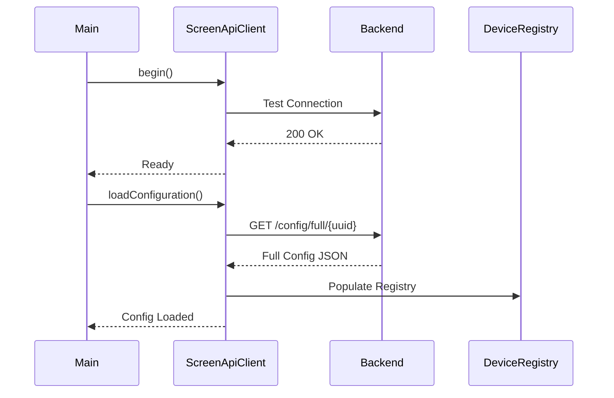
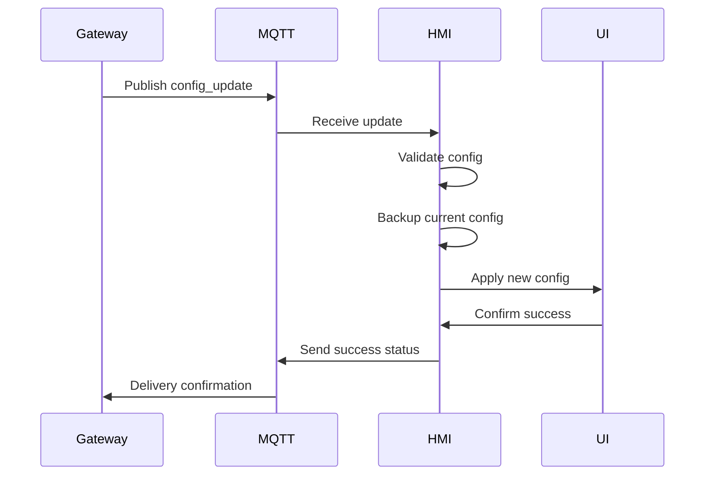

# 📡 API Reference - AutoTech HMI Display v2 Protocolo Híbrido MQTT/REST

## 📋 Índice

- [Visão Geral](#visão-geral)
- [API REST](#api-rest)
- [Estrutura de Tópicos MQTT](#estrutura-de-tópicos-mqtt)
- [Formatos de Mensagem](#formatos-de-mensagem)
- [Endpoints MQTT](#endpoints-mqtt)
- [Endpoints REST](#endpoints-rest)
- [Comandos de Controle](#comandos-de-controle)
- [Status e Telemetria](#status-e-telemetria)
- [Sistema de Configuração](#sistema-de-configuração)
- [Códigos de Erro](#códigos-de-erro)
- [Exemplos de Uso](#exemplos-de-uso)

## 🎯 Visão Geral

O AutoTech HMI Display v2 utiliza um protocolo híbrido MQTT/REST para máxima flexibilidade:

### **Protocolo MQTT** (Primário)
- **Recebe**: Configurações dinâmicas e comandos do Gateway
- **Envia**: Comandos de controle, status e telemetria
- **Subscreve**: Tópicos de configuração e status de dispositivos
- **Publica**: Comandos para dispositivos e relatórios de status

### **API REST** (Complementar)
- **Configurações**: Endpoint unificado `/api/config/full/{device_uuid}`
- **Dispositivos**: Listagem e gerenciamento via `/api/devices`
- **Telas**: Configuração de interfaces via `/api/screens`
- **Ícones**: Carregamento de ícones via `/api/icons`
- **Fallback**: MQTT como fallback se REST falhar

### Características Principais
- **QoS 0**: Para telemetria e status (fire-and-forget)
- **QoS 1**: Para comandos críticos e configurações
- **Retained**: Para status e configurações persistentes
- **Buffer**: 20KB para suportar configurações grandes
- **Reconnect**: Automático com resubscrição de tópicos

## 🌐 API REST

### Configuração Base
```cpp
// Configurações definidas em DeviceConfig.h
#define API_PROTOCOL "http"
#define API_SERVER "192.168.4.1"
#define API_PORT 8080
#define API_BASE_PATH "/api"
#define API_TIMEOUT 10000
#define API_RETRY_COUNT 3
#define API_RETRY_DELAY 1000
#define API_USE_AUTH false
#define API_CACHE_TTL 30000
```

### Endpoints Disponíveis

#### 1. **Configuração Unificada** ⭐ *Recomendado*
```
GET /api/config/full/{device_uuid}
```
**Descrição**: Endpoint otimizado que retorna configuração completa em uma única requisição
**Parâmetros**: 
- `device_uuid`: UUID único do dispositivo HMI
**Resposta**: Objeto JSON com todas as configurações necessárias

```json
{
  "version": "2.0.0",
  "protocol_version": "1.0",
  "devices": [...],
  "relay_boards": [...],
  "screens": [...],
  "icons": {...},
  "theme": {...},
  "system": {...}
}
```

#### 2. **Dispositivos**
```
GET /api/devices
```
**Descrição**: Lista todos os dispositivos registrados no sistema
**Resposta**: Array de dispositivos

```json
[
  {
    "id": 1,
    "uuid": "esp32_dev_001234",
    "type": "hmi_display", 
    "name": "HMI Principal",
    "status": "online"
  }
]
```

#### 3. **Placas de Relé**
```
GET /api/relays/boards
```
**Descrição**: Lista todas as placas de relé configuradas
**Resposta**: Array de placas de relé

```json
[
  {
    "id": 1,
    "device_id": 2,
    "name": "Placa Principal",
    "total_channels": 16,
    "active_channels": 12
  }
]
```

#### 4. **Telas**
```
GET /api/screens
```
**Descrição**: Lista todas as telas configuradas
**Resposta**: Array de telas

```json
[
  {
    "id": 1,
    "name": "home",
    "title": "Menu Principal",
    "type": "menu",
    "order": 0
  }
]
```

#### 5. **Itens de Tela**
```
GET /api/screens/{screen_id}/items
```
**Descrição**: Retorna todos os itens/componentes de uma tela específica
**Parâmetros**: 
- `screen_id`: ID da tela
**Resposta**: Array de itens da tela

#### 6. **Ícones**
```
GET /api/icons?platform=esp32
```
**Descrição**: Retorna mapeamento de ícones otimizado para ESP32
**Parâmetros**: 
- `platform`: Plataforma alvo (esp32)
**Resposta**: Objeto com mapeamentos de ícones

```json
{
  "light_on": "💡",
  "light_off": "🔸",
  "engine": "🔧"
}
```

#### 7. **Temas**
```
GET /api/themes
```
**Descrição**: Retorna configurações de tema visual
**Resposta**: Objeto com definições de tema

### Autenticação e Segurança

```cpp
// Headers enviados automaticamente pelo ScreenApiClient
"Accept: application/json"
"Content-Type: application/json"
"User-Agent: AutoCore-HMI-v2.0.0"

// Se API_USE_AUTH = true
"Authorization: Bearer {API_AUTH_TOKEN}"
```

### Cache e Performance

O `ScreenApiClient` implementa cache inteligente:
- **TTL**: 30 segundos por padrão (configurável)
- **Invalidação**: Automática após TTL ou erro
- **Estratégia**: Cache-first com fallback para rede

### Tratamento de Erros

```cpp
// Códigos HTTP tratados especificamente:
200: Sucesso
404: Endpoint não encontrado
500: Erro interno do servidor  
503: Serviço indisponível
-1:  Falha de conexão de rede
```

## 🌐 Estrutura de Tópicos MQTT

### Hierarquia Global
```
autocore/
├── gateway/                    # Gateway central do sistema
│   ├── config/
│   │   ├── request            # → Solicita configuração
│   │   ├── response           # ← Recebe configuração
│   │   └── update             # ← Hot-reload de configuração
│   ├── status                 # ← Status do gateway
│   └── discovery              # ← Auto-discovery de dispositivos
├── {device_id}/               # ID único do dispositivo (ex: hmi_display_1)
│   ├── status                 # → Status do dispositivo
│   ├── command                # ← Comandos para o dispositivo
│   ├── telemetry              # → Telemetria detalhada
│   └── heartbeat              # → Heartbeat periódico
├── relay_board_{n}/           # Placas de relés (relay_board_1, relay_board_2...)
│   ├── status                 # ← Status da placa
│   ├── command                # → Comandos para a placa
│   └── channel/{n}/           # Canais individuais (1, 2, 3...)
│       ├── status             # ← Status do canal
│       └── command            # → Comando para o canal
└── system/
    ├── announcement           # ← Anúncios globais
    ├── emergency              # → Comandos de emergência
    └── broadcast              # ← Broadcasts do sistema
```

### Convenções de Nomenclatura
- **device_id**: `hmi_display_{n}` (ex: hmi_display_1)
- **board_id**: `relay_board_{n}` (ex: relay_board_1)
- **Wildcards**: `+` para um nível, `#` para múltiplos níveis

## 📝 Formatos de Mensagem

### Estrutura Base
Todas as mensagens seguem este formato base:

```json
{
  "timestamp": "2025-01-18T12:00:00.000Z",
  "device_id": "hmi_display_1",
  "type": "message_type",
  "data": {
    // Dados específicos da mensagem
  }
}
```

### Tipos de Mensagem
- `config_request` - Solicitação de configuração
- `config_response` - Resposta com configuração
- `config_update` - Atualização de configuração (hot-reload)
- `device_command` - Comando para dispositivo externo
- `device_status` - Status de dispositivo
- `telemetry` - Dados de telemetria
- `heartbeat` - Sinal de vida
- `error` - Relatório de erro

## 🔧 Endpoints MQTT

### 1. Configuração do Sistema

#### `autocore/gateway/config/request`
**Direção**: HMI → Gateway  
**QoS**: 1  
**Retained**: false  
**Descrição**: Solicita configuração completa do sistema

```json
{
  "timestamp": "2025-01-18T12:00:00Z",
  "device_id": "hmi_display_1",
  "type": "config_request",
  "version": "2.0.0",
  "capabilities": {
    "display": "320x240",
    "touch": true,
    "buttons": 3,
    "memory": "320KB"
  }
}
```

#### `autocore/gateway/config/response`
**Direção**: Gateway → HMI  
**QoS**: 1  
**Retained**: true  
**Descrição**: Configuração completa do sistema

```json
{
  "timestamp": "2025-01-18T12:00:00Z",
  "request_id": "req_12345",
  "device_id": "hmi_display_1",
  "type": "config_response",
  "config": {
    "version": "2.0.0",
    "system": { /* configurações do sistema */ },
    "screens": { /* definições de telas */ },
    "devices": { /* configurações de dispositivos */ }
  }
}
```

#### `autocore/gateway/config/update`
**Direção**: Gateway → HMI  
**QoS**: 1  
**Retained**: false  
**Descrição**: Atualização parcial ou completa da configuração (hot-reload)

```json
{
  "timestamp": "2025-01-18T12:00:00Z",
  "device_id": "hmi_display_1",
  "type": "config_update",
  "update_type": "partial|full",
  "sections": ["screens", "devices"],
  "config": {
    // Nova configuração ou seções atualizadas
  }
}
```

### 2. Controle de Dispositivos

#### `autocore/relay_board_1/command`
**Direção**: HMI → Placa de Relés  
**QoS**: 1  
**Retained**: false  
**Descrição**: Comando para controlar relés

```json
{
  "timestamp": "2025-01-18T12:00:00Z",
  "device_id": "hmi_display_1",
  "type": "device_command",
  "target": "relay_board_1",
  "command": {
    "type": "relay",
    "channel": 1,
    "action": "toggle|on|off|pulse",
    "duration": 1000,  // Para ação pulse (ms)
    "source": "hmi_button",
    "user_action": true
  }
}
```

#### `autocore/relay_board_1/channel/1/command`
**Direção**: HMI → Placa de Relés (Canal Específico)  
**QoS**: 1  
**Retained**: false  
**Descrição**: Comando para canal específico de relé

```json
{
  "timestamp": "2025-01-18T12:00:00Z",
  "device_id": "hmi_display_1",
  "type": "channel_command",
  "target": "relay_board_1",
  "channel": 1,
  "action": "on",
  "validate_interlocks": true,
  "source": "hmi_touch"
}
```

### 3. Status e Monitoramento

#### `autocore/hmi_display_1/status`
**Direção**: HMI → Sistema  
**QoS**: 0  
**Retained**: true  
**Descrição**: Status atual do display HMI

```json
{
  "timestamp": "2025-01-18T12:00:00Z",
  "device_id": "hmi_display_1",
  "type": "device_status",
  "status": "online|offline|error",
  "current_screen": "home",
  "backlight": 100,
  "system": {
    "uptime": 3600,
    "free_heap": 180000,
    "heap_size": 320000,
    "wifi_rssi": -65,
    "wifi_ssid": "AutoTech_Network",
    "ip_address": "192.168.4.100"
  },
  "health": {
    "mqtt_connected": true,
    "config_loaded": true,
    "display_ok": true,
    "touch_ok": true,
    "buttons_ok": true
  }
}
```

#### `autocore/hmi_display_1/telemetry`
**Direção**: HMI → Sistema  
**QoS**: 0  
**Retained**: false  
**Descrição**: Telemetria detalhada do dispositivo

```json
{
  "timestamp": "2025-01-18T12:00:00Z",
  "device_id": "hmi_display_1",
  "type": "telemetry",
  "metrics": {
    "display": {
      "brightness": 100,
      "active_time": 3600,
      "screen_changes": 45
    },
    "interaction": {
      "button_presses": 120,
      "touch_events": 89,
      "navigation_events": 23
    },
    "communication": {
      "mqtt_messages_sent": 156,
      "mqtt_messages_received": 89,
      "commands_sent": 34,
      "configs_received": 2
    },
    "performance": {
      "avg_response_time": 45,
      "max_response_time": 120,
      "cpu_usage": 25
    }
  }
}
```

#### `autocore/hmi_display_1/heartbeat`
**Direção**: HMI → Sistema  
**QoS**: 0  
**Retained**: false  
**Descrição**: Heartbeat simples para monitoramento

```json
{
  "timestamp": "2025-01-18T12:00:00Z",
  "device_id": "hmi_display_1",
  "type": "heartbeat",
  "sequence": 12345,
  "uptime": 3600
}
```

### 4. Recebimento de Status Externos

#### `autocore/relay_board_1/status`
**Direção**: Placa de Relés → HMI  
**QoS**: 0  
**Retained**: true  
**Descrição**: Status da placa de relés (recebido pelo HMI para atualizar UI)

```json
{
  "timestamp": "2025-01-18T12:00:00Z",
  "device_id": "relay_board_1",
  "type": "device_status",
  "status": "online",
  "channels": {
    "1": {"state": "on", "current": 0.5},
    "2": {"state": "off", "current": 0.0},
    "3": {"state": "on", "current": 1.2}
  },
  "power": {
    "voltage": 12.8,
    "total_current": 1.7
  }
}
```

#### `autocore/relay_board_1/channel/1/status`
**Direção**: Placa de Relés → HMI  
**QoS**: 0  
**Retained**: true  
**Descrição**: Status específico de um canal de relé

```json
{
  "timestamp": "2025-01-18T12:00:00Z",
  "device_id": "relay_board_1",
  "type": "channel_status",
  "channel": 1,
  "state": "on",
  "current": 0.5,
  "voltage": 12.8,
  "power": 6.4,
  "temperature": 25.0,
  "last_change": "2025-01-18T11:58:30Z",
  "total_on_time": 1800
}
```

## 🔌 Endpoints REST

### Classe ScreenApiClient

A classe `ScreenApiClient` gerencia toda comunicação REST do dispositivo:

```cpp
// Exemplo de uso da classe ScreenApiClient
ScreenApiClient* apiClient = new ScreenApiClient();
if (apiClient->begin()) {
    JsonDocument config;
    if (apiClient->loadConfiguration(config)) {
        // Configuração carregada com sucesso
    }
}
```

### Métodos Disponíveis

#### 1. **Configuração Completa**
```cpp
bool loadConfiguration(JsonDocument& config);
bool loadFullConfiguration(JsonDocument& config);
```
**Descrição**: Carrega configuração completa usando endpoint unificado
**Performance**: 1 requisição vs 4+ requisições do método legado

#### 2. **Listagem de Dispositivos**
```cpp
bool getDevices(JsonArray& devices);
```
**Descrição**: Retorna array com todos os dispositivos registrados

#### 3. **Placas de Relé**
```cpp
bool getRelayBoards(JsonArray& boards);
```
**Descrição**: Retorna array com todas as placas de relé

#### 4. **Telas e Itens**
```cpp
bool getScreens(JsonArray& screens);
bool getScreenItems(int screenId, JsonArray& items);
```
**Descrição**: Carrega definições de telas e seus componentes

#### 5. **Recursos Visuais**
```cpp
bool getIcons(JsonDocument& icons);
bool getThemes(JsonDocument& themes);
```
**Descrição**: Carrega ícones e temas visuais

### Configuração de Rede

#### Parâmetros de Configuração
```cpp
// DeviceConfig.h - Seção API REST
#define API_PROTOCOL "http"              // Protocolo (http/https)
#define API_SERVER "192.168.4.1"        // IP do servidor backend
#define API_PORT 8080                    // Porta do servidor
#define API_BASE_PATH "/api"             // Caminho base da API
#define API_TIMEOUT 10000                // Timeout em ms
#define API_RETRY_COUNT 3                // Número de tentativas
#define API_RETRY_DELAY 1000             // Delay entre tentativas
#define API_USE_AUTH false               // Usar autenticação
#define API_AUTH_TOKEN "your_token"      // Token de autenticação
#define API_CACHE_TTL 30000              // Cache TTL em ms
```

#### Device Registration
```cpp
// Auto-registro do dispositivo
bool DeviceRegistration::performSmartRegistration();
```
**Funcionalidade**: 
- Auto-registra o dispositivo no backend
- Obtém credenciais MQTT dinâmicas se disponíveis
- Atualiza configuração de rede automaticamente

### Registry de Dispositivos

#### DeviceRegistry (Singleton)
```cpp
DeviceRegistry* registry = DeviceRegistry::getInstance();

// Adicionar dispositivo
DeviceInfo device(1, "esp32_001", "hmi_display", "HMI Principal");
registry->addDevice(device);

// Adicionar placa de relé
RelayBoardInfo board(1, 2, "Placa Principal", 16);
registry->addRelayBoard(board);

// Buscar por UUID
DeviceInfo* device = registry->getDeviceByUUID("esp32_001");
```

### Fluxo de Carregamento

#### 1. **Inicialização**


#### 2. **Fallback MQTT**
Se a API REST falhar, o sistema automaticamente usa MQTT como fallback:
```cpp
// No ConfigReceiver
if (!apiClient->loadConfiguration(config)) {
    // Fallback para MQTT
    return loadConfigFromMQTT(config);
}
```

### Error Handling

#### Códigos de Erro REST
```cpp
// ScreenApiClient error codes
-1:  Connection failed
200: Success
404: Not found
500: Internal server error
503: Service unavailable
```

#### Log de Debugging
```cpp
// Logs detalhados para diagnóstico
logger->debug("ScreenApiClient: Request URL: " + url);
logger->debug("ScreenApiClient: Response size: " + String(response.length()));
logger->error("ScreenApiClient: HTTP error: " + String(lastHttpCode));
```

## ⚡ Comandos de Controle

### Tipos de Comando

#### 1. **Relay Commands**
Controle de relés individuais ou múltiplos:

```json
{
  "type": "relay",
  "channel": 1,
  "action": "toggle",
  "validate_interlocks": true
}
```

**Ações Disponíveis**:
- `on` - Liga o relé
- `off` - Desliga o relé  
- `toggle` - Alterna o estado
- `pulse` - Pulso temporizado (requer `duration`)

#### 2. **Preset Commands**
Execução de presets/macros:

```json
{
  "type": "preset",
  "preset_name": "emergency",
  "parameters": {
    "intensity": 100,
    "duration": 30000
  }
}
```

#### 3. **Mode Commands**
Mudança de modo de operação (ex: 4x4):

```json
{
  "type": "mode",
  "mode_name": "4x4_low",
  "transition": "smooth",
  "confirm": true
}
```

#### 4. **System Commands**
Comandos do sistema:

```json
{
  "type": "system",
  "action": "restart|config_reload|factory_reset",
  "confirm": true
}
```

### Validações e Segurança

#### Interlocks
Sistema previne ações conflitantes:
```json
{
  "command": {
    "type": "relay",
    "channel": 1,
    "action": "on"
  },
  "validation": {
    "interlock_check": true,
    "conflicting_channels": [2],
    "safety_timeout": 30000
  }
}
```

#### Confirmação de Comandos Críticos
```json
{
  "command": {
    "type": "system",
    "action": "factory_reset"
  },
  "confirmation": {
    "required": true,
    "token": "reset_12345",
    "expires": "2025-01-18T12:05:00Z"
  }
}
```

## 📊 Status e Telemetria

### Níveis de Status

#### 1. **Basic Status**
Status essencial enviado regularmente:
- Estado da conexão
- Tela atual
- Status do sistema

#### 2. **Detailed Status**
Status completo enviado em intervalos menores:
- Métricas de sistema
- Status de hardware
- Diagnósticos

#### 3. **Telemetry**
Dados detalhados para análise:
- Performance
- Uso
- Estatísticas

### Triggers de Status

1. **Periódico**: A cada 30 segundos (configurável)
2. **Mudança de Estado**: Quando algo muda
3. **Solicitado**: Quando requisitado via comando
4. **Alerta**: Quando detecta problema

## ⚙️ Sistema de Configuração

### Hot-Reload Process



### Versionamento
- **Semantic Versioning**: Major.Minor.Patch
- **Compatibility Check**: Verifica se versão é suportada
- **Migration**: Migra configurações antigas automaticamente

### Validação de Configuração
1. **JSON Schema**: Estrutura básica
2. **Business Rules**: Regras de negócio
3. **Hardware Limits**: Limites do hardware
4. **Safety Checks**: Verificações de segurança

## ❌ Códigos de Erro

### Categorias de Erro

#### 1. **Configuration Errors (1xxx)**
- `1001`: JSON malformado
- `1002`: Versão incompatível
- `1003`: Configuração muito grande
- `1004`: Campos obrigatórios ausentes
- `1005`: Valores inválidos

#### 2. **Communication Errors (2xxx)**
- `2001`: Falha na conexão MQTT
- `2002`: Timeout de comunicação
- `2003`: Mensagem muito grande
- `2004`: Tópico inválido
- `2005`: Credenciais inválidas

#### 3. **Hardware Errors (3xxx)**
- `3001`: Display não responde
- `3002`: Touch screen falhou
- `3003`: Botão travado
- `3004`: LED não funciona
- `3005`: Memória insuficiente

#### 4. **System Errors (4xxx)**
- `4001`: Falha na inicialização
- `4002`: Watchdog timeout
- `4003`: Stack overflow
- `4004`: Heap corruption
- `4005`: Task falhou

### Formato de Erro

```json
{
  "timestamp": "2025-01-18T12:00:00Z",
  "device_id": "hmi_display_1",
  "type": "error",
  "error": {
    "code": 1001,
    "category": "configuration",
    "severity": "error|warning|info",
    "message": "JSON malformado na configuração recebida",
    "details": {
      "line": 45,
      "column": 12,
      "expected": "comma",
      "received": "bracket"
    },
    "recovery": "using_last_valid_config",
    "retry_possible": true
  }
}
```

## 🚀 Exemplos de Uso

### 1. Inicialização Completa

```bash
# 1. HMI solicita configuração
mosquitto_pub -h localhost -t "autocore/gateway/config/request" -m '{
  "timestamp": "2025-01-18T12:00:00Z",
  "device_id": "hmi_display_1",
  "type": "config_request",
  "version": "2.0.0"
}'

# 2. Gateway responde com configuração
mosquitto_pub -h localhost -t "autocore/gateway/config/response" -m '{
  "timestamp": "2025-01-18T12:00:01Z",
  "device_id": "hmi_display_1",
  "type": "config_response",
  "config": {
    "version": "2.0.0",
    "screens": { ... },
    "devices": { ... }
  }
}'

# 3. HMI envia status após carregar configuração
mosquitto_pub -h localhost -t "autocore/hmi_display_1/status" -m '{
  "timestamp": "2025-01-18T12:00:02Z",
  "device_id": "hmi_display_1",
  "type": "device_status",
  "status": "online",
  "current_screen": "home",
  "config_loaded": true
}'
```

### 2. Controle de Relé

```bash
# 1. Usuário pressiona botão no HMI
# HMI envia comando para controlar luz alta
mosquitto_pub -h localhost -t "autocore/relay_board_1/command" -m '{
  "timestamp": "2025-01-18T12:00:00Z",
  "device_id": "hmi_display_1",
  "type": "device_command",
  "target": "relay_board_1",
  "command": {
    "type": "relay",
    "channel": 1,
    "action": "toggle",
    "source": "hmi_button",
    "validate_interlocks": true
  }
}'

# 2. Placa de relés responde com novo status
mosquitto_pub -h localhost -t "autocore/relay_board_1/channel/1/status" -m '{
  "timestamp": "2025-01-18T12:00:01Z",
  "device_id": "relay_board_1",
  "type": "channel_status",
  "channel": 1,
  "state": "on",
  "current": 0.5,
  "last_change": "2025-01-18T12:00:01Z"
}'
```

### 3. Hot-Reload de Configuração

```bash
# 1. Gateway envia atualização de configuração
mosquitto_pub -h localhost -t "autocore/gateway/config/update" -m '{
  "timestamp": "2025-01-18T12:00:00Z",
  "device_id": "hmi_display_1",
  "type": "config_update",
  "update_type": "partial",
  "sections": ["screens"],
  "config": {
    "screens": {
      "home": {
        "title": "Menu Principal Atualizado",
        "items": [ ... ]
      }
    }
  }
}'

# 2. HMI confirma aplicação da atualização
mosquitto_pub -h localhost -t "autocore/hmi_display_1/status" -m '{
  "timestamp": "2025-01-18T12:00:02Z",
  "device_id": "hmi_display_1",
  "type": "device_status",
  "status": "online",
  "config_updated": true,
  "config_version": "2.0.1",
  "hot_reload_success": true
}'
```

### 4. Monitoramento com Wildcards

```bash
# Monitorar todos os status do sistema
mosquitto_sub -h localhost -t "autocore/+/status" -v

# Monitorar todos os comandos
mosquitto_sub -h localhost -t "autocore/+/command" -v

# Monitorar canais específicos de todas as placas
mosquitto_sub -h localhost -t "autocore/relay_board_+/channel/+/status" -v

# Monitorar tudo do gateway
mosquitto_sub -h localhost -t "autocore/gateway/#" -v
```

### 5. Teste de Preset

```bash
# Executar preset de emergência
mosquitto_pub -h localhost -t "autocore/relay_board_1/command" -m '{
  "timestamp": "2025-01-18T12:00:00Z",
  "device_id": "hmi_display_1",
  "type": "device_command",
  "target": "relay_board_1",
  "command": {
    "type": "preset",
    "preset_name": "emergency",
    "source": "hmi_emergency_button"
  }
}'
```

## 🔧 Ferramentas de Debug

### MQTT Client Tools

```bash
# Instalar ferramentas MQTT
brew install mosquitto

# Monitorar tráfego MQTT em tempo real
mosquitto_sub -h localhost -t "autocore/#" -v

# Enviar comando de teste
mosquitto_pub -h localhost -t "autocore/hmi_display_1/command" -m '{
  "type": "system",
  "action": "ping"
}'

# Solicitar status completo
mosquitto_pub -h localhost -t "autocore/hmi_display_1/command" -m '{
  "type": "system",
  "action": "full_status"
}'
```

### Log Analysis

```bash
# Monitor logs do HMI via Serial
python monitor_serial.py --port /dev/cu.usbserial-2110 --baud 115200

# Filtrar apenas mensagens MQTT
python monitor_serial.py | grep "MQTT"

# Filtrar apenas erros
python monitor_serial.py | grep "ERROR"
```

## 📋 Checklist de Implementação

### Para Desenvolvedores

- [ ] Implementar validação de mensagens JSON
- [ ] Adicionar retry logic para comandos críticos
- [ ] Implementar rate limiting para prevenir spam
- [ ] Adicionar logging detalhado de MQTT
- [ ] Testar reconexão automática
- [ ] Validar todos os formatos de mensagem
- [ ] Implementar timeout para comandos
- [ ] Testar hot-reload completo
- [ ] Validar interlocks de segurança
- [ ] Testar com configurações grandes (>10KB)

### Para Testadores

- [ ] Testar todos os tipos de comando
- [ ] Verificar comportamento em rede instável
- [ ] Testar hot-reload com configurações inválidas
- [ ] Validar todos os códigos de erro
- [ ] Testar cenários de falha de hardware
- [ ] Verificar performance com muitas mensagens
- [ ] Testar compatibilidade de versões
- [ ] Validar integridade dos dados
- [ ] Testar comportamento em baixa memória
- [ ] Verificar logs e diagnósticos

---

**Versão**: 2.0.0  
**Última Atualização**: Janeiro 2025  
**Autor**: AutoTech Team