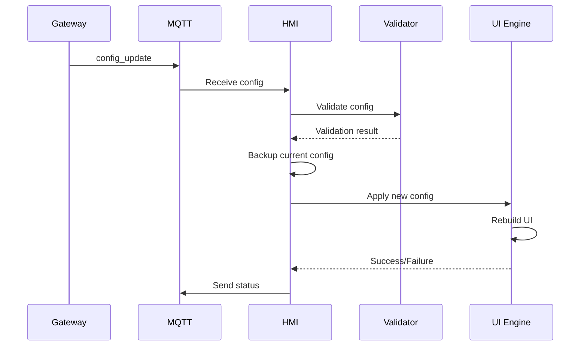

# ⚙️ Configuration Guide - AutoTech HMI Display v2

## 📋 Índice

- [Visão Geral](#visão-geral)
- [Estrutura da Configuração JSON](#estrutura-da-configuração-json)
- [Sistema de Versionamento](#sistema-de-versionamento)
- [Configurações do Sistema](#configurações-do-sistema)
- [Definição de Telas](#definição-de-telas)
- [Tipos de Componentes](#tipos-de-componentes)
- [Configuração de Dispositivos](#configuração-de-dispositivos)
- [Sistema de Presets](#sistema-de-presets)
- [Temas e Personalização Visual](#temas-e-personalização-visual)
- [Validação e Limites](#validação-e-limites)
- [Hot-Reload](#hot-reload)
- [Exemplos Práticos](#exemplos-práticos)
- [Troubleshooting de Configuração](#troubleshooting-de-configuração)

## 🎯 Visão Geral

O AutoTech HMI Display v2 é **100% configurável** via JSON, eliminando completamente a necessidade de modificar código para diferentes tipos de veículos. A filosofia "Configure, não programe" permite:

### Características Principais
- **Configuração Dinâmica**: Recebida via MQTT do Gateway
- **Hot-Reload**: Mudanças aplicadas sem reinicialização
- **Validação Automática**: Schema JSON e regras de negócio
- **Versionamento**: Controle de compatibilidade
- **Fallback**: Mantém última configuração válida
- **Modular**: Seções independentes e intercambiáveis

### Capacidades do Sistema
- **Telas**: Ilimitadas (limitado pela memória)
- **Itens por Tela**: 6 por página (paginação automática)
- **Dispositivos**: Suporte a múltiplas placas de relés
- **Presets**: Automações complexas configuráveis
- **Idiomas**: Multi-idioma com fallback automático
- **Temas**: Sistema visual totalmente customizável

## 📄 Estrutura da Configuração JSON

### Estrutura Raiz
```json
{
  "version": "2.0.0",
  "metadata": {
    "created_at": "2025-01-18T12:00:00Z",
    "updated_at": "2025-01-18T12:30:00Z",
    "author": "AutoTech Team",
    "description": "Configuração para Jeep Wrangler Off-Road"
  },
  "system": { /* Configurações globais do sistema */ },
  "screens": { /* Definições de todas as telas */ },
  "devices": { /* Configuração de dispositivos */ },
  "presets": { /* Automações e macros */ },
  "themes": { /* Temas visuais */ },
  "fourWheelDrive": { /* Sistema 4x4 */ },
  "mqtt": { /* Configurações MQTT */ },
  "validation": { /* Regras de validação */ }
}
```

### Seções Obrigatórias
- `version` - Versão da configuração
- `system` - Configurações do sistema  
- `screens` - Pelo menos uma tela ("home")
- `devices` - Pelo menos um dispositivo HMI

### Seções Opcionais
- `metadata` - Informações adicionais
- `presets` - Automações
- `themes` - Personalização visual
- `fourWheelDrive` - Sistema 4x4
- `mqtt` - Configurações MQTT específicas
- `validation` - Regras customizadas

## 🔢 Sistema de Versionamento

### Formato Semantic Versioning
```json
{
  "version": "MAJOR.MINOR.PATCH",
  "compatibility": {
    "minimum_firmware": "2.0.0",
    "maximum_firmware": "2.9.99"
  }
}
```

### Regras de Compatibilidade
- **MAJOR**: Mudanças incompatíveis na estrutura
- **MINOR**: Novas funcionalidades compatíveis
- **PATCH**: Correções e melhorias menores

### Exemplos de Versionamento
```json
"2.0.0" // Versão inicial
"2.1.0" // + Novos tipos de componente
"2.1.1" // + Correção de bugs
"3.0.0" // Breaking changes na estrutura
```

## 🖥️ Configurações do Sistema

### Seção `system`
```json
{
  "system": {
    "name": "AutoTech Control System",
    "language": "pt-BR",
    "theme": "dark",
    "timezone": "America/Sao_Paulo",
    "display": {
      "width": 320,
      "height": 240,
      "rotation": 1,
      "backlight": 100,
      "timeout": 30000,
      "screensaver": {
        "enabled": true,
        "timeout": 60000,
        "type": "clock"
      },
      "touch": {
        "enabled": true,
        "sensitivity": 50,
        "calibration": {
          "min_x": 200, "max_x": 3700,
          "min_y": 240, "max_y": 3800
        }
      },
      "layout": {
        "items_per_page": 6,
        "grid_columns": 2,
        "grid_rows": 3,
        "margin": 10,
        "gap": 5,
        "header_height": 40,
        "navbar_height": 40
      }
    },
    "behavior": {
      "auto_return_home": true,
      "home_timeout": 30000,
      "confirm_critical_actions": true,
      "enable_sound": true,
      "animation_speed": "medium"
    },
    "logging": {
      "level": "info",
      "mqtt_debug": false,
      "ui_debug": false
    },
    "networking": {
      "mqtt": {
        "broker": "192.168.4.1",
        "port": 1883,
        "username": "",
        "password": "",
        "topics": {
          "config_request": "autocore/gateway/config/request",
          "config_response": "autocore/gateway/config/response",
          "config_update": "autocore/gateway/config/update"
        }
      },
      "api": {
        "enabled": true,
        "protocol": "http",
        "server": "192.168.4.1",
        "port": 8080,
        "base_path": "/api",
        "timeout": 10000,
        "retry_count": 3,
        "retry_delay": 1000,
        "cache_ttl": 30000,
        "auth": {
          "enabled": false,
          "token": ""
        },
        "endpoints": {
          "config_full": "/config/full/{device_uuid}",
          "devices": "/devices",
          "relay_boards": "/relays/boards",
          "screens": "/screens",
          "icons": "/icons?platform=esp32",
          "themes": "/themes"
        }
      }
    }
  }
}
```

### Parâmetros Detalhados

#### Display Settings
| Parâmetro | Tipo | Padrão | Descrição |
|-----------|------|---------|-----------|
| `width` | int | 320 | Largura do display |
| `height` | int | 240 | Altura do display |
| `rotation` | int | 1 | Rotação (0-3) |
| `backlight` | int | 100 | Brilho (0-100) |
| `timeout` | int | 30000 | Timeout do backlight (ms) |

#### Layout Settings
| Parâmetro | Tipo | Padrão | Descrição |
|-----------|------|---------|-----------|
| `items_per_page` | int | 6 | Itens por página |
| `grid_columns` | int | 2 | Colunas do grid |
| `grid_rows` | int | 3 | Linhas do grid |
| `margin` | int | 10 | Margem externa (px) |
| `gap` | int | 5 | Espaço entre itens (px) |

#### API REST Settings ⭐ *Nova Funcionalidade*
| Parâmetro | Tipo | Padrão | Descrição |
|-----------|------|---------|-----------|
| `enabled` | bool | true | Habilita API REST |
| `protocol` | string | "http" | Protocolo (http/https) |
| `server` | string | "192.168.4.1" | IP do servidor backend |
| `port` | int | 8080 | Porta do servidor |
| `base_path` | string | "/api" | Caminho base da API |
| `timeout` | int | 10000 | Timeout por requisição (ms) |
| `retry_count` | int | 3 | Tentativas em caso de falha |
| `retry_delay` | int | 1000 | Delay entre tentativas (ms) |
| `cache_ttl` | int | 30000 | Tempo de vida do cache (ms) |

#### MQTT Settings
| Parâmetro | Tipo | Padrão | Descrição |
|-----------|------|---------|-----------|
| `broker` | string | "192.168.4.1" | IP do broker MQTT |
| `port` | int | 1883 | Porta do broker |
| `username` | string | "" | Usuário MQTT (opcional) |
| `password` | string | "" | Senha MQTT (opcional) |

## 📱 Definição de Telas

### Estrutura Base de Tela
```json
{
  "screens": {
    "screen_id": {
      "type": "menu|control|actions|mode_selector|info",
      "title": "Título da Tela",
      "description": "Descrição opcional",
      "icon": "icon_id",
      "parent": "parent_screen_id",
      "items": [
        /* Array de componentes */
      ],
      "style": {
        /* Personalização visual */
      },
      "behavior": {
        /* Comportamento específico */
      }
    }
  }
}
```

### Tipos de Tela

#### 1. **Menu** - Navegação Principal
```json
{
  "home": {
    "type": "menu",
    "title": "Menu Principal",
    "description": "Tela principal com acesso a todas funcionalidades",
    "items": [
      {
        "id": "nav_lighting",
        "type": "navigation",
        "icon": "light",
        "label": "Iluminação",
        "target": "lighting_screen"
      }
    ]
  }
}
```

#### 2. **Control** - Controle de Dispositivos
```json
{
  "lighting": {
    "type": "control",
    "title": "Sistema de Iluminação",
    "parent": "home",
    "items": [
      {
        "id": "light_high",
        "type": "relay",
        "icon": "light_high",
        "label": "Farol Alto",
        "device": "relay_board_1",
        "channel": 1,
        "mode": "toggle"
      }
    ]
  }
}
```

#### 3. **Actions** - Presets e Ações
```json
{
  "quick_actions": {
    "type": "actions",
    "title": "Ações Rápidas",
    "items": [
      {
        "id": "emergency",
        "type": "action",
        "icon": "emergency",
        "label": "Emergência",
        "action": {
          "type": "preset",
          "preset": "emergency_preset"
        }
      }
    ]
  }
}
```

#### 4. **Mode Selector** - Seleção de Modos
```json
{
  "traction_modes": {
    "type": "mode_selector",
    "title": "Sistema de Tração",
    "items": [
      {
        "id": "mode_4x2",
        "type": "mode",
        "icon": "4x2",
        "label": "4x2",
        "mode": "4x2_mode"
      },
      {
        "id": "mode_4x4",
        "type": "mode",
        "icon": "4x4", 
        "label": "4x4",
        "mode": "4x4_mode"
      }
    ]
  }
}
```

#### 5. **Info** - Telas Informativas
```json
{
  "diagnostics": {
    "type": "info",
    "title": "Diagnósticos",
    "refresh_interval": 5000,
    "items": [
      {
        "id": "voltage_display",
        "type": "gauge",
        "label": "Tensão da Bateria",
        "min": 10.0,
        "max": 15.0,
        "unit": "V",
        "source": {
          "device": "sensor_board_1",
          "field": "voltage"
        }
      }
    ]
  }
}
```

## 🧩 Tipos de Componentes

### 1. **Navigation** - Botões de Navegação
```json
{
  "id": "nav_lighting",
  "type": "navigation", 
  "icon": "light",
  "label": "Iluminação",
  "target": "lighting_screen",
  "style": {
    "expand": true,
    "color": "#ffffff",
    "bg_color": "#0066cc"
  }
}
```

### 2. **Relay** - Controle de Relés
```json
{
  "id": "light_high",
  "type": "relay",
  "icon": "light_high",
  "label": "Farol Alto", 
  "device": "relay_board_1",
  "channel": 1,
  "mode": "toggle|momentary|pulse",
  "duration": 1000,
  "interlock": [2, 3],
  "confirmation": false,
  "style": {
    "on_color": "#00ff00",
    "off_color": "#666666"
  }
}
```

**Modos de Operação**:
- `toggle` - Liga/Desliga alternando
- `momentary` - Ativo apenas enquanto pressionado
- `pulse` - Pulso temporizado (requer `duration`)

### 3. **Action** - Execução de Presets
```json
{
  "id": "emergency",
  "type": "action",
  "icon": "emergency", 
  "label": "Emergência",
  "action": {
    "type": "preset",
    "preset": "emergency_lights"
  },
  "confirmation": true,
  "style": {
    "bg_color": "#ff0000",
    "color": "#ffffff"
  }
}
```

### 4. **Mode** - Seleção de Modos
```json
{
  "id": "mode_4x4",
  "type": "mode",
  "icon": "4x4",
  "label": "4x4 High",
  "mode": "4x4_high",
  "exclusive_group": "traction_modes",
  "confirmation": true
}
```

### 5. **Slider** - Controles Deslizantes
```json
{
  "id": "brightness",
  "type": "slider",
  "label": "Brilho da Tela",
  "min": 10,
  "max": 100,
  "step": 5,
  "value": 80,
  "unit": "%",
  "action": {
    "type": "setting",
    "setting": "display.backlight",
    "immediate": true
  }
}
```

### 6. **Gauge** - Medidores Visuais
```json
{
  "id": "voltage_gauge",
  "type": "gauge",
  "label": "Tensão",
  "min": 10.0,
  "max": 15.0,
  "unit": "V",
  "zones": [
    {"min": 10.0, "max": 11.5, "color": "#ff0000"},
    {"min": 11.5, "max": 14.0, "color": "#00ff00"},
    {"min": 14.0, "max": 15.0, "color": "#ff8800"}
  ],
  "source": {
    "device": "sensor_board_1",
    "field": "voltage",
    "update_interval": 1000
  }
}
```

### 7. **Label** - Texto Dinâmico
```json
{
  "id": "status_label",
  "type": "label",
  "label": "Status do Sistema:",
  "value": {
    "source": "variable",
    "variable": "system_status",
    "format": "Sistema: {value}"
  },
  "style": {
    "font_size": 16,
    "color": "#cccccc"
  }
}
```

### 8. **List** - Listas de Opções
```json
{
  "id": "preset_list",
  "type": "list",
  "label": "Presets Disponíveis",
  "options": [
    {
      "id": "camp_mode",
      "label": "Modo Camping",
      "icon": "camping",
      "action": {
        "type": "preset",
        "preset": "camping_preset"
      }
    }
  ]
}
```

## 🖥️ Configuração de Dispositivos

### Seção `devices`
```json
{
  "devices": {
    "relay_board_1": {
      "type": "relay_board",
      "name": "Placa Principal de Relés",
      "model": "16CH-Relay-ESP32", 
      "channels": 16,
      "ip_address": "192.168.4.101",
      "initial_state": "all_off",
      "channel_map": {
        "1": {"name": "Farol Alto", "type": "light"},
        "2": {"name": "Farol Baixo", "type": "light"},
        "3": {"name": "Pisca Esquerdo", "type": "signal"},
        "16": {"name": "Buzina", "type": "horn"}
      },
      "interlocks": {
        "1": [2],        // Farol alto bloqueia baixo
        "2": [1],        // Farol baixo bloqueia alto  
        "12": [13],      // Guincho IN bloqueia OUT
        "13": [12]       // Guincho OUT bloqueia IN
      },
      "safety": {
        "horn_timeout": 5000,      // Buzina máximo 5s
        "winch_timeout": 30000,    // Guincho máximo 30s
        "current_limit": 15.0      // Limite de corrente (A)
      },
      "mqtt": {
        "status_topic": "autocore/relay_board_1/status",
        "command_topic": "autocore/relay_board_1/command"
      }
    },
    
    "hmi_display_1": {
      "type": "hmi_display",
      "name": "Display Principal",
      "model": "ESP32-2432S028R",
      "resolution": "320x240",
      "current_screen": "home",
      "settings": {
        "backlight": 100,
        "timeout": 30000,
        "language": "pt-BR",
        "theme": "dark"
      }
    },
    
    "sensor_board_1": {
      "type": "sensor_board",
      "name": "Sensores Principais",
      "sensors": {
        "voltage": {
          "type": "analog",
          "range": [0.0, 20.0],
          "unit": "V",
          "precision": 2,
          "calibration": {
            "offset": 0.0,
            "scale": 1.0
          }
        },
        "current": {
          "type": "analog", 
          "range": [0.0, 50.0],
          "unit": "A",
          "precision": 2
        },
        "temperature": {
          "type": "digital",
          "range": [-40.0, 125.0], 
          "unit": "°C",
          "precision": 1
        }
      }
    }
  }
}
```

### Tipos de Dispositivos

#### 1. **Relay Board** - Placas de Relés
- Suporte a múltiplas placas
- Configuração de interlocks
- Limites de segurança
- Mapeamento de canais

#### 2. **HMI Display** - Displays de Interface
- Configurações de tela
- Preferências do usuário
- Estado atual da navegação

#### 3. **Sensor Board** - Placas de Sensores
- Sensores analógicos e digitais
- Calibração individual
- Limites e alertas

#### 4. **Custom Devices** - Dispositivos Customizados
- Extensibilidade para novos tipos
- Configuração específica por tipo

## 🎭 Sistema de Presets

### Seção `presets`
```json
{
  "presets": {
    "emergency_lights": {
      "name": "Luzes de Emergência",
      "description": "Ativa pisca-alerta para situações de emergência",
      "type": "toggle",
      "icon": "emergency",
      "confirmation": true,
      "actions": [
        {
          "device": "relay_board_1",
          "channels": [3, 4],
          "action": "blink",
          "pattern": {
            "on_time": 500,
            "off_time": 500,
            "repeat": -1
          }
        },
        {
          "device": "hmi_display_1", 
          "action": "set_theme",
          "theme": "emergency"
        }
      ],
      "timeout": 0,
      "auto_disable": false
    },
    
    "all_lights_on": {
      "name": "Todas as Luzes",
      "description": "Liga todas as luzes do veículo",
      "type": "action",
      "icon": "light",
      "actions": [
        {
          "device": "relay_board_1",
          "channels": [1, 2, 7, 8, 9, 10, 11],
          "action": "on"
        }
      ]
    },
    
    "camping_mode": {
      "name": "Modo Camping",
      "description": "Configuração otimizada para camping",
      "type": "mode",
      "icon": "camping",
      "actions": [
        {
          "device": "relay_board_1",
          "channels": [7, 10],
          "action": "on"
        },
        {
          "device": "hmi_display_1",
          "action": "set_backlight",
          "value": 30
        }
      ],
      "exit_actions": [
        {
          "device": "relay_board_1",
          "channels": [7, 10],
          "action": "off"
        },
        {
          "device": "hmi_display_1",
          "action": "set_backlight",
          "value": 100
        }
      ]
    }
  }
}
```

### Tipos de Preset

#### 1. **Toggle** - Liga/Desliga
- Estado persistente
- Ações de entrada e saída
- Visual feedback

#### 2. **Action** - Ação Única
- Execução imediata
- Sem estado persistente
- Confirmação opcional

#### 3. **Mode** - Modo de Operação
- Estado exclusivo com outros modos
- Ações de entrada/saída
- Timeout automático opcional

### Ações Disponíveis

#### Device Actions
```json
{
  "device": "relay_board_1",
  "channels": [1, 2, 3],
  "action": "on|off|toggle|pulse|blink",
  "duration": 1000,
  "pattern": {
    "on_time": 500,
    "off_time": 300,
    "repeat": 5
  }
}
```

#### System Actions
```json
{
  "device": "hmi_display_1",
  "action": "set_backlight|set_theme|navigate|show_message",
  "value": 50,
  "theme": "emergency",
  "screen": "diagnostics",
  "message": "Preset ativado com sucesso!"
}
```

## 🎨 Temas e Personalização Visual

### Seção `themes`
```json
{
  "themes": {
    "dark": {
      "name": "Tema Escuro",
      "description": "Tema escuro para uso noturno",
      "colors": {
        "background": "#1a1a1a",
        "surface": "#2d2d2d",
        "primary": "#0066cc",
        "secondary": "#4d79a4",
        "accent": "#ff6b35",
        "text": "#ffffff",
        "text_secondary": "#cccccc",
        "success": "#28a745",
        "warning": "#ffc107",
        "error": "#dc3545",
        "border": "#404040"
      },
      "fonts": {
        "primary": "Montserrat-14",
        "secondary": "Montserrat-12",
        "title": "Montserrat-16"
      },
      "dimensions": {
        "border_radius": 8,
        "border_width": 2,
        "padding": 10,
        "margin": 5
      }
    },
    
    "light": {
      "name": "Tema Claro",
      "colors": {
        "background": "#f5f5f5",
        "surface": "#ffffff",
        "primary": "#0066cc",
        "text": "#333333"
      }
    },
    
    "emergency": {
      "name": "Tema Emergência",
      "colors": {
        "background": "#330000",
        "surface": "#550000", 
        "primary": "#ff0000",
        "accent": "#ff3333",
        "text": "#ffffff"
      },
      "effects": {
        "blink": true,
        "blink_interval": 500
      }
    }
  }
}
```

### Sistema de Cores

#### Paleta Base
- `background` - Fundo principal
- `surface` - Superfícies de componentes
- `primary` - Cor primária da marca
- `secondary` - Cor secundária
- `accent` - Cor de destaque

#### Cores Semânticas
- `success` - Verde para sucesso
- `warning` - Amarelo para avisos
- `error` - Vermelho para erros
- `info` - Azul para informações

#### Tipografia
- `text` - Texto principal
- `text_secondary` - Texto secundário
- `text_muted` - Texto esmaecido

### Estilos de Componente
```json
{
  "component_style": {
    "button": {
      "normal": {
        "bg_color": "{surface}",
        "text_color": "{text}",
        "border_color": "{border}"
      },
      "pressed": {
        "bg_color": "{primary}",
        "text_color": "{background}"
      },
      "active": {
        "bg_color": "{success}",
        "text_color": "{background}"
      },
      "disabled": {
        "bg_color": "{border}",
        "text_color": "{text_secondary}"
      }
    }
  }
}
```

## ✅ Validação e Limites

### Schema de Validação
```json
{
  "validation": {
    "schema_version": "2.0.0",
    "rules": {
      "max_screens": 50,
      "max_items_per_screen": 20,
      "max_devices": 10,
      "max_presets": 30,
      "max_config_size": 20480
    },
    "required_fields": [
      "version",
      "system.name",
      "system.display",
      "screens.home"
    ],
    "field_limits": {
      "screen_title": 30,
      "item_label": 20,
      "device_name": 50,
      "preset_name": 30
    }
  }
}
```

### Regras de Negócio

#### Telas
- Tela "home" é obrigatória
- Máximo 6 itens por página
- Targets devem referenciar telas existentes

#### Dispositivos
- IDs de dispositivos devem ser únicos
- Canais não podem exceder limite do dispositivo
- Interlocks devem ser bidirecionais

#### Presets
- Nomes de presets devem ser únicos
- Ações devem referenciar dispositivos válidos
- Timeouts devem ser positivos

### Validação de Integridade
```json
{
  "integrity_checks": {
    "circular_references": true,
    "orphaned_screens": true,
    "invalid_references": true,
    "duplicate_ids": true,
    "resource_limits": true
  }
}
```

## 🔄 Hot-Reload

### Processo de Hot-Reload


### Tipos de Update

#### 1. **Full Update** - Configuração Completa
```json
{
  "type": "config_update",
  "update_type": "full",
  "config": {
    // Configuração completa nova
  }
}
```

#### 2. **Partial Update** - Seções Específicas
```json
{
  "type": "config_update",
  "update_type": "partial",
  "sections": ["screens", "presets"],
  "config": {
    "screens": { /* apenas screens */ },
    "presets": { /* apenas presets */ }
  }
}
```

#### 3. **Incremental Update** - Mudanças Pontuais
```json
{
  "type": "config_update",
  "update_type": "incremental",
  "changes": [
    {
      "action": "add",
      "path": "screens.new_screen",
      "value": { /* nova tela */ }
    },
    {
      "action": "modify",
      "path": "screens.home.title",
      "value": "Novo Título"
    },
    {
      "action": "remove",
      "path": "screens.old_screen"
    }
  ]
}
```

### Estratégias de Rollback

#### Automatic Rollback
- Falha na validação → Manter configuração atual
- Erro na aplicação → Reverter para backup
- Timeout na aplicação → Cancelar update

#### Manual Rollback
- Comando explicit de rollback
- Restaurar configuração anterior
- Log das mudanças para auditoria

## 📚 Exemplos Práticos

### 1. Configuração Básica para Jeep Wrangler
```json
{
  "version": "2.0.0",
  "system": {
    "name": "Jeep Wrangler Off-Road System",
    "language": "pt-BR",
    "theme": "dark"
  },
  "screens": {
    "home": {
      "type": "menu",
      "title": "Menu Principal",
      "items": [
        {
          "id": "lighting",
          "type": "navigation",
          "icon": "light",
          "label": "Iluminação",
          "target": "lighting_screen"
        },
        {
          "id": "winch",
          "type": "navigation", 
          "icon": "winch",
          "label": "Guincho",
          "target": "winch_screen"
        }
      ]
    },
    "lighting_screen": {
      "type": "control",
      "title": "Sistema de Iluminação",
      "parent": "home",
      "items": [
        {
          "id": "light_bar",
          "type": "relay",
          "icon": "light_bar",
          "label": "Barra LED",
          "device": "relay_board_1",
          "channel": 1,
          "mode": "toggle"
        }
      ]
    }
  },
  "devices": {
    "relay_board_1": {
      "type": "relay_board",
      "channels": 16,
      "name": "Placa Principal"
    }
  }
}
```

### 2. Sistema Completo para Motorhome
```json
{
  "version": "2.0.0",
  "system": {
    "name": "Motorhome Control System",
    "language": "pt-BR"
  },
  "screens": {
    "home": {
      "type": "menu",
      "title": "Casa Móvel",
      "items": [
        {"id": "interior", "type": "navigation", "label": "Interior", "target": "interior_screen"},
        {"id": "exterior", "type": "navigation", "label": "Exterior", "target": "exterior_screen"},
        {"id": "utilities", "type": "navigation", "label": "Utilidades", "target": "utilities_screen"},
        {"id": "diagnostics", "type": "navigation", "label": "Diagnósticos", "target": "diag_screen"}
      ]
    },
    "interior_screen": {
      "type": "control", 
      "title": "Iluminação Interna",
      "items": [
        {"id": "main_light", "type": "relay", "label": "Luz Principal", "device": "relay_board_1", "channel": 1},
        {"id": "kitchen_light", "type": "relay", "label": "Cozinha", "device": "relay_board_1", "channel": 2},
        {"id": "bedroom_light", "type": "relay", "label": "Quarto", "device": "relay_board_1", "channel": 3}
      ]
    }
  },
  "presets": {
    "night_mode": {
      "name": "Modo Noturno",
      "type": "toggle",
      "actions": [
        {"device": "relay_board_1", "channels": [1,2,3], "action": "off"},
        {"device": "hmi_display_1", "action": "set_backlight", "value": 20}
      ]
    }
  }
}
```

### 3. Configuração para Veículo Industrial
```json
{
  "version": "2.0.0",
  "system": {
    "name": "Industrial Vehicle Control",
    "language": "pt-BR"
  },
  "screens": {
    "home": {
      "type": "menu",
      "title": "Controle Industrial", 
      "items": [
        {"id": "hydraulics", "type": "navigation", "label": "Hidráulica", "target": "hydraulics_screen"},
        {"id": "beacons", "type": "navigation", "label": "Sinalizadores", "target": "beacons_screen"}
      ]
    },
    "hydraulics_screen": {
      "type": "control",
      "title": "Sistema Hidráulico",
      "items": [
        {"id": "pump", "type": "relay", "label": "Bomba Principal", "device": "relay_board_1", "channel": 1, "confirmation": true},
        {"id": "lift_up", "type": "relay", "label": "Subir", "device": "relay_board_1", "channel": 2, "mode": "momentary"},
        {"id": "lift_down", "type": "relay", "label": "Descer", "device": "relay_board_1", "channel": 3, "mode": "momentary"}
      ]
    }
  },
  "devices": {
    "relay_board_1": {
      "type": "relay_board",
      "channels": 16,
      "interlocks": {
        "2": [3],
        "3": [2] 
      },
      "safety": {
        "pump_timeout": 300000
      }
    }
  }
}
```

## 🛠️ Troubleshooting de Configuração

### Problemas Comuns

#### 1. **Configuração não Carrega**
```
Sintomas:
• HMI permanece na tela "Aguardando configuração"
• Log mostra "Config request timeout"

Causas Possíveis:
• Gateway offline ou sem resposta
• Erro na comunicação MQTT
• Configuração muito grande (>20KB)
• Formato JSON inválido

Soluções:
1. Verificar conexão MQTT
2. Validar JSON em validator online
3. Reduzir tamanho da configuração
4. Verificar logs do Gateway
```

#### 2. **Hot-Reload Falha**
```
Sintomas:
• Configuração não se aplica
• HMI reverte para configuração anterior
• Erro "Validation failed"

Causas Possíveis:
• JSON Schema inválido
• Referências circulares
• Limites de recursos excedidos
• IDs duplicados

Soluções:
1. Usar ferramenta de validação
2. Verificar referências entre telas
3. Respeitar limites documentados
4. Garantir IDs únicos
```

#### 3. **Componentes não Aparecem**
```
Sintomas:
• Tela carrega mas sem componentes
• Apenas alguns itens visíveis
• Layout quebrado

Causas Possíveis:
• Erro na estrutura do array "items"
• Tipos de componente não suportados
• Propriedades obrigatórias ausentes
• Limite de itens por tela excedido

Soluções:
1. Verificar estrutura do array items
2. Usar apenas tipos suportados
3. Incluir todas propriedades obrigatórias
4. Dividir em múltiplas telas se necessário
```

#### 4. **Comandos não Funcionam**
```
Sintomas:
• Botões não respondem
• Relés não acionam
• Erro "Device not found"

Causas Possíveis:
• Dispositivos não configurados
• IDs de dispositivo incorretos
• Canais inválidos
• Comunicação com dispositivo falhou

Soluções:
1. Verificar seção "devices"
2. Conferir IDs de dispositivos
3. Validar números de canais
4. Testar comunicação direta com dispositivos
```

### Ferramentas de Debug

#### 1. **Validador de Configuração**
```bash
# Usar ferramenta online ou script local
python validate_config.py config.json

# Resultado esperado:
✓ JSON válido
✓ Schema válido  
✓ Referências válidas
✓ Limites respeitados
✓ Integridade OK
```

#### 2. **Teste de Hot-Reload**
```bash
# Enviar configuração de teste
mosquitto_pub -h localhost \
  -t "autocore/gateway/config/update" \
  -f test_config.json

# Monitorar resposta
mosquitto_sub -h localhost \
  -t "autocore/hmi_display_1/status" \
  -v
```

#### 3. **Logs Detalhados**
```cpp
// Habilitar debug no DeviceConfig.h
#define DEBUG_LEVEL 3

// Logs esperados:
[DEBUG] Config received: 7432 bytes
[INFO] Config validation: PASSED
[INFO] Hot reload triggered
[DEBUG] Building 5 screens...
[INFO] UI rebuilt successfully
```

#### 4. **Métricas de Performance**
```json
{
  "metrics": {
    "config_size": 7432,
    "validation_time": 45,
    "rebuild_time": 1200,
    "memory_usage": 180000,
    "screens_built": 5
  }
}
```

### Checklist de Validação

#### Antes do Deploy
- [ ] JSON válido (sem erros de sintaxe)
- [ ] Schema válido (estrutura correta)
- [ ] Referências válidas (targets existem)
- [ ] IDs únicos (sem duplicatas)
- [ ] Limites respeitados (tamanho, quantidade)
- [ ] Dispositivos configurados
- [ ] Interlocks válidos
- [ ] Presets testados
- [ ] Temas aplicados corretamente
- [ ] Hot-reload funcional

#### Após o Deploy
- [ ] Interface carrega corretamente
- [ ] Navegação funciona
- [ ] Comandos respondem
- [ ] Status atualiza
- [ ] Presets executam
- [ ] Temas aplicam
- [ ] Performance adequada
- [ ] Logs sem erros
- [ ] Fallback funcional
- [ ] Rollback possível

---

**Versão**: 2.0.0  
**Última Atualização**: Janeiro 2025  
**Autor**: AutoTech Team