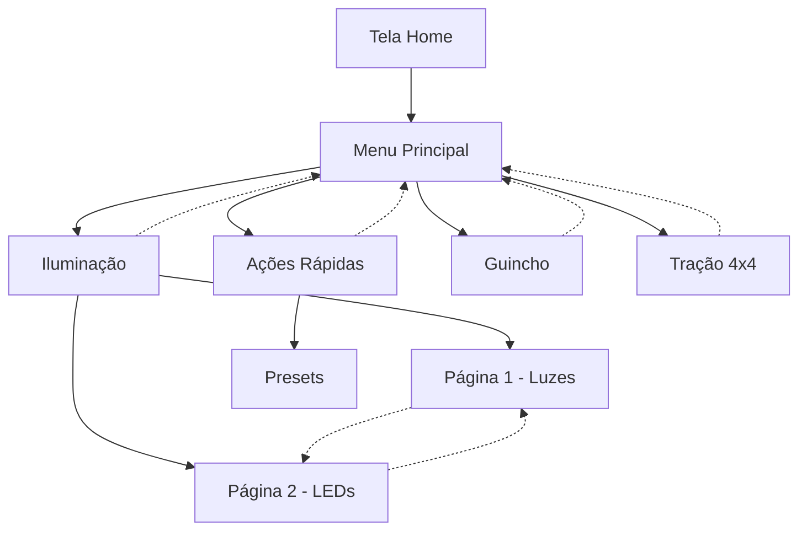

# 🖥️ User Interface Guide - AutoTech HMI Display v2

## 📋 Índice

- [Visão Geral da Interface](#visão-geral-da-interface)
- [Sistema de Navegação](#sistema-de-navegação)
- [Tipos de Tela](#tipos-de-tela)
- [Componentes Interativos](#componentes-interativos)
- [Sistema de Paginação](#sistema-de-paginação)
- [Feedback Visual](#feedback-visual)
- [Temas e Personalização](#temas-e-personalização)
- [Sistema Multi-idioma](#sistema-multi-idioma)
- [Acessibilidade](#acessibilidade)
- [Shortcuts e Atalhos](#shortcuts-e-atalhos)

## 🎯 Visão Geral da Interface

O AutoTech HMI Display v2 apresenta uma interface totalmente configurável baseada no framework LVGL, otimizada para controle veicular em displays touchscreen de 2.8" (320x240 pixels).

### Características Principais
- **Layout Responsivo**: Adapta-se automaticamente ao conteúdo
- **Navegação Intuitiva**: Botões físicos + touch screen
- **Feedback Visual**: LEDs RGB de status + animações na tela
- **Paginação Automática**: Sistema inteligente para múltiplos itens
- **Temas Dinâmicos**: Personalização visual completa
- **Multi-idioma**: Suporte automático a múltiplos idiomas

### Anatomia da Tela
```
┌─────────────────────────────────────┐
│ Header (40px)                       │ ← Título + Status
├─────────────────────────────────────┤
│                                     │
│                                     │
│        Área de Conteúdo             │ ← Grid 2x3 (160px)
│         (Grid 2x3)                  │
│                                     │
│                                     │
├─────────────────────────────────────┤
│ Navigation Bar (40px)               │ ← Home + Paginação
└─────────────────────────────────────┘
  320x240 pixels (Landscape)
```

## 🧭 Sistema de Navegação

### Controles de Entrada

#### 1. **Botões Físicos**
```
[PREV] ← Navegação Anterior / Página Anterior
[SELECT] ← Confirmar / OK / Enter
[NEXT] → Navegação Próxima / Página Próxima
```

#### 2. **Touch Screen**
- **Tap**: Selecionar item
- **Long Press**: Ação secundária (onde disponível)
- **Swipe Left/Right**: Mudar página
- **Double Tap**: Zoom/Foco (componentes específicos)

### Fluxo de Navegação



### Breadcrumb Navigation
```
Home > Iluminação > Página 2/2
└─┬─┘   └─────┬────┘   └─┬─┘
  │           │          └─ Indicador de página
  │           └─ Tela atual  
  └─ Sempre navegável
```

## 📱 Tipos de Tela

### 1. **Menu Screen** - Navegação Principal
```
┌─────────────────────────┐
│ Menu Principal       📶 │ ← Header
├─────────────────────────┤
│  💡      ⚡             │
│ Iluminação  Ações       │
│                         │
│  🔗      🚙             │
│ Guincho   Tração        │
│                         │
│  🔧      ℹ️             │
│ Auxiliar  Info          │
├─────────────────────────┤
│ 🏠 Home            1/1 │ ← Navigation Bar
└─────────────────────────┘
```

**Características**:
- Grid 2x3 de botões de navegação
- Ícones grandes (32x32px) 
- Labels descritivos
- Paginação automática se >6 itens

### 2. **Control Screen** - Controle de Dispositivos
```
┌─────────────────────────┐
│ Iluminação          📶 │
├─────────────────────────┤
│  💡      💡             │
│ Luz Alta  Luz Baixa     │
│ [ON]      [OFF]         │
│                         │
│  ◀️       ▶️             │
│ Pisca E   Pisca D       │
│ [OFF]     [OFF]         │
├─────────────────────────┤
│ 🏠 Home   ◀️ ▶️      2/3 │
└─────────────────────────┘
```

**Características**:
- Botões toggle com estado visual
- Indicadores ON/OFF coloridos
- Status em tempo real
- Feedback imediato de ações

### 3. **Action Screen** - Presets e Ações
```
┌─────────────────────────┐
│ Ações Rápidas       📶 │
├─────────────────────────┤
│  ⭐      🚨             │
│Todas Luzes Emergência  │
│             [ATIVO]     │
│                         │
│  🏕️      ⭐             │
│ Camping  Show Luzes     │
│                         │
├─────────────────────────┤
│ 🏠 Home            1/2 │
└─────────────────────────┘
```

**Características**:
- Presets como botões grandes
- Estado visual para presets ativos
- Confirmação para ações críticas
- Ícones temáticos específicos

### 4. **Mode Selector** - Seleção de Modos
```
┌─────────────────────────┐
│ Sistema de Tração   📶 │
├─────────────────────────┤
│        🚗               │
│        4x2              │
│      [ATUAL]            │
│                         │
│  🚙      🏔️             │
│  4x4     4x4 Low        │
│                         │
├─────────────────────────┤
│ 🏠 Home            1/1 │
└─────────────────────────┘
```

**Características**:
- Seleção exclusiva (radio button)
- Destaque visual do modo atual
- Confirmação para mudanças críticas
- Ícones específicos por modo

### 5. **Info Screen** - Informações e Sensores
```
┌─────────────────────────┐
│ Diagnósticos        📶 │
├─────────────────────────┤
│ Tensão: 12.8V      🟢  │
│ ████████░░ 85%          │
│                         │
│ Corrente: 5.2A     🟡  │
│ ████░░░░░░ 35%          │
│                         │
│ Temp: 45°C         🟢  │
│ ██████░░░░ 60%          │
├─────────────────────────┤
│ 🏠 Home    🔄      1/1 │ ← Auto-refresh
└─────────────────────────┘
```

**Características**:
- Valores em tempo real
- Gauges visuais com zonas coloridas
- Auto-refresh configurável
- Alertas visuais por zonas

## 🧩 Componentes Interativos

### 1. **Navigation Button**
```
┌─────────────┐
│     💡      │ ← Ícone grande (32x32)
│ Iluminação  │ ← Label
└─────────────┘
```

### 2. **Relay Toggle Button**
```
Estado OFF:           Estado ON:
┌─────────────┐       ┌─────────────┐
│     💡      │       │     💡      │
│ Luz Alta    │       │ Luz Alta    │
│   [OFF]     │  →    │   [ON]      │
└─────────────┘       └─────────────┘
 Cinza/Neutro          Verde/Ativo
```

### 3. **Action Button**
```
┌─────────────┐
│     🚨      │ ← Ícone de ação
│ Emergência  │ ← Nome do preset
│ Confirmar?  │ ← Confirmação se necessária
└─────────────┘
```

### 4. **Mode Selector**
```
Não Selecionado:      Selecionado:
┌─────────────┐       ┌─────────────┐
│     🚙      │       │     🚙      │
│  4x4 High   │  →    │  4x4 High   │
│             │       │  [ATUAL]    │
└─────────────┘       └─────────────┘
 Borda normal          Borda destacada
```

### 5. **Slider Control**
```
┌─────────────────────┐
│ Brilho da Tela      │ ← Label
│ ████████░░ 80%      │ ← Barra visual
│ ○────────●─────     │ ← Slider interativo
└─────────────────────┘
```

### 6. **Gauge Display**
```
┌─────────────────────┐
│ Tensão da Bateria   │
│      12.8V          │ ← Valor atual
│   ┌─────────┐       │
│   │ ████░░░░ │       │ ← Gauge circular
│   │  85%    │       │
│   └─────────┘       │
└─────────────────────┘
```

## 📄 Sistema de Paginação

### Paginação Automática
Quando uma tela tem mais de 6 itens, o sistema automaticamente divide em páginas:

```
11 itens = 2 páginas
Página 1: Itens 1-6
Página 2: Itens 7-11

15 itens = 3 páginas  
Página 1: Itens 1-6
Página 2: Itens 7-12
Página 3: Itens 13-15
```

### Controles de Paginação
```
Navigation Bar:
┌─────────────────────────────────────┐
│ 🏠 Home   ◀️ Prev  Next ▶️    2/3 │
└─────────────────────────────────────┘
           └─┬─┘    └─┬─┘     └┬┘
             │        │        └─ Indicador atual
             │        └─ Próxima página
             └─ Página anterior
```

### Navegação por Páginas

#### Botões Físicos
- **PREV**: Página anterior (ou item anterior se uma página)
- **NEXT**: Próxima página (ou próximo item se uma página)
- **SELECT**: Confirmar item selecionado

#### Touch Screen
- **Swipe Left**: Próxima página
- **Swipe Right**: Página anterior
- **Tap**: Selecionar item diretamente

## 🎨 Feedback Visual

### Estados dos Componentes

#### Botões de Relé
```
OFF:    Fundo cinza (#666666), texto branco
ON:     Fundo verde (#00ff00), texto preto
ERROR:  Fundo vermelho (#ff0000), texto branco
LOADING: Fundo amarelo (#ffff00), texto preto
```

#### Botões de Ação
```
IDLE:   Fundo padrão do tema
ACTIVE: Fundo da cor primária
CONFIRM: Borda piscando vermelha
SUCCESS: Flash verde por 500ms
```

### LEDs de Status RGB

| Cor | Estado | Descrição |
|-----|--------|-----------|
| 🔴 **Vermelho** | Error | WiFi/MQTT desconectado |
| 🟡 **Amarelo** | Warning | Conectando ou aguardando |
| 🟢 **Verde** | OK | Sistema operacional |
| 🔵 **Azul** | Info | Recebendo configuração |
| 🟣 **Roxo** | Update | Hot-reload em progresso |
| ⚪ **Branco** | Test | Modo diagnóstico |

### Animações

#### Transições de Tela
- **Fade In/Out**: 200ms para mudança de tela
- **Slide Left/Right**: 300ms para paginação
- **Scale Up**: 150ms para confirmações

#### Feedback de Interação
- **Button Press**: Scale down 95% por 100ms
- **Success Flash**: Verde por 200ms
- **Error Shake**: Vibração horizontal por 300ms

## 🎭 Temas e Personalização

### Tema Escuro (Padrão)
```
Background: #1a1a1a (Preto suave)
Surface:    #2d2d2d (Cinza escuro)
Primary:    #0066cc (Azul AutoTech)
Text:       #ffffff (Branco)
Success:    #28a745 (Verde)
Warning:    #ffc107 (Amarelo)
Error:      #dc3545 (Vermelho)
```

### Tema Claro
```
Background: #f5f5f5 (Cinza claro)
Surface:    #ffffff (Branco)
Primary:    #0066cc (Azul AutoTech)
Text:       #333333 (Cinza escuro)
```

### Tema Emergência
```
Background: #330000 (Vermelho escuro)
Surface:    #550000 (Vermelho médio)
Primary:    #ff0000 (Vermelho brilhante)
Text:       #ffffff (Branco)
Efeitos:    Piscar a cada 500ms
```

### Personalização por Componente
```json
{
  "button_style": {
    "font_size": 14,
    "border_radius": 8,
    "padding": 10,
    "border_width": 2
  },
  "icon_style": {
    "size": 32,
    "color": "primary"
  }
}
```

## 🌍 Sistema Multi-idioma

### Idiomas Suportados
- **pt-BR**: Português Brasileiro (padrão)
- **en-US**: Inglês Americano
- **es-ES**: Espanhol

### Estrutura Multi-idioma
```json
{
  "label": {
    "pt-BR": "Iluminação",
    "en-US": "Lighting", 
    "es-ES": "Iluminación"
  }
}
```

### Fallback Automático
1. Idioma configurado do sistema
2. Inglês (en-US) se disponível
3. Primeiro idioma disponível
4. String do ID como último recurso

### Strings do Sistema
| Chave | pt-BR | en-US | es-ES |
|-------|-------|-------|-------|
| `home` | Menu Principal | Main Menu | Menú Principal |
| `back` | Voltar | Back | Volver |
| `confirm` | Confirmar | Confirm | Confirmar |
| `cancel` | Cancelar | Cancel | Cancelar |
| `on` | LIGADO | ON | ENCENDIDO |
| `off` | DESLIGADO | OFF | APAGADO |
| `loading` | Carregando... | Loading... | Cargando... |

## ♿ Acessibilidade

### Contraste e Visibilidade
- **Contraste mínimo**: 4.5:1 entre texto e fundo
- **Tamanhos de fonte**: Mínimo 14px para textos principais
- **Ícones**: Mínimo 32x32px para componentes principais
- **Touch targets**: Mínimo 44x44px para fácil toque

### Feedback Tátil
- **Vibração**: Feedback para ações importantes (se hardware suportar)
- **Áudio**: Beeps configuráveis para confirmações
- **Visual**: Flash de confirmação para todas as ações

### Simplificação de Interface
- **Navegação linear**: Ordem lógica de navegação
- **Agrupamento**: Funções relacionadas agrupadas
- **Consistência**: Padrões visuais consistentes
- **Clareza**: Labels claros e descritivos

## ⌨️ Shortcuts e Atalhos

### Atalhos com Botões Físicos

#### Navegação Rápida
- **Long Press HOME**: Voltar para tela inicial
- **PREV + SELECT**: Página anterior (atalho)
- **NEXT + SELECT**: Próxima página (atalho)

#### Ações do Sistema
- **PREV + NEXT (2s)**: Menu de configurações local
- **SELECT (5s)**: Reset para configuração padrão
- **ALL BUTTONS (3s)**: Modo diagnóstico

### Atalhos Touch

#### Gestos Especiais
- **Double Tap Header**: Voltar para Home
- **Swipe Up**: Mostrar informações da tela atual
- **Swipe Down**: Refresh/Reload da tela atual
- **Long Press Item**: Menu de contexto (quando disponível)

#### Combinações
- **Touch + PREV**: Cancelar ação em progresso
- **Touch + SELECT**: Confirmar sem soltar
- **Touch + NEXT**: Pular confirmações (ações não-críticas)

### Modos Especiais

#### Modo Apresentação
- **Acesso**: Triple tap na área vazia
- **Função**: Aumenta fontes e ícones em 150%
- **Saída**: Triple tap novamente

#### Modo Debug  
- **Acesso**: PREV + NEXT + SELECT (5s)
- **Função**: Mostra informações técnicas
- **Recursos**: FPS, memória, status MQTT, etc.
- **Saída**: Qualquer botão

#### Modo Configuração Local
- **Acesso**: Long press em área vazia + SELECT
- **Função**: Ajustes rápidos sem MQTT
- **Opções**: Brilho, idioma, tema, calibração touch
- **Saída**: Botão HOME ou timeout de 30s

### Configurações Rápidas

```
Menu de Configuração Local:
┌─────────────────────────┐
│ Configurações       📶 │
├─────────────────────────┤
│ Brilho:    ████████░░   │ ← Slider 10-100%
│ Idioma:    [pt-BR] ▼    │ ← Dropdown  
│ Tema:      [Escuro] ▼   │ ← Dropdown
│ Touch:     [Calibrar]   │ ← Botão ação
│                         │
│ Reset:     [Confirmar]  │ ← Botão crítico
├─────────────────────────┤
│ 🏠 Sair            1/1 │
└─────────────────────────┘
```

## 📏 Especificações de Layout

### Dimensões de Componentes

```
Header:           320x40px
  Title:          Esquerda, font 16px
  Status Icons:   Direita, 16x16px

Navigation Bar:   320x40px  
  Home Button:    40x40px, esquerda
  Page Controls:  Centro
  Page Counter:   Direita, font 12px

Grid Item:        150x60px (2x3 grid)
  Icon:           32x32px, topo
  Label:          Font 12px, baixo
  Status:         Font 10px, centro
  Padding:        5px todas direções
```

### Espaçamentos
```
Margin Externa:   10px
Gap entre itens:  5px
Padding Interno:  10px (botões), 5px (labels)
Border Radius:    8px (padrão), 4px (pequeno)
Border Width:     2px (normal), 1px (sutil)
```

### Responsividade
```
Portrait (240x320):   Grid 1x6, navbar superior
Landscape (320x240):  Grid 2x3, navbar inferior
Auto-rotate:          Baseado na configuração
Text scaling:         Automático por densidade
```

---

**Versão**: 2.0.0  
**Última Atualização**: Janeiro 2025  
**Autor**: AutoTech Team